# Informe del Trabajo Parcial

<div>
  <p align="center"></p>
  <p align="center">Universidad Peruana de Ciencias Aplicadas</p>
  <p align="center">Facultad de Ingeniería</p>
  <p align="center">Carrera: Ingeniería de Software</p>
  <p align="center"><b>Periodo: 202610 </b></p>
  <p align="center">Código del curso: 1ACC0238 </p>
    <p align="center">Nombre del curso: Desarrollo de Aplicaciones Móviles</p>
  <p align="center">NRC: 3646</p>
  <p align="center">Nombre del profesor: Mayta Guillermo Jorge Luis</p>
  <p align="center"><b>Informe de Trabajo Parcial</b></p>
  <p align="center">Nombre del startup: NeuroDraw</p>
  <p align="center">Nombre del producto: NeuroZen</p>
</div>

---

<h3 align="center">Relación de integrantes</h3>

<div align="center">

<table>
  <thead>
    <tr>
      <th>Código</th>
      <th>Apellidos y Nombres</th>
    </tr>
  </thead>
  <tbody>
    <tr>
      <td>U20231G159</td>
      <td>Castro Picón, Manuel Fernando Joao</td>
    </tr>
    <tr>
      <td>U20321774</td>
      <td>Requena Gutiérrez, Diego Gabriel</td>
    </tr>
    <tr>
      <td>U20201E781</td>
      <td>Huaman De La Cruz, Jean Pool</td>
    </tr>
    <tr>
      <td>U20231B475</td>
      <td>Solis Chang, Santiago Valentino</td>
    </tr>
    <tr>
      <td>U20231G054</td>
      <td>Vila Guillen, Miguel Angel</td>
    </tr>
  </tbody>
</table>

</div>

<p align="center"><b>Tabla 0.1.</b> Relación de integrantes del equipo.</p>

<div>
  
  <p align="center"><b>Abril, 2026</b></p>
</div>

---

## Registro de Versiones del Informe

El objetivo de esta sección es resumir las modificaciones relevantes que se realizan al informe durante el ciclo de vida del proyecto.

<table border="1" cellpadding="10" cellspacing="0" style="border-collapse: collapse; width: 100%;">
  <tr>
    <td align="center" style="border: 1px solid #ddd; padding: 8px;">Versión</td>
    <td align="center" style="border: 1px solid #ddd; padding: 8px;">Fecha</td>
    <td align="center" style="border: 1px solid #ddd; padding: 8px;">Autores</td>
    <td align="center" style="border: 1px solid #ddd; padding: 8px;">Descripción</td>
  </tr>
  <tr>
    <td style="border: 1px solid #ddd; padding: 8px;">AV1</td>
    <td style="border: 1px solid #ddd; padding: 8px;">22/04/2026</td>
    <td style="border: 1px solid #ddd; padding: 8px;">
      <ul>
        <li>Castro Picón, Manuel Fernando Joao</li>
      </ul>
    </td>
    <td style="border: 1px solid #ddd; padding: 8px;">            
      <ul>
        <li>Capítulo II: Punto 2.6.3 Bounded Context: Recommendations & Activities</li>
        <li>Capítulo II: Punto 2.6.3.1 Domain Layer</li>
        <li>Capítulo II: Punto 2.6.3.2 Interface Layer</li>
      </ul>
    </td>
  </tr>
  <tr>
    <td style="border: 1px solid #ddd; padding: 8px;">AV1</td>
    <td style="border: 1px solid #ddd; padding: 8px;">22/04/2026</td>
    <td style="border: 1px solid #ddd; padding: 8px;">
      <ul>
        <li>Requena Gutiérrez, Diego Gabriel</li>
      </ul>
    </td>
    <td style="border: 1px solid #ddd; padding: 8px;">            
      <ul>
        <li>Capítulo II: Punto 2.1 Competidores</li>
        <li>Capítulo II: Punto 2.2 Entrevistas</li>
        <li>Capítulo II: Punto 2.6.1 Bounded Context: IAM</li>
        <li>Capítulo II: Punto 2.6.2 Bounded Context: Assessments</li>
      </ul>
    </td>
  </tr>
  <tr>
    <td style="border: 1px solid #ddd; padding: 8px;">AV1</td>
    <td style="border: 1px solid #ddd; padding: 8px;">22/04/2026</td>
    <td style="border: 1px solid #ddd; padding: 8px;">
      <ul>
        <li>Huaman De La Cruz, Jean Pool</li>
      </ul>
    </td>
    <td style="border: 1px solid #ddd; padding: 8px;">            
      <ul>
        <li>Capítulo II: Punto 2.3 Needfinding</li>
        <li>Capítulo II: Punto 2.3.4 Empathy Mapping</li>
        <li>Capítulo II: Punto 2.6.7 Bounded Context: Notifications</li>
        <li>Capítulo II: Punto 2.6.7.2 Interface Layer</li>
      </ul>
    </td>
  </tr>
  <tr>
    <td style="border: 1px solid #ddd; padding: 8px;">AV1</td>
    <td style="border: 1px solid #ddd; padding: 8px;">22/04/2026</td>
    <td style="border: 1px solid #ddd; padding: 8px;">
      <ul>
        <li>Solis Chang, Santiago Valentino</li>
      </ul>
    </td>
    <td style="border: 1px solid #ddd; padding: 8px;">            
      <ul>
        <li>Capítulo II: Punto 2.5.3 Software Architecture</li>
        <li>Capítulo II: Punto 2.6.4 Bounded Context: Health Tracking & Dashboard</li>
        <li>Capítulo II: Punto 2.6.4.1 Domain Layer</li>
        <li>Capítulo II: Punto 2.6.4.2 Interface Layer</li>
      </ul>
    </td>
  </tr>
  <tr>
    <td style="border: 1px solid #ddd; padding: 8px;">AV1</td>
    <td style="border: 1px solid #ddd; padding: 8px;">22/04/2026</td>
    <td style="border: 1px solid #ddd; padding: 8px;">
      <ul>
        <li>Vila Guillen, Miguel Angel</li>
      </ul>
    </td>
    <td style="border: 1px solid #ddd; padding: 8px;">            
      <ul>
        <li>Capítulo II: Punto 2.6.5 Bounded Context: Professionals & Appointments</li>
        <li>Capítulo II: Punto 2.6.6 Bounded Context: Community & Resources</li>
        <li>Capítulo II: Punto 2.6.6.1 Domain Layer</li>
        <li>Capítulo II: Punto 2.6.6.2 Interface Layer</li>
      </ul>
    </td>
  </tr>
</table>

## Project Report Collaboration Insights

El equipo ha trabajado de manera colaborativa en el repositorio de GitHub, registrando avances constantes en la construcción del informe.  
Repositorio del informe:

A continuación, se presentan las evidencias de participación y colaboración de los integrantes:

- Cada integrante del grupo realizó commits, modificaciones y carga de archivos en distintas secciones del informe.
- Se refleja la división de tareas entre redacción, correcciones de estilo, incorporación de imágenes y ajustes técnicos en Markdown.
- Todos los miembros participaron en mayor o menor medida, garantizando que el documento evolucionara de forma colaborativa y transparente.
- La evidencia gráfica incluye la vista de contribuciones, así como el historial de actividad donde se observa el detalle de commits y cambios en el repositorio.

<div>
  <p align="center">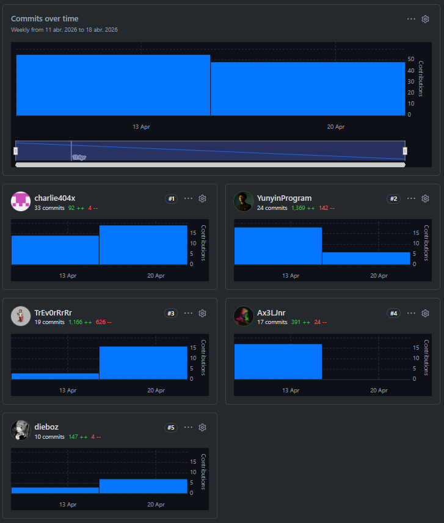</p>
</div>

### Contribuciones por integrante

<table border="1" cellpadding="10" cellspacing="0" style="border-collapse: collapse; width: 100%;">
  <tr>
    <td align="center" style="border: 1px solid #ddd; padding: 8px;">Integrante</td>
    <td align="center" style="border: 1px solid #ddd; padding: 8px;">Tareas Asignadas</td>
  </tr>

  <tr>
    <td style="border: 1px solid #ddd; padding: 8px;">Castro Picón, Manuel Fernando Joao</td>
    <td style="border: 1px solid #ddd; padding: 8px;">
      <ul>
        <li>Capítulo I – Presentación</li>
        <li>
          1.1 Startup Profile<br>1.1.1 Descripción de la Startup<br>1.1.2 Perfiles de integrantes del equipo<br>1.2 Solution Profile<br>1.2.1 Antecedentes y problemática<br>1.2.2 Lean UX Process<br>1.2.2.1 Lean UX Problem Statements<br>1.2.2.2 Lean UX Assumptions<br>1.2.2.3 Lean UX Hypothesis Statements<br>1.2.2.4 Lean UX Canvas<br>1.3 Segmentos objetivo
        </li>
      </ul>
    </td>
  </tr>
  <tr>
    <td style="border: 1px solid #ddd; padding: 8px;">Requena Gutiérrez, Diego Gabriel</td>
    <td style="border: 1px solid #ddd; padding: 8px;">
      <ul>
        <li>Capítulo II</li>
        <li>
          2.1 Competidores<br>2.1.1 Análisis competitivo<br>2.1.2 Estrategias y tácticas frente a competidores<br>2.2 Entrevistas<br>2.2.1 Diseño de entrevistas<br>2.2.2 Registro de entrevistas<br>2.2.3 Análisis de entrevistas
        </li>
      </ul>
    </td>
  </tr>
  <tr>
    <td style="border: 1px solid #ddd; padding: 8px;">Huaman De La Cruz, Jean Pool</td>
    <td style="border: 1px solid #ddd; padding: 8px;">
      <ul>
        <li>2.3 Needfinding</li>
        <li>
          2.3.1 User Personas<br>2.3.2 User Task Matrix<br>2.3.3 User Journey Mapping<br>2.3.4 Empathy Mapping<br>2.3.5 Big Picture EventStorming<br>2.3.6 Ubiquitous Language
        </li>
      </ul>
    </td>
  </tr>
  <tr>
    <td style="border: 1px solid #ddd; padding: 8px;">Solis Chang, Santiago Valentino</td>
    <td style="border: 1px solid #ddd; padding: 8px;">
      <ul>
        <li>2.4 Requirements Specification</li>
        <li>
          2.4.1 User Stories<br>2.4.2 Impact Mapping<br>2.4.3 Product Backlog
        </li>
      </ul>
    </td>
  </tr>
  <tr>
    <td style="border: 1px solid #ddd; padding: 8px;">Vila Guillen, Miguel Angel</td>
    <td style="border: 1px solid #ddd; padding: 8px;">
      <ul>
        <li>2.5.1 EventStorming</li>
        <li>
          2.5.1.1 Candidate Context Discovery<br>2.5.1.2 Domain Message Flows Modeling<br>2.5.1.3 Bounded Context Canvases
        </li>
      </ul>
    </td>
  </tr>
  <tr>
    <td style="border: 1px solid #ddd; padding: 8px;">Castro Picón, Manuel Fernando Joao</td>
    <td style="border: 1px solid #ddd; padding: 8px;">
      <ul>
        <li>2.5.2 Context Mapping</li>
      </ul>
    </td>
  </tr>
  <tr>
    <td style="border: 1px solid #ddd; padding: 8px;">Solis Chang, Santiago Valentino</td>
    <td style="border: 1px solid #ddd; padding: 8px;">
      <ul>
        <li>2.5.3 Software Architecture</li>
        <li>
          2.5.3.1 Context Level Diagrams<br>2.5.3.2 Container Level Diagrams<br>2.5.3.3 Deployment Diagrams
        </li>
      </ul>
    </td>
  </tr>
  <tr>
    <td style="border: 1px solid #ddd; padding: 8px;">Requena Gutiérrez, Diego Gabriel</td>
    <td style="border: 1px solid #ddd; padding: 8px;">
      <ul>
        <li>2.6.1 Bounded Context: IAM</li>
        <li>
          2.6.1.1 Domain Layer<br>2.6.1.2 Interface Layer<br>2.6.1.3 Application Layer<br>2.6.1.4 Infrastructure Layer<br>2.6.1.5 Component Level Diagrams<br>2.6.1.6 Code Level Diagrams<br>2.6.1.6.1 Class Diagram<br>2.6.1.6.2 Database Diagram
        </li>
      </ul>
    </td>
  </tr>
  <tr>
    <td style="border: 1px solid #ddd; padding: 8px;">Requena Gutiérrez, Diego Gabriel</td>
    <td style="border: 1px solid #ddd; padding: 8px;">
      <ul>
        <li>2.6.2 Bounded Context: Assessments</li>
        <li>
          2.6.2.1 Domain Layer<br>2.6.2.2 Interface Layer<br>2.6.2.3 Application Layer<br>2.6.2.4 Infrastructure Layer<br>2.6.2.5 Component Level Diagrams<br>2.6.2.6 Code Level Diagrams<br>2.6.2.6.1 Class Diagram<br>2.6.2.6.2 Database Diagram
        </li>
      </ul>
    </td>
  </tr>
  <tr>
    <td style="border: 1px solid #ddd; padding: 8px;">Castro Picón, Manuel Fernando Joao</td>
    <td style="border: 1px solid #ddd; padding: 8px;">
      <ul>
        <li>2.6.3 Bounded Context: Recommendations & Activities</li>
        <li>
          2.6.3.1 Domain Layer<br>2.6.3.2 Interface Layer<br>2.6.3.3 Application Layer<br>2.6.3.4 Infrastructure Layer<br>2.6.3.5 Component Level Diagrams<br>2.6.3.6 Code Level Diagrams<br>2.6.3.6.1 Class Diagram<br>2.6.3.6.2 Database Diagram
        </li>
      </ul>
    </td>
  </tr>
  <tr>
    <td style="border: 1px solid #ddd; padding: 8px;">Solis Chang, Santiago Valentino</td>
    <td style="border: 1px solid #ddd; padding: 8px;">
      <ul>
        <li>2.6.4 Bounded Context: Health Tracking & Dashboard</li>
        <li>
          2.6.4.1 Domain Layer<br>2.6.4.2 Interface Layer<br>2.6.4.3 Application Layer<br>2.6.4.4 Infrastructure Layer<br>2.6.4.5 Component Level Diagrams<br>2.6.4.6 Code Level Diagrams<br>2.6.4.6.1 Class Diagram<br>2.6.4.6.2 Database Diagram
        </li>
      </ul>
    </td>
  </tr>
  <tr>
    <td style="border: 1px solid #ddd; padding: 8px;">Vila Guillen, Miguel Angel</td>
    <td style="border: 1px solid #ddd; padding: 8px;">
      <ul>
        <li>2.6.5 Bounded Context: Professionals & Appointments</li>
        <li>
          2.6.5.1 Domain Layer<br>2.6.5.2 Interface Layer<br>2.6.5.3 Application Layer<br>2.6.5.4 Infrastructure Layer<br>2.6.5.5 Component Level Diagrams<br>2.6.5.6 Code Level Diagrams<br>2.6.5.6.1 Class Diagram<br>2.6.5.6.2 Database Diagram
        </li>
      </ul>
    </td>
  </tr>
  <tr>
    <td style="border: 1px solid #ddd; padding: 8px;">Vila Guillen, Miguel Angel</td>
    <td style="border: 1px solid #ddd; padding: 8px;">
      <ul>
        <li>2.6.6 Bounded Context: Community & Resources</li>
        <li>
          2.6.6.1 Domain Layer<br>2.6.6.2 Interface Layer<br>2.6.6.3 Application Layer<br>2.6.6.4 Infrastructure Layer<br>2.6.6.5 Component Level Diagrams<br>2.6.6.6 Code Level Diagrams<br>2.6.6.6.1 Class Diagram<br>2.6.6.6.2 Database Diagram
        </li>
      </ul>
    </td>
  </tr>
  <tr>
    <td style="border: 1px solid #ddd; padding: 8px;">Huaman De La Cruz, Jean Pool</td>
    <td style="border: 1px solid #ddd; padding: 8px;">
      <ul>
        <li>2.6.7 Bounded Context: Notification</li>
        <li>
          2.6.7.1 Domain Layer<br>2.6.7.2 Interface Layer<br>2.6.7.3 Application Layer<br>2.6.7.4 Infrastructure Layer<br>2.6.7.5 Component Level Diagrams<br>2.6.7.6 Code Level Diagrams<br>2.6.7.6.1 Class Diagram<br>2.6.7.6.2 Database Diagram
        </li>
      </ul>
    </td>
  </tr>

</table>

# Contenido

1. [Capítulo I: Presentación](#capítulo-i-presentación)  
   1.1. [Startup Profile](#11-startup-profile)  
    1.1.1. [Descripción de la Startup](#111-descripción-de-la-startup)  
    1.1.2. [Perfiles de integrantes del equipo](#112-perfiles-de-integrantes-del-equipo)  
   1.2. [Solution Profile](#12-solution-profile)  
    1.2.1. [Antecedentes y problemática](#121-antecedentes-y-problemática)  
    1.2.2. [Lean UX Process](#122-lean-ux-process)  
    1.2.2.1. [Lean UX Problem Statements](#1221-lean-ux-problem-statements)  
    1.2.2.2. [Lean UX Assumptions](#1222-lean-ux-assumptions)  
    1.2.2.3. [Lean UX Hypothesis Statements](#1223-lean-ux-hypothesis-statements)  
    1.2.2.4. [Lean UX Canvas](#1224-lean-ux-canvas)  
   1.3. [Segmentos objetivo](#13-segmentos-objetivo)

2. [Capítulo II: Requirements Development and Software Solution Design](#capítulo-ii-requirements-development-and-software-solution-design)  
   2.1. [Competidores](#21-competidores)  
    2.1.1. [Análisis competitivo](#211-análisis-competitivo)  
    2.1.2. [Estrategias y tácticas frente a competidores](#212-estrategias-y-tácticas-frente-a-competidores)  
   2.2. [Entrevistas](#22-entrevistas)  
    2.2.1. [Diseño de entrevistas](#221-diseño-de-entrevistas)  
    2.2.2. [Registro de entrevistas](#222-registro-de-entrevistas)  
    2.2.3. [Análisis de entrevistas](#223-análisis-de-entrevistas)  
   2.3. [Needfinding](#23-needfinding)  
    2.3.1. [User Personas](#231-user-personas)  
    2.3.2. [User Task Matrix](#232-user-task-matrix)  
    2.3.3. [User Journey Mapping](#233-user-journey-mapping)  
    2.3.4. [Empathy Mapping](#234-empathy-mapping)  
    2.3.5. [Big Picture EventStorming](#235-big-picture-eventstorming)  
    2.3.6. [Ubiquitous Language](#236-ubiquitous-language)  
   2.4. [Requirements specification](#24-requirements-specification)  
    2.4.1. [User Stories](#241-user-stories)  
    2.4.2. [Impact Mapping](#242-impact-mapping)  
    2.4.3. [Product Backlog](#243-product-backlog)  
   2.5. [Strategic-Level Domain-Driven Design](#25-strategic-level-domain-driven-design)  
    2.5.1. [EventStorming](#251-eventstorming)  
    2.5.1.1. [Candidate Context Discovery](#2511-candidate-context-discovery)  
    2.5.1.2. [Domain Message Flows Modeling](#2512-domain-message-flows-modeling)  
    2.5.1.3. [Bounded Context Canvases](#2513-bounded-context-canvases)  
    2.5.2. [Context Mapping](#252-context-mapping)  
    2.5.3. [Software Architecture](#253-software-architecture)  
    2.5.3.1. [Software Architecture Context Level Diagrams](#2531-software-architecture-context-level-diagrams)  
    2.5.3.2. [Software Architecture Container Level Diagrams](#2532-software-architecture-container-level-diagrams)  
    2.5.3.3. [Software Architecture Deployment Diagrams](#2533-software-architecture-deployment-diagrams)  
   2.6. [Tactical-Level Domain-Driven Design](#26-tactical-level-domain-driven-design)  
    2.6.1. [Bounded Context: IAM](#261-bounded-context-iam)  
    2.6.1.1. [Domain Layer](#2611-domain-layer)  
    2.6.1.2. [Interface Layer](#2612-interface-layer)  
    2.6.1.3. [Application Layer](#2613-application-layer)  
    2.6.1.4. [Infrastructure Layer](#2614-infrastructure-layer)  
    2.6.1.5. [Bounded Context Software Architecture Component Level Diagrams](#2615-bounded-context-software-architecture-component-level-diagrams)  
    2.6.1.6. [Bounded Context Software Architecture Code Level Diagrams](#2616-bounded-context-software-architecture-code-level-diagrams)  
    2.6.1.6.1. [Bounded Context Domain Layer Class Diagrams](#26161-bounded-context-domain-layer-class-diagrams)  
    2.6.1.6.2. [Bounded Context Database Design Diagram](#26162-bounded-context-database-design-diagram)  
    2.6.2. [Bounded Context: Assessments](#262-bounded-context-assessments)  
    2.6.2.1. [Domain Layer](#2621-domain-layer)  
    2.6.2.2. [Interface Layer](#2622-interface-layer)  
    2.6.2.3. [Application Layer](#2623-application-layer)  
    2.6.2.4. [Infrastructure Layer](#2624-infrastructure-layer)  
    2.6.2.5. [Bounded Context Software Architecture Component Level Diagrams](#2625-bounded-context-software-architecture-component-level-diagrams)  
    2.6.2.6. [Bounded Context Software Architecture Code Level Diagrams](#2626-bounded-context-software-architecture-code-level-diagrams)  
    2.6.2.6.1. [Bounded Context Domain Layer Class Diagrams](#26261-bounded-context-domain-layer-class-diagrams)  
    2.6.2.6.2. [Bounded Context Database Design Diagram](#26262-bounded-context-database-design-diagram)  
    2.6.3. [Bounded Context: Recommendations & Activities](#263-bounded-context-recommendations-&-activities)  
    2.6.3.1. [Domain Layer](#2631-domain-layer)  
    2.6.3.2. [Interface Layer](#2632-interface-layer)  
    2.6.3.3. [Application Layer](#2633-application-layer)  
    2.6.3.4. [Infrastructure Layer](#2634-infrastructure-layer)  
    2.6.3.5. [Bounded Context Software Architecture Component Level Diagrams](#2635-bounded-context-software-architecture-component-level-diagrams)  
    2.6.3.6. [Bounded Context Software Architecture Code Level Diagrams](#2636-bounded-context-software-architecture-code-level-diagrams)  
    2.6.3.6.1. [Bounded Context Domain Layer Class Diagrams](#26361-bounded-context-domain-layer-class-diagrams)  
    2.6.3.6.2. [Bounded Context Database Design Diagram](#26362-bounded-context-database-design-diagram)  
    2.6.4. [Bounded Context: Health Tracking & Dashboard](#264-bounded-context-health-tracking-&-dashboard)  
    2.6.4.1. [Domain Layer](#2641-domain-layer)  
    2.6.4.2. [Interface Layer](#2642-interface-layer)  
    2.6.4.3. [Application Layer](#2643-application-layer)  
    2.6.4.4. [Infrastructure Layer](#2644-infrastructure-layer)  
    2.6.4.5. [Bounded Context Software Architecture Component Level Diagrams](#2645-bounded-context-software-architecture-component-level-diagrams)  
    2.6.4.6. [Bounded Context Software Architecture Code Level Diagrams](#2646-bounded-context-software-architecture-code-level-diagrams)  
    2.6.4.6.1. [Bounded Context Domain Layer Class Diagrams](#26461-bounded-context-domain-layer-class-diagrams)  
    2.6.4.6.2. [Bounded Context Database Design Diagram](#26462-bounded-context-database-design-diagram)  
    2.6.5. [Bounded Context: Professionals & Appointments](#265-bounded-context-professionals-&-appointments)  
    2.6.5.1. [Domain Layer](#2651-domain-layer)  
    2.6.5.2. [Interface Layer](#2652-interface-layer)  
    2.6.5.3. [Application Layer](#2653-application-layer)  
    2.6.5.4. [Infrastructure Layer](#2654-infrastructure-layer)  
    2.6.5.5. [Bounded Context Software Architecture Component Level Diagrams](#2655-bounded-context-software-architecture-component-level-diagrams)  
    2.6.5.6. [Bounded Context Software Architecture Code Level Diagrams](#2656-bounded-context-software-architecture-code-level-diagrams)  
    2.6.5.6.1. [Bounded Context Domain Layer Class Diagrams](#26561-bounded-context-domain-layer-class-diagrams)  
    2.6.5.6.2. [Bounded Context Database Design Diagram](#26562-bounded-context-database-design-diagram)  
    2.6.6. [Bounded Context: Community & Resources](#266-bounded-context-community-&-resources)  
    2.6.6.1. [Domain Layer](#2661-domain-layer)  
    2.6.6.2. [Interface Layer](#2662-interface-layer)  
    2.6.6.3. [Application Layer](#2663-application-layer)  
    2.6.6.4. [Infrastructure Layer](#2664-infrastructure-layer)  
    2.6.6.5. [Bounded Context Software Architecture Component Level Diagrams](#2665-bounded-context-software-architecture-component-level-diagrams)  
    2.6.6.6. [Bounded Context Software Architecture Code Level Diagrams](#2666-bounded-context-software-architecture-code-level-diagrams)  
    2.6.6.6.1. [Bounded Context Domain Layer Class Diagrams](#26661-bounded-context-domain-layer-class-diagrams)  
    2.6.6.6.2. [Bounded Context Database Design Diagram](#26662-bounded-context-database-design-diagram)  
    2.6.7. [Bounded Context: Notification](#267-bounded-context-notification)  
    2.6.7.1. [Domain Layer](#2671-domain-layer)  
    2.6.7.2. [Interface Layer](#2672-interface-layer)  
    2.6.7.3. [Application Layer](#2673-application-layer)  
    2.6.7.4. [Infrastructure Layer](#2674-infrastructure-layer)  
    2.6.7.5. [Bounded Context Software Architecture Component Level Diagrams](#2675-bounded-context-software-architecture-component-level-diagrams)  
    2.6.7.6. [Bounded Context Software Architecture Code Level Diagrams](#2676-bounded-context-software-architecture-code-level-diagrams)  
    2.6.7.6.1. [Bounded Context Domain Layer Class Diagrams](#26761-bounded-context-domain-layer-class-diagrams)  
    2.6.7.6.2. [Bounded Context Database Design Diagram](#26762-bounded-context-database-design-diagram)

3. [Capítulo III: Solution UI/UX Design](#capítulo-iii-solution-uiux-design)  
   3.1. [Product design](#31-product-design)  
    3.1.1. [Style Guidelines](#311-style-guidelines)  
    3.1.1.1. [General Style Guidelines](#3111-general-style-guidelines)  
    3.1.2. [Information Architecture](#312-information-architecture)  
    3.1.2.1. [Organization Systems](#3121-organization-systems)  
    3.1.2.2. [Labelling Systems](#3122-labelling-systems)  
    3.1.2.3. [SEO Tags and Meta Tags](#3123-seo-tags-and-meta-tags)  
    3.1.2.4. [Searching Systems](#3124-searching-systems)  
    3.1.2.5. [Navigation Systems](#3125-navigation-systems)  
    3.1.3. [Landing Page UI Design](#313-landing-page-ui-design)  
    3.1.3.1. [Landing Page Wireframe](#3131-landing-page-wireframe)  
    3.1.3.2. [Landing Page Mock-up](#3132-landing-page-mock-up)  
    3.1.4. [Mobile Applications UX/UI Design](#314-mobile-applications-uxui-design)  
    3.1.4.1. [Mobile Applications Wireframes](#3141-mobile-applications-wireframes)  
    3.1.4.2. [Mobile Applications Wireflow Diagrams](#3142-mobile-applications-wireflow-diagrams)  
    3.1.4.3. [Mobile Applications Mock-ups](#3143-mobile-applications-mock-ups)  
    3.1.4.4. [Mobile Applications User Flow Diagrams](#3144-mobile-applications-user-flow-diagrams)  
    3.1.4.5. [Mobile Applications Prototyping](#3145-mobile-applications-prototyping)

4. [Capítulo IV: Product Implementation & Validation](#capítulo-iv-product-implementation--validation)  
   4.1. [Software Configuration Management](#41-software-configuration-management)  
    4.1.1. [Software Development Environment Configuration](#411-software-development-environment-configuration)  
    4.1.2. [Source Code Management](#412-source-code-management)  
    4.1.3. [Source Code Style Guide & Conventions](#413-source-code-style-guide--conventions)  
    4.1.4. [Software Deployment Configuration](#414-software-deployment-configuration)  
   4.2. [Landing Page & Mobile Application Implementation](#42-landing-page--mobile-application-implementation)  
    4.2.1. [Sprint 1](#421-sprint-1)  
    4.2.1.1. [Sprint Planning 1](#4211-sprint-planning-1)  
    4.2.1.2. [Sprint Backlog 1](#4212-sprint-backlog-1)  
    4.2.1.3. [Development Evidence for Sprint Review](#4213-development-evidence-for-sprint-review)  
    4.2.1.4. [Testing Suite Evidence for Sprint Review](#4214-testing-suite-evidence-for-sprint-review)  
    4.2.1.5. [Execution Evidence for Sprint Review](#4215-execution-evidence-for-sprint-review)  
    4.2.1.6. [Services Documentation Evidence for Sprint Review](#4216-services-documentation-evidence-for-sprint-review)  
    4.2.1.7. [Software Deployment Evidence for Sprint Review](#4217-software-deployment-evidence-for-sprint-review)  
    4.2.1.8. [Team Collaboration Insights during Sprint](#4218-team-collaboration-insights-during-sprint)  
    4.2.2. [Sprint 2](#422-sprint-2)  
    4.2.2.1. [Sprint Planning 2](#4221-sprint-planning-2)  
    4.2.2.2. [Sprint Backlog 2](#4222-sprint-backlog-2)  
    4.2.2.3. [Development Evidence for Sprint Review](#4223-development-evidence-for-sprint-review)  
    4.2.2.4. [Testing Suite Evidence for Sprint Review](#4224-testing-suite-evidence-for-sprint-review)  
    4.2.2.5. [Execution Evidence for Sprint Review](#4225-execution-evidence-for-sprint-review)  
    4.2.2.6. [Services Documentation Evidence for Sprint Review](#4226-services-documentation-evidence-for-sprint-review)  
    4.2.2.7. [Software Deployment Evidence for Sprint Review](#4227-software-deployment-evidence-for-sprint-review)  
    4.2.2.8. [Team Collaboration Insights during Sprint](#4228-team-collaboration-insights-during-sprint)  
    4.2.3. [Sprint 3](#423-sprint-3)  
    4.2.3.1. [Sprint Planning 3](#4231-sprint-planning-3)  
    4.2.3.2. [Sprint Backlog 3](#4232-sprint-backlog-3)  
    4.2.3.3. [Development Evidence for Sprint Review](#4233-development-evidence-for-sprint-review)  
    4.2.3.4. [Testing Suite Evidence for Sprint Review](#4234-testing-suite-evidence-for-sprint-review)  
    4.2.3.5. [Execution Evidence for Sprint Review](#4235-execution-evidence-for-sprint-review)  
    4.2.3.6. [Services Documentation Evidence for Sprint Review](#4236-services-documentation-evidence-for-sprint-review)  
    4.2.3.7. [Software Deployment Evidence for Sprint Review](#4237-software-deployment-evidence-for-sprint-review)  
    4.2.3.8. [Team Collaboration Insights during Sprint](#4238-team-collaboration-insights-during-sprint)  
    4.2.4. [Sprint 4](#424-sprint-4)  
    4.2.4.1. [Sprint Planning 4](#4241-sprint-planning-4)  
    4.2.4.2. [Sprint Backlog 4](#4242-sprint-backlog-4)  
    4.2.4.3. [Development Evidence for Sprint Review](#4243-development-evidence-for-sprint-review)  
    4.2.4.4. [Testing Suite Evidence for Sprint Review](#4244-testing-suite-evidence-for-sprint-review)  
    4.2.4.5. [Execution Evidence for Sprint Review](#4245-execution-evidence-for-sprint-review)  
    4.2.4.6. [Services Documentation Evidence for Sprint Review](#4246-services-documentation-evidence-for-sprint-review)  
    4.2.4.7. [Software Deployment Evidence for Sprint Review](#4247-software-deployment-evidence-for-sprint-review)  
    4.2.4.8. [Team Collaboration Insights during Sprint](#4248-team-collaboration-insights-during-sprint)  
   4.3. [Validation Interviews](#43-validation-interviews)  
    4.3.1. [Diseño de Entrevistas](#431-diseño-de-entrevistas)  
    4.3.2. [Registro de Entrevistas](#432-registro-de-entrevistas)  
    4.3.3. [Evaluaciones según heurísticas](#433-evaluaciones-según-heurísticas)

5. [Conclusiones](#5-conclusiones)  
   5.1. [Conclusiones y recomendaciones](#51-conclusiones-y-recomendaciones)  
   5.2. [Video App Validation](#52-video-app-validation)  
   5.3. [Video About the product](#53-video-about-the-product)  
   5.4. [Video About the team](#54-video-about-the-team)

6. [Glosario](#6-glosario)

7. [Bibliografía](#7-bibliografía)

8. [Anexos](#8-anexos)

---

## Student Outcomes

| Student Outcomes                                                                                                                            | Acciones realizadas                                                                                                                                                                                                                                                                                                                                                                                                                                                                                                                                                                                                                                                                                                                                                                                                                                                                                                                                                                                                                                                                                                                                                                                                                                                                                                                                                                                                                                                                                                                                                                                                                                                                                                                                                                                                                                                                                                                                                                                                                                                                                                                                                                                                                                                                                                                                                                                                                                                                                                                                                                                                                                                                                                                                                               | Conclusiones                                                                                                                                                                                                                                                                                                                                                                                                                                                                                                                                                                                                                                                                                                                      |
| :------------------------------------------------------------------------------------------------------------------------------------------ | :-------------------------------------------------------------------------------------------------------------------------------------------------------------------------------------------------------------------------------------------------------------------------------------------------------------------------------------------------------------------------------------------------------------------------------------------------------------------------------------------------------------------------------------------------------------------------------------------------------------------------------------------------------------------------------------------------------------------------------------------------------------------------------------------------------------------------------------------------------------------------------------------------------------------------------------------------------------------------------------------------------------------------------------------------------------------------------------------------------------------------------------------------------------------------------------------------------------------------------------------------------------------------------------------------------------------------------------------------------------------------------------------------------------------------------------------------------------------------------------------------------------------------------------------------------------------------------------------------------------------------------------------------------------------------------------------------------------------------------------------------------------------------------------------------------------------------------------------------------------------------------------------------------------------------------------------------------------------------------------------------------------------------------------------------------------------------------------------------------------------------------------------------------------------------------------------------------------------------------------------------------------------------------------------------------------------------------------------------------------------------------------------------------------------------------------------------------------------------------------------------------------------------------------------------------------------------------------------------------------------------------------------------------------------------------------------------------------------------------------------------------------------------------- | :-------------------------------------------------------------------------------------------------------------------------------------------------------------------------------------------------------------------------------------------------------------------------------------------------------------------------------------------------------------------------------------------------------------------------------------------------------------------------------------------------------------------------------------------------------------------------------------------------------------------------------------------------------------------------------------------------------------------------------- |
| **Actualiza conceptos y conocimientos necesarios para su desarrollo profesional y en especial para su proyecto en soluciones de software.** | **Vila Guillen, Miguel Angel**<br>AV1: Durante el desarrollo del AV1, actualizó y aplicó conocimientos avanzados en Domain-Driven Design mediante la elaboración completa del EventStorming, incluyendo Candidate Context Discovery y Domain Message Flows Modeling. Además, diseñó e implementó dos bounded contexts completos (Courts y Availabilities) con todas sus capas (Domain, Interface, Application e Infrastructure), así como diagramas de arquitectura a nivel de componentes y código (Class Diagrams y Database Design Diagrams).<br><br>**Solis Chang, Santiago Valentino**<br>AV1: Durante el desarrollo del AV1, actualizó y aplicó conocimientos en arquitectura de software y Domain-Driven Design mediante la elaboración de User Stories, Impact Mapping y Product Backlog. Además, diseñó los bounded contexts de Coaches y Reviews, así como diagramas de arquitectura (contexto, contenedores y componentes) y diagramas UML del dominio.<br><br>**Requena Gutiérrez, Diego Gabriel**<br>AV1: Durante el desarrollo del AV1, actualizó y aplicó conocimientos en análisis de dominio y arquitectura de software mediante la elaboración del análisis competitivo, estrategias y tácticas frente a competidores, así como el diseño del Context Mapping utilizando Domain-Driven Design. Además, desarrolló los bounded contexts de Bookings y Analytics, incluyendo sus respectivas capas (Domain, Application, Interface e Infrastructure), junto con diagramas de arquitectura (Component Level) y diagramas de código (Class Diagram y Database Design).<br><br>**Huaman De La Cruz, Jean Pool**<br>AV1: Durante el desarrollo del AV1, apliqué y actualicé mis conocimientos en el proceso de creación de elementos needfinding, tales como los User Persona, User Journey Mapping, Empathy Mapping, entre otros. Así como en el proceso de Big Picture EventStorming, e identificación y desarrollo de bounded context relacionados al negocio como payments y matches, a partir de sus respectivas capas, junto con sus diagramas de arquitectura y diagramas de código.<br><br>**Castro Picón, Manuel Fernando Joao**<br>AV1: Durante el desarrollo del AV1, actualizó y aplicó sus conocimientos en arquitectura de software y diseño centrado en el usuario mediante la aplicación de Lean UX, realizando entrevistas, definición de hipótesis y validación de necesidades. Asimismo, participó en la construcción del Context Mapping bajo el enfoque de Domain-Driven Design y en el modelado de los bounded contexts de IAM, Users y Notifications, desarrollando sus capas principales y los diagramas de soporte (componentes, clases y base de datos), lo que permitió una mejor comprensión de la organización y estructura del sistema. | El equipo demostró un efectivo liderazgo conjunto durante el AV1, donde cada miembro asumió responsabilidades compartidas de coordinación y toma de decisiones. Se evidenció una colaboración fluida que abarcó desde aspectos estratégicos y técnicos del proyecto hasta la planificación operativa y distribución de tareas. La comunicación continua, las reuniones regulares y el trabajo colaborativo. El compromiso colectivo por mantener una sana relación de equipo y la capacidad para resolver conflictos de manera conjunta permitieron lograr consensos efectivos y entregar un trabajo cohesivo y de calidad, demostrando que el liderazgo fue verdaderamente compartido y distribuido entre todos los integrantes. |
| **Reconoce la necesidad del aprendizaje permanente para el desempeño profesional y el desarrollo de proyectos en soluciones de software.**  | **Vila Guillen, Miguel Angel**<br>AV1: Durante el AV1, investigó y aplicó metodologías avanzadas de Domain-Driven Design, incluyendo técnicas de EventStorming para descubrimiento de contextos acotados y modelado de flujos de dominio. Investigó patrones de arquitectura de software (C4 Model, patrones tácticos de DDD) y utilizó herramientas para la elaboración de diagramas UML complejos, diagramas de componentes y diseño de bases de datos relacionales. Esto fortaleció significativamente sus habilidades en modelado de sistemas complejos, separación de responsabilidades y arquitectura orientada al dominio.<br><br>**Solis Chang, Santiago Valentino**<br>AV1: Durante el AV1, investigó y aplicó nuevas herramientas y metodologías como Structurizr para diagramas C4, PlantUML para modelado de clases y Miro para Impact Mapping. Esto permitió mejorar la calidad del diseño arquitectónico y fortalecer sus habilidades en modelado de sistemas y documentación técnica.<br><br>**Requena Gutiérrez, Diego Gabriel**<br>AV1: Durante el AV1, investigó y aplicó conceptos de Domain-Driven Design y modelado arquitectónico, utilizando herramientas para la elaboración de diagramas UML, diagramas de componentes y diseño de bases de datos. Esto le permitió mejorar su capacidad de estructurar bounded contexts, comprender mejor la separación de responsabilidades y fortalecer sus habilidades en documentación técnica y diseño de soluciones de software.<br><br>**Huaman De La Cruz, Jean Pool**<br>AV1: Durante el desarrollo del AV1, comprendí la importancia del constante aprendizaje autodidacta para mi desarrollo profesional en el desarrollo de proyectos de software, tomando en cuenta temas esenciales como Domain Driven Design (DDD) y modelado arquitectónico de diagramas de componentes, clases y bases de datos. Ello me incentivó a seguir expandiendo mis conocimientos para mejorar mi capacidad de estructurar bounded context, su respectiva documentación técnica, entre otras áreas de este tipo de proyectos.<br><br>**Castro Picón, Manuel Fernando Joao**<br>AV1: Durante el desarrollo del AV1, exploró y utilizó herramientas orientadas al modelado y diseño de software como Structurizr, PlantUML y Miro, integrándolas en la elaboración de diagramas C4, modelos de clases y actividades de Impact Mapping. Este proceso le permitió no solo mejorar la representación visual de la arquitectura del sistema, sino también afianzar su capacidad de organizar ideas, estructurar soluciones y documentar de manera más clara los distintos componentes del proyecto.                                                                                                                                  | El equipo logró mantener un entorno colaborativo e inclusivo mediante la distribución clara de responsabilidades, la coordinación constante y la planificación progresiva de actividades durante las entregas. Cada integrante aportó desde su área de trabajo, lo que permitió avanzar de manera ordenada y alineada con los objetivos del proyecto. La organización de tareas, el seguimiento de avances y la comunicación permanente favorecieron el cumplimiento de metas parciales y la construcción de un proceso de trabajo más estructurado y cooperativo.                                                                                                                                                                |

---

# Capítulo I: Presentación

## 1.1. Startup Profile

### 1.1.1. Descripción de la Startup

Nuestro startup llamado NeuroDraw está enfocado en una rápida detección del estrés en el ámbito
laboral de personas entre 20 a 50 años de edad. Abarcando temas como salud mental, presión laboral
y servicios, el software facilita el tratamiento del estrés laboral.
Los usuarios pueden realizar un test que recabará información de salud, comportamiento, actitudes y
patrones en la persona. La plataforma permite el contacto con un psicólogo. Además, fomenta
diversas actividades para complementar el tratamiento contra el estrés.

### 1.1.2. Perfiles de integrantes del equipo

| Foto                                                    | Nombres y Apellidos               | Carrera                | Descripción                                                                                                                                                                                                                                                 |
| ------------------------------------------------------- | --------------------------------- | ---------------------- | ----------------------------------------------------------------------------------------------------------------------------------------------------------------------------------------------------------------------------------------------------------- |
|     | Manuel Fernando Joao Castro Picón | Ingeniería de Software | Tengo 19 años y curso el 5to ciclo en la Universidad Peruana de Ciencias Aplicadas. Me gusta entrenar calistenia, escuchar música y jugar fútbol. Me considero responsable, adaptable al trabajo en equipo y con metas claras para ser un gran profesional. |
|     | Santiago Valentino Solis Chang    | Ingeniería de Software | Tengo 20 años y curso el 5to ciclo en la Universidad Peruana de Ciencias Aplicadas. En mi tiempo libre disfruto jugar videojuegos, practicar tenis y aprender sobre programación web. Soy responsable, comprometido y capaz de trabajar en equipo.          |
|   | Miguel Angel Vila Guillen         | Ingeniería de Software | Tengo 21 años y estudio el 6to ciclo en la Universidad Peruana de Ciencias Aplicadas. Me gusta jugar videojuegos, tocar la guitarra y el fútbol. Me considero capaz de trabajar en equipo y aspiro a ser un profesional competente.                         |
|  | Diego Gabriel Requena Gutiérrez   | Ingeniería de Software | Tengo 19 años y curso el 5to ciclo en la Universidad Peruana de Ciencias Aplicadas. Soy una persona comprometida con mis objetivos, busco optimizar mi rendimiento y mantener un equilibrio entre la excelencia y una vida saludable.                       |
|     | Huaman De La Cruz Jean Pool       | Ingeniería de Software | Tengo 23 años; Estoy cursando la carrera de ingeniería de software en quinto ciclo. Soy una persona orientada a objetivos y con una meta clara, quiero poder crear soluciones disruptivas que revolucionen el mercado.                                      |

## 1.2. Solution Profile

### 1.2.1. Antecedentes y problemática

El proyecto Neuro Zen consiste en desarrollar un sistema de identificación y gestión del estrés laboral
dirigido específicamente a adultos entre 20 y 50 años, mediante la observación y registro de señales
corporales visibles como postura corporal, tensión muscular facial, cambios en la respiración,
sudoración visible, temblores, rojeces en la piel y otros indicadores físicos detectables a simple vista,
integrando estos datos en una aplicación que permita a los usuarios auto-evaluar sus niveles de estrés
en el entorno laboral, recibir recomendaciones personalizadas y estrategias prácticas para la gestión
del estrés, mejorando así el bienestar de los trabajadores y la productividad organizacional, mientras
se previenen problemas de salud asociados al estrés crónico en la población económicamente activa.

### 1.2.2. Lean UX Process

#### 1.2.2.1. Lean UX Problem Statements

Nuestra app permite a los usuarios identificar y gestionar su estrés laboral mediante un
test de autoevaluación y la observación de señales físicas visibles como la postura, la
respiración y la tensión facial. Además, brinda acceso a psicólogos y actividades
prácticas para mejorar el bienestar.
Hemos observado que muchos adultos entre 20 y 50 años sufren niveles elevados de
estrés en el trabajo, pero no cuentan con herramientas simples, accesibles y efectivas
para reconocer estos niveles a tiempo ni saber cómo actuar al respecto.
¿Cómo pueden los trabajadores detectar y manejar su estrés de forma temprana y
efectiva en su entorno laboral, usando una herramienta accesible, fácil de usar e
integrada en su rutina diaria?

#### 1.2.2.2. Lean UX Assumptions

**Feature:** Sistema de identificación y gestión del estrés laboral en NeuroZen

**Registro Bio-métrico y Perfil del Usuario:**
Creemos que nuestros usuarios (adultos de 20 a 50 años en el ámbito laboral) necesitan una forma sencilla y segura de registrar sus parámetros bio-métricos (por medio de la cámara o sensores de sus dispositivos móviles) junto con información de salud y comportamiento. Esto permitirá personalizar el seguimiento y el manejo del estrés en función de las características individuales.

**Detección Temprana de Estrés mediante Patrones Físicos:**
Creemos que la identificación de señales bio-métricas observables (postura, tensión muscular, patrones de respiración y sudoración) permitirá detectar de forma temprana niveles de estrés. Esto facilitará la intervención oportuna antes de que se agraven los síntomas, impactando positivamente en la salud mental y física de los usuarios.

**Integración de Evaluaciones Psicológicas y Recomendaciones Personalizadas:**
Creemos que los usuarios se beneficiarán al combinar la autoevaluación bio-métrica con tests emocionales y recomendaciones personalizadas (ejercicios de respiración, pausas activas, contacto con especialistas). Esta integración permitirá al usuario conocer su estado en tiempo real y acceder a soluciones prácticas y adaptadas a su contexto.

**Seguimiento y Análisis de Datos de Estrés:**
Creemos que disponer de un registro histórico del nivel de estrés y obtener estadísticas personalizadas ayudará al usuario a identificar patrones y cambios en su salud, promoviendo acciones preventivas y
mejoras en su entorno laboral y personal.

**Business Outcomes (Resultados del negocio)**

- Se aumentará la productividad laboral y se reducirá el ausentismo, ya que los trabajadores podrán identificar y gestionar su estrés de manera proactiva.

- Se generarán ingresos a través de planes de suscripción individuales y acuerdos corporativos con empresas interesadas en el bienestar de sus empleados.

- NeuroZen se posicionará como una herramienta innovadora y confiable para la salud mental en el ámbito laboral, ampliando su alcance en el mercado latinoamericano.

**Users (Usuarios)**

- Profesionales y empleados de 20 a 50 años que desarrollan sus actividades en ambientes laborales exigentes y de alta presión.

- Personas que desean mejorar sus niveles de bienestar integral mediante el monitoreo de señales físicas y emocionales.

- Usuarios que utilizan dispositivos móviles y buscan soluciones digitales para la autogestión de su salud mental.

**User Outcomes (Beneficios para el usuario)**

- Identificar sus niveles de estrés de manera temprana y objetiva, mediante el análisis de patrones bio-métricos.

- Acceder a recomendaciones personalizadas que les ayuden a manejar y reducir los síntomas de estrés.

- Visualizar estadísticas y tendencias de su bienestar, facilitando el seguimiento a lo largo del tiempo.

- Mejorar su calidad de vida laboral y personal gracias a estrategias adaptadas a sus necesidades específicas.

**Features (Características)**

- **Registro de Datos Biométricos:** Herramienta de captura de señales físicas a través de la cámara y sensores del móvil.

- **Autoevaluación Integral:** Tests combinados que evalúan tanto aspectos emocionales como físicos del estrés.

- **Recomendaciones Personalizadas:** Sugerencias de ejercicios, pausas activas y consejos de salud mental basados en el perfil del usuario.

- **Historial y Seguimiento:** Dashboard interactivo que muestra evolución, tendencias y alertas de niveles de estrés.

- **Integración con Profesionales:** Opción de contactar con psicólogos o especialistas en bienestar para intervenciones personalizadas.

#### 1.2.2.3. Lean UX Hypothesis Statements

Hypothesis Statement 01

**Creemos** que la implementación de un sistema de registro biométrico y autoevaluación permitirá a los usuarios identificar tempranamente sus niveles de estrés laboral.

**Sabemos** la hipótesis se confirma cuando se observe una correlación significativa entre los datos bio-métricos capturados y las autoevaluaciones realizadas por los usuarios.

**Cuando** al menos el 65% de los usuarios completen de forma regular la evaluación en la plataforma y se detecten cambios relevantes en sus patrones bio-métricos.

Hypothesis Statement 02

**Creemos** que al ofrecer recomendaciones personalizadas basadas en el análisis del estrés, los usuarios
adoptarán prácticas de autogestión más efectivas para reducir sus síntomas.

**Sabemos** que la hipótesis es correcta cuando los usuarios reporten mejoras en su bienestar y se
registre una disminución en los indicadores de estrés en los seguimientos mensuales.

**Cuando** se logre una reducción del 20% en la frecuencia e intensidad de síntomas reportados durante
los primeros seis meses de uso.

Hypothesis Statement 03

**Creemos** que la visualización de un historial interactivo y tendencias de estrés motivará a los usuarios a llevar un control continuo de su salud mental.

**Sabemos** que esto es cierto cuando se registre un aumento en la interacción con el dashboard y una mayor adherencia a las recomendaciones sugeridas

**Cuando** el uso constante de las herramientas de seguimiento genere datos que indiquen una mayor
consciencia y manejo proactivo del estrés en el entorno laboral.

#### 1.2.2.4. Lean UX Canvas

Lean UX Canvas es una de las herramientas que hemos utilizado para comprender a nuestros posibles usuarios y sus necesidades. Esta es usada en el campo del diseño centrado en el usuario y la metodología Lean con la intención de desarrollar productos de forma eficientes y práctica para los usuarios. A su vez, esta puede ser utilizada por equipos multidisciplinarios para que colaboración de forma ordenada dentro un marco estructurado.

<div>
  <p align="center">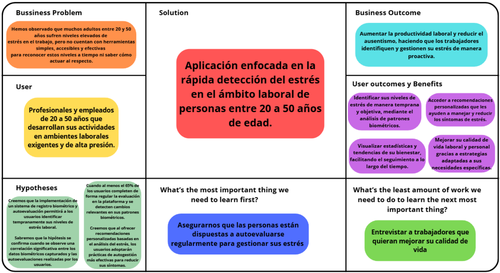</p>
</div>

## 1.3. Segmentos objetivo

#### Segmento objetivo #1: Trabajadores formales con jornadas extensas

Este segmento está compuesto por personas que cumplen horarios laborales prolongados, generalmente mayores a 8 horas diarias, y que enfrentan altos niveles de presión psicológica en su entorno profesional. La sobrecarga de trabajo y la falta de límites claros entre lo personal y lo laboral generan cuadros de estrés que afectan su rendimiento y calidad de vida. Según estudios realizados en distintos sectores, alrededor del 70% de los trabajadores presenta síntomas de estrés agudo en sus actividades cotidianas (Estudio LATAM, 2020). Este grupo constituye un eje clave para el éxito de la plataforma, al ser los principales beneficiarios de las capacidades que propone MinDora.

#### Segmento objetivo #2: Trabajadores informales o con horarios flexibles

Este segmento está compuesto por adultos que no necesariamente forman parte del empleo formal y cuyas actividades se desarrollan sin horarios fijos. A menudo, experimentan mayores niveles de estrés debido a la disponibilidad permanente que exige su trabajo, la inestabilidad económica y la dificultad para establecer límites entre la vida laboral y personal. Un estudio realizado a 250 trabajadores informales muestra que el 56% presenta un nivel medio de estrés, el 33.3% un nivel bajo y el 10.6% un nivel alto (Porcayo, 2022). Este grupo también se beneficiará de la plataforma, destacando su potencial para ampliar el alcance del producto en contextos laborales diversos y cada vez más comunes.

---

# Capítulo II: Requirements Development and Software Solution Design

## 2.1. Competidores

En este apartado analizaremos las posibles competencias para nuestra página web,
viendo en ello sus descripciones y planes de negocios.

| Competidores | Características                                                                                                                                                                                                                                                                              | Diferencias                                                                                                                                                                                              | Limitaciones                                                                                                                                                          |
| ------------ | -------------------------------------------------------------------------------------------------------------------------------------------------------------------------------------------------------------------------------------------------------------------------------------------- | -------------------------------------------------------------------------------------------------------------------------------------------------------------------------------------------------------- | --------------------------------------------------------------------------------------------------------------------------------------------------------------------- |
| **Calm**     | - Contiene un ejercicio de respiración para reducir el estrés.<br>- Cursos de 10 minutos al día para reducir el estrés.<br>- Ejercicios físicos tipo meditaciones para relajar el cuerpo.<br>- Historias en audiolibro para dormir mejor.                                                    | - Enfoque multimedia de alta producción con audios narrados por celebridades y música profesional.<br>- Contenido especializado por necesidad (estrés, concentración, sueño).                            | - La mayoría del contenido requiere suscripción de pago.<br>- No tiene controles parentales para gestionar el uso infantil.                                           |
| **Wysa**     | - Chatbot de apoyo emocional impulsado por IA.<br>- Ejercicios como respiraciones guiadas, meditaciones y relajación muscular.<br>- Privacidad: no requiere nombre real y las conversaciones son anónimas.<br>- Versión de pago con acceso a terapeutas profesionales.                       | - Interfaz conversacional con IA (diferente a Calm con audio y Equoo con juegos).<br>- Incorpora técnicas de CBT y DBT guiadas.<br>- Modelo freemium claro (chatbot gratuito + coaching humano de pago). | - No puede atender emergencias de salud mental ni sustituir atención profesional.<br>- Limitaciones técnicas para comprender lenguaje complejo y matices emocionales. |
| **Equoo**    | - Usa Terapia Cognitiva Conductual y psicología positiva para enseñar habilidades emocionales.<br>- Juego con 52 niveles sobre neuroticismo, amabilidad y reciprocidad.<br>- Chatbot personalizado de apoyo.<br>- Estudios clínicos respaldan su eficacia para reducir ansiedad y depresión. | - Experiencia gamificada con misiones y recompensas.<br>- Orientación a jóvenes con narrativa adaptada.<br>- Progresión tipo “nivel” con estadísticas, ausente en Calm y Wysa.                           | - Variedad limitada de juegos emocionales, lo que puede volverse repetitivo.<br>- El enfoque gamificado puede no resonar con quienes prefieren métodos más directos.  |

### 2.1.1. Análisis competitivo

| Criterio                                          | Calm                                                                                                                                                                                                      | Wysa                                                                                                                                                                          | Equoo                                                                                                                             |
| :------------------------------------------------ | :-------------------------------------------------------------------------------------------------------------------------------------------------------------------------------------------------------- | :---------------------------------------------------------------------------------------------------------------------------------------------------------------------------- | :-------------------------------------------------------------------------------------------------------------------------------- |
| **Perfil: Descripción**                           | Aplicación de bienestar mental para relajarse, dormir mejor y reducir el estrés. Ofrece meditaciones guiadas, historias para dormir, música relajante, ejercicios de respiración y clases de mindfulness. | Asistente de bienestar emocional basado en IA que ofrece terapia cognitivo-conductual (CBT), terapia dialéctica conductual (DBT), journaling y meditaciones, disponible 24/7. | Plataforma gamificada que desarrolla inteligencia emocional mediante juegos interactivos basados en psicología.                   |
| **Ventaja Competitiva**                           | Diversidad de maneras para relajarse; efectivo para cualquier necesidad.                                                                                                                                  | Combina un chatbot accesible 24/7 con técnicas terapéuticas validadas, y la opción de coaching humano para apoyo más profundo.                                                | Combina entretenimiento con técnicas psicológicas efectivas, aumentando la adherencia y el compromiso en el desarrollo emocional. |
| **Perfil de Marketing: Mercado Objetivo**         | Adultos entre 30 y 35 años con ingresos medio-altos que puedan pagar una suscripción.                                                                                                                     | Adultos jóvenes (18-35) y empresas que buscan herramientas de salud mental accesibles 24/7.                                                                                   | Adultos jóvenes (18-35), profesionales estresados, empresas e instituciones educativas.                                           |
| **Perfil de Marketing: Estrategias de marketing** | Modelo freemium, marketing con celebridades y alianzas con empresas.                                                                                                                                      | Marketing de contenidos, alianzas B2B y ASO con campañas en Instagram y LinkedIn.                                                                                             | Contenido educativo, partnerships B2B, campañas en redes sociales y pruebas gratuitas.                                            |
| **Perfil de Producto: Productos & Servicios**     | Meditaciones guiadas, historias para dormir, música relajante, ejercicios de respiración, clases de movimientos.                                                                                          | Chatbot gratuito con CBT/DBT y "pathways" temáticos; sesiones premium con coaches humanos.                                                                                    | App de entrenamiento emocional, versión empresarial y evaluaciones personalizadas.                                                |
| **Perfil de Producto: Precios & Costos**          | **Freemium**; plan mensual **15 USD**, anual **70 USD**, familiar **100 USD**, de por vida **400 USD**.                                                                                                   | **Freemium**; plan mensual **12 USD**, anual **19 USD**; tarifas corporativas variables.                                                                                      | **Freemium**; plan individual **$5-10/mes**, planes corporativos por volumen.                                                     |
| **Perfil de Producto: Canales de Distribución**   | App móvil (iOS/Android); plataforma web para empresas y coaching.                                                                                                                                         | App móvil (iOS/Android); plataforma web para empresas y coaching.                                                                                                             | Apps móviles (iOS/Android); plataforma web; integración con sistemas corporativos.                                                |
| **Análisis SWOT: Fortalezas**                     | Disponible 24/7, diversidad de opciones en la aplicación.                                                                                                                                                 | Disponible 24/7, técnicas terapéuticas validadas e interfaz intuitiva.                                                                                                        | Base científica sólida, formato atractivo, enfoque preventivo.                                                                    |
| **Análisis SWOT: Debilidades**                    | Precio elevado, no ofrece sesiones en vivo, enfoque principal para angloparlantes.                                                                                                                        | No reemplaza terapia presencial, contenido gratuito limitado, calidad dependiente de la IA.                                                                                   | Alta competencia, creación continua de contenido, percepción de ser una solución "ligera".                                        |
| **Análisis SWOT: Oportunidades**                  | Expansión internacional, integración con servicios de salud mental profesional.                                                                                                                           | Expansión en nuevos mercados, alianzas con telemedicina y wearables, localización cultural.                                                                                   | Creciente interés en salud mental, expansión internacional, integraciones tecnológicas.                                           |
| **Análisis SWOT: Amenazas**                       | Competencia intensa, precios más asequibles en otras apps.                                                                                                                                                | Competencia intensa, regulaciones de salud digital, preocupaciones por privacidad de datos.                                                                                   | Saturación del mercado, cambios en políticas de privacidad, escepticismo sobre la eficacia digital.                               |

### 2.1.2. Estrategias y tácticas frente a competidores

**FODA de nuestra empresa: "NeuroZen"**

F: Sistema de detección rápida de estrés laboral con test personalizados y conexión directa a
profesionales de salud mental.

O: Creciente conciencia sobre salud mental en empresas y mayor disposición a invertir en bienestar
laboral.

D: Posible resistencia de los usuarios a reconocer problemas de estrés y dependencia de la honestidad
en las respuestas al test.

A: Aparición de soluciones similares en el mercado y preocupaciones sobre confidencialidad de datos
sensibles de salud mental.

Para aprovechar las fortalezas y oportunidades de "NeuroZen", y al mismo tiempo enfrentar las
debilidades y contrarrestar las amenazas del entorno competitivo, podemos considerar las siguientes
estrategias y tácticas:

● Desarrollar programas de implementación corporativa que incluyan talleres de sensibilización
sobre la importancia de la salud mental.

● Establecer alianzas con empresas de seguros médicos para ofrecer descuentos a
organizaciones que implementen nuestro sistema preventivo.

● Implementar tecnología de análisis de comportamiento que complemente las respuestas
subjetivas del test con indicadores objetivos.

● Crear un sólido programa de certificación en privacidad de datos y comunicarlo claramente a
usuarios y empresas clientes.

● Generar reportes anónimos agregados para departamentos de RR.HH. que muestren el ROI en
términos de reducción de ausentismo y mejora de productividad.

## 2.2. Entrevistas.

---

### 2.2.1. Diseño de entrevistas

**Segmento: Personas activas en el ámbito laboral con jornadas extendidas**

Para evaluar las necesidades y experiencias de profesionales con horarios laborales extensos que
enfrentan altos niveles de estrés, hemos desarrollado una serie de preguntas enfocadas en comprender
su rutina diaria, factores estresantes, y estrategias actuales para manejar la presión laboral. Esta
información nos permitirá identificar oportunidades para que nuestra plataforma ofrezca soluciones
efectivas que mejoren su calidad de vida y rendimiento profesional.

Introducción:

Buenos días/tardes, soy [...], representante de [Nombre del Proyecto]. Estamos
desarrollando una plataforma destinada a ayudar a profesionales con horarios laborales extensos a
manejar mejor el estrés y mejorar su calidad de vida. Nos gustaría conocer más sobre tu experiencia
laboral y los desafíos que enfrentas en tu día a día. Tu perspectiva será muy valiosa para desarrollar
una solución que realmente responda a las necesidades de personas como tú.

Preguntas:

1. Para comenzar, ¿podrías presentarte y contarnos brevemente sobre tu profesión y el sector en
   el que trabajas?
2. ¿Cómo describirías una jornada laboral típica para ti? ¿Cuántas horas trabajas habitualmente?
3. ¿Qué aspectos de tu trabajo consideras que generan mayor presión o estrés?
4. ¿Has notado cambios en tu salud física o mental que atribuyas al estrés laboral?
5. ¿Cómo suele afectar el estrés laboral a tu rendimiento en el trabajo y a tu vida personal?
6. ¿Qué estrategias utilizas actualmente para manejar el estrés relacionado con tu trabajo?
7. ¿Tu empresa o lugar de trabajo ofrece algún programa o recurso para ayudar a los empleados
   a manejar el estrés?
8. En los momentos de mayor presión laboral, ¿qué tipo de apoyo o herramientas te resultarían
   más útiles?
9. ¿Utilizas actualmente alguna aplicación o plataforma digital para gestionar el estrés o mejorar
   tu bienestar? Si es así, ¿cuál y qué te parece?
10. ¿Qué características o funcionalidades consideras importantes en una plataforma diseñada
    para ayudar a reducir el estrés laboral?

**Segmento: Adultos entre 20 y 50 años con trabajo informal o sin horarios definidos**

Para evaluar las necesidades y experiencias de adultos que trabajan en el sector informal o con
horarios no definidos, hemos desarrollado preguntas orientadas a comprender cómo manejan sus
tiempos, los factores estresantes específicos de su situación laboral y sus mecanismos actuales para
gestionar el estrés. Esta información nos permitirá adaptar nuestra plataforma para ofrecer soluciones
que respondan a las características particulares de este segmento, que según estudios, experimenta
niveles variables de estrés debido a la naturaleza omnipresente de su trabajo.

Introducción:

Buenos días/tardes, soy [...], representante de NeuroZen. Estamos desarrollando una
plataforma para ayudar a personas que trabajan sin horarios fijos o en el sector informal a manejar
mejor el estrés y mejorar su calidad de vida. Nos interesa conocer tu experiencia para crear una
solución que realmente funcione para personas como tú. Agradecemos mucho tu tiempo y sinceridad
en esta conversación.

Preguntas:

1. Para empezar, ¿podrías contarnos a qué te dedicas y cómo es tu rutina de trabajo habitual?
2. ¿Cómo organizas tu tiempo entre el trabajo y otras actividades? ¿Tienes algún método para
   establecer límites?
3. ¿Sientes que tu trabajo "te sigue a todas partes"? ¿Puedes describir cómo es esa experiencia?
4. ¿Cuáles son los principales factores que te generan estrés en tu trabajo?
5. ¿Cómo describirías el nivel de estrés que experimentas habitualmente (bajo, medio, alto)?
   ¿Varía mucho dependiendo de las temporadas o circunstancias?
6. ¿De qué manera crees que el no tener un horario fijo afecta tu nivel de estrés, en comparación
   con trabajos formales con horarios establecidos?
7. ¿Has notado algún impacto en tu salud física o mental debido al estrés relacionado con tu
   trabajo?
8. ¿Qué estrategias o métodos utilizas actualmente para manejar el estrés cuando sientes que el
   trabajo invade todos los aspectos de tu vida?
9. ¿Utilizas alguna aplicación, plataforma o recurso digital para ayudarte a organizar tu trabajo o
   manejar el estrés? ¿Cuál ha sido tu experiencia?
10. ¿Qué momentos del día considerarías más apropiados para dedicar tiempo a actividades para
    reducir el estrés?

### 2.2.2. Registro de entrevistas

**Segmento 1: Personas activas en el ámbito laboral con jornadas extendidas**

Entrevista N°1

● Nombre: Enzo Joaquín Alatrista Amaya.

● Sexo: Masculino.

● Edad: 25.

● Estado Civil: Soltero.

● Labor: Ingeniero de Sistemas.

Detalles de la entrevista:

● Duración: 03:26

[● Link: https://drive.google.com/file/d/13V0bp8f4mNgHBX6nU5c74mhhuCYzXYmT/view?usp=sharing](https://drive.google.com/file/d/13V0bp8f4mNgHBX6nU5c74mhhuCYzXYmT/view?usp=sharing)

Resumen de los puntos clave en la entrevista:

La entrevista con Enzo, ingeniero de sistemas de 25 años, revela el alto nivel de presión en el
sector tecnológico. Sus jornadas laborales de hasta 11 horas, sumadas a la disponibilidad
constante y los cambios de último minuto, han afectado su salud con insomnio, dolores de
cabeza e irritabilidad. Esto impacta su productividad y vida personal, generando agotamiento
emocional. Aunque intenta manejar el estrés con caminatas y ejercicios de respiración, su
rutina no le permite ser constante. Su empresa no ofrece apoyo real para el manejo del estrés,
más allá de charlas esporádicas. Enzo valora herramientas simples y accesibles, con
recordatorios para pausas, ejercicios rápidos y la opción de contactar a un profesional desde
la misma app.

Entrevista N°2

● Nombre: Andrés Luján Carrión

● Sexo: Masculino

● Edad: 40

● Estado Civil: Soltero

● Labor: Rector(USL)

Detalles de la entrevista:

● Duración: 4min11seg

[● Link: https://drive.google.com/file/d/1aePzhaW86rM-1leKeeb1c65SbWk9Y0yZ/view?usp=sharing](https://drive.google.com/file/d/1aePzhaW86rM-1leKeeb1c65SbWk9Y0yZ/view?usp=sharing)

Resumen de los puntos clave en la entrevista:

- El entrevistado trabaja entre 10 y 12 horas diarias.
- Su principal fuente de estrés son la necesidad de resultados rápidos frente a cambios que
  requieren tiempo.
- Ha notado fatiga mental, insomnio y tensión muscular.
- Le parecerían útiles herramientas como coaching personalizado y plataformas digitales.
- Le gustaría que la aplicación contase con coaching emocional, seguimiento de estrés y una
  comunidad de apoyo.

  Entrevista N°3

● Nombre: Valentina Flores.

● Sexo: Femenino.

● Edad: 24 años.

● Estado Civil: Soltera.

● Labor: Analista de Recursos Humanos.

Detalles de la entrevista:

● Duración: 02:25

[● Link: https://drive.google.com/file/d/10gpZrHKXRZATb-VCJ6RAm-Zu81CONRbT/view?usp=sharing](https://drive.google.com/file/d/10gpZrHKXRZATb-VCJ6RAm-Zu81CONRbT/view?usp=sharing)

Resumen de los puntos clave en la entrevista:

La entrevista con Valentina Flores (24 años), analista de Recursos Humanos, evidencia cómo las
jornadas extensas y la alta carga laboral generan estrés, insomnio y agotamiento emocional.
El estrés afecta su concentración, estado de ánimo y vida personal. Aunque intenta aliviarlo con
pausas o caminatas, la falta de tiempo y apoyo institucional limita sus esfuerzos. Valentina
considera útil una app con ejercicios guiados, recordatorios y seguimiento emocional, que le
ayude a equilibrar su bienestar en el entorno laboral.

**Segmento 2: Adultos entre 20 y 50 años con trabajo informal o sin horarios definidos**

Entrevista N°4

● Nombre: Cristofer Pablo Paucar

● Sexo: Masculino

● Edad: 21

● Estado Civil: Soltero

● Labor: Repartidor

Detalles de la entrevista:

● Duración: 6:27

[● Link: https://drive.google.com/file/d/1SRe3Ilrde37SMS8YGALvpk9OqU4jpwh0/view?usp=sharing](https://drive.google.com/file/d/1SRe3Ilrde37SMS8YGALvpk9OqU4jpwh0/view?usp=sharing)

Resumen de los puntos clave en la entrevista:

La entrevista con Cristofer Paucar, un repartidor delivery de 21 años que trabaja sin un
horario fijo. Organiza su jornada en función de la demanda y necesidades económicas, lo que
implica horarios variables que a menudo se extienden hasta la noche. Reconoce que tiene
dificultades para establecer límites entre su vida personal y laboral, ya que su trabajo "lo
sigue a todas partes" debido a la constante atención al celular.
Los principales factores de estrés que enfrenta son la inestabilidad laboral, la incertidumbre
económica, fallas en las aplicaciones de reparto, el tráfico, clientes exigentes y el desgaste
físico. Califica su nivel de estrés como medio, aunque se eleva en situaciones específicas
como fines de mes o días lluviosos.

Cristofer considera que la falta de un horario fijo agrava el estrés al dificultar la separación
entre el trabajo y la vida personal. Ha notado efectos negativos en su salud física y mental,
incluyendo dolores corporales, cansancio, insomnio e irritabilidad. Para manejar el estrés,
intenta desconectarse ocasionalmente, escuchar música o realizar actividades recreativas,
aunque no siempre lo logra. Si bien usa aplicaciones básicas para organizar su vida personal,
no emplea herramientas específicas para el manejo del estrés, pero le gustaría explorar
alguna. Identifica la mañana y la noche como los momentos más adecuados para realizar
actividades relajantes, aunque muchas veces depende del flujo de trabajo diario.

Entrevista N°5

● Nombre: Laura Méndez

● Sexo: Mujer

● Edad: 24 años

● Estado Civil: Soltera

● Labor: Freelancer diseñadora gráfica y fotógrafa de eventos

Detalles de la entrevista:

● Duración: 8 minutos con 39 segundos

[● Link: https://drive.google.com/file/d/1qmh7C8VD0SDWj4DvPe7hUj3HFCdga7o5/view?usp=sharing](https://drive.google.com/file/d/1qmh7C8VD0SDWj4DvPe7hUj3HFCdga7o5/view?usp=sharing)

Resumen de los puntos clave en la entrevista:

La entrevista con Laura Méndez, una diseñadora gráfica freelance y fotógrafa de 24 años,
revela los desafíos únicos que enfrenta como trabajadora con horarios irregulares. Su
situación laboral se caracteriza por la ausencia de límites entre vida personal y profesional,
con un teléfono que funciona como "oficina móvil" y clientes que esperan disponibilidad
constante. Los principales factores de estrés identificados incluyen la inestabilidad económica
que la lleva a sobrecargarse de trabajo, las expectativas poco realistas de los clientes, y la
imposibilidad de desconectar completamente, resultando en un nivel de estrés medio-alto con
picos que afectan su salud física y creatividad. Aunque intenta implementar estrategias como
yoga o ejercicio, estas prácticas son inconsistentes debido a su carga laboral, por lo que
necesita soluciones flexibles que se adapten a su ritmo caótico: herramientas rápidas
accesibles desde el móvil, técnicas para establecer límites sin perder clientes y métodos
efectivos para "apagar" su mente al finalizar la jornada.

Entrevista N°6

● Nombre: Jose Feliciano

● Sexo: Hombre

● Edad: 56 años

● Estado Civil: Casado

● Labor: Trabajador independiente en Software.

Detalles de la entrevista:

● Duración: 2 minutos con 50 segundos

[● Link:https://drive.google.com/file/d/1x6wdR-u7jdTX1J-8nMbbKf8xzeWVYhVH/view](https://drive.google.com/file/d/1x6wdR-u7jdTX1J-8nMbbKf8xzeWVYhVH/view)

Resumen de los puntos clave en la entrevista:

La entrevista con José Feliciano, un trabajador independiente en software de 56 años, muestra las dificultades de mantener equilibrio entre la vida laboral y personal cuando se trabaja por cuenta propia. Su rutina varía constantemente, sin horarios fijos, lo que le genera complicaciones para desconectarse del trabajo. José comenta que su celular y laptop son herramientas esenciales pero también fuentes de distracción y presión constante. Entre los principales factores de estrés menciona los plazos ajustados, los cambios imprevistos y la falta de pausas reales durante el día. Describe su nivel de estrés como medio, con aumentos en épocas de alta carga laboral. Este estilo de trabajo flexible le otorga libertad, pero también incrementa su dificultad para descansar y cuidar su salud, notando síntomas como dolores de cabeza y cansancio. Para manejar el estrés recurre a caminatas, música y pausas cortas, además de apoyarse en herramientas digitales como Google Calendar y Notion. Considera que los mejores momentos para relajarse son las noches o las mañanas antes de empezar la jornada.

### 2.2.3. Análisis de entrevistas

**Segmento 1: Personas activas en el ámbito laboral con jornadas extendidas**

Hallazgos:

● Los profesionales experimentan jornadas laborales extendidas de 10-12 horas diarias,
sin límites claros entre vida laboral y personal.

● Enfrentan presión constante por resultados inmediatos ante cambios que requieren
tiempo.

● Presentan síntomas físicos y emocionales similares: fatiga mental, insomnio, tensión
muscular, irritabilidad y dolores de cabeza.

● Las empresas ofrecen poco o nulo apoyo real para el manejo del estrés laboral.

● Aunque intentan implementar técnicas de manejo del estrés, la carga laboral impide
ser constantes.

● Valoran soluciones digitales accesibles, rápidas y adaptables a sus horarios saturados.

Conclusión:

Los profesionales con jornadas extendidas constituyen un segmento vulnerable al estrés
crónico debido a la combinación de largas horas de trabajo, disponibilidad permanente y
presión por resultados inmediatos. Sus intentos individuales de manejar el estrés mediante
técnicas convencionales resultan insuficientes ante la falta de límites laborales claros y apoyo
institucional. Este grupo necesita soluciones tecnológicas personalizadas que se integren
fácilmente a su rutina, ofrezcan intervenciones breves pero efectivas, y proporcionen tanto
seguimiento automatizado como acceso a apoyo profesional cuando sea necesario. La
aplicación debe enfocarse en crear micro hábitos de bienestar que puedan sostenerse incluso
en entornos laborales exigentes, permitiéndoles recuperar el equilibrio sin comprometer su
desempeño profesional.

**Segmento 2: Adultos entre 20 y 50 años con trabajo informal o sin horarios definidos**

Hallazgos:

● Ausencia de límites trabajo-vida personal: Ambos experimentan una fusión entre su
vida laboral y personal, con el teléfono móvil como vínculo constante al trabajo.

● Horarios irregulares: Ninguno tiene un horario fijo, organizándose según demanda y
necesidades económicas.

● Principales factores de estrés: Comparten preocupaciones por la inestabilidad
económica, las expectativas de disponibilidad constante y la dificultad para
desconectar.

● Impacto en la salud: Ambos reportan efectos negativos como dolores físicos,
cansancio e irritabilidad.

● Estrategias de afrontamiento inconsistentes: Aunque intentan aplicar métodos para
manejar el estrés (música, ejercicio, yoga), no logran mantenerlos de forma regular.

● Necesidad de herramientas adaptables: Los dos expresan interés en explorar
soluciones que se ajusten a sus horarios variables.

Conclusión:

Los testimonios de Cristofer y Laura revelan una realidad laboral cada vez más común:
trabajadores con horarios flexibles que enfrentan una constante disponibilidad laboral
mediada por dispositivos móviles, generando una difuminación de límites entre trabajo y vida
personal que impacta negativamente su bienestar. Esta situación crea un ciclo donde la
inestabilidad económica los impulsa a aceptar más trabajo, intensificando el estrés y
deteriorando su salud física y mental. Sus casos evidencian la necesidad urgente de
desarrollar herramientas y estrategias específicamente diseñadas para trabajadores con
horarios irregulares, que sean accesibles desde dispositivos móviles, requieran poco tiempo
de implementación y ayuden efectivamente a establecer límites saludables sin comprometer
su sustento económico.

## 2.3. Needfinding

Al recopilar toda la información de los segmentos objetivo y realizar las entrevistas se hará
un análisis de estos mismos haciendo uso de User Persona, Task Matrix, Journey Mapping,
Empathy Mapping y As-Is Scenario Mapping.

### 2.3.1. User Personas

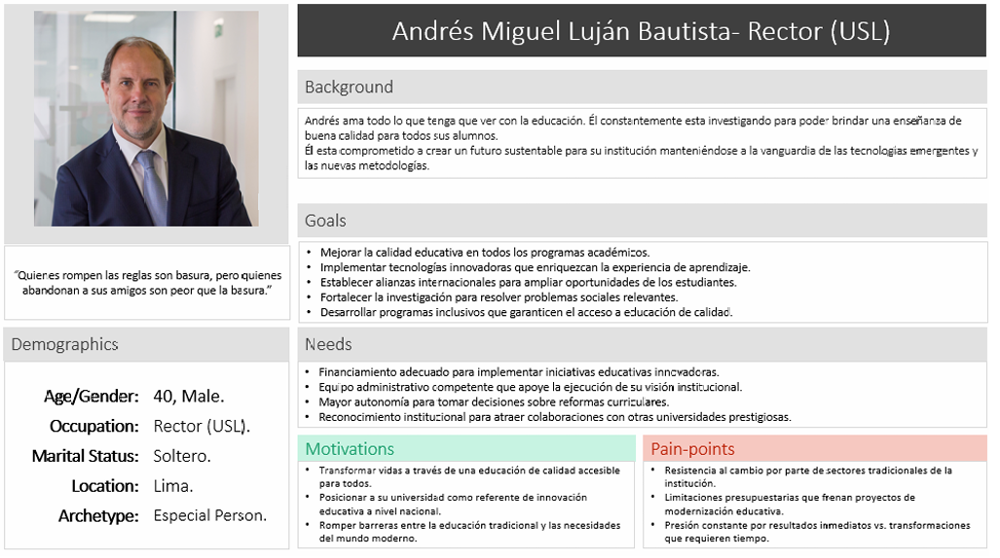<br>

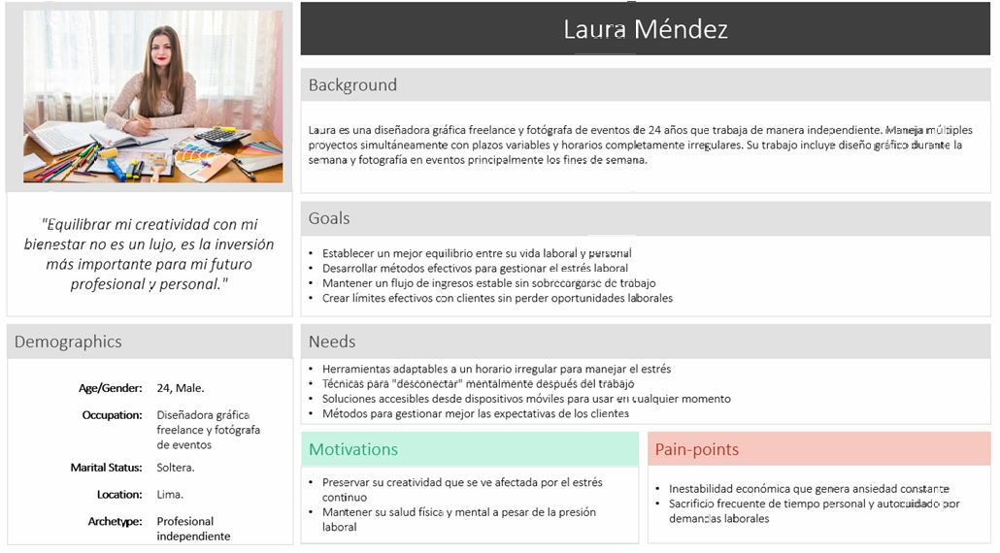<br>

### 2.3.2. User Task Matrix

| Tareas                                                 | Laura Frecuencia | Laura Importancia | Andrés Frecuencia | Andrés Importancia |
| ------------------------------------------------------ | ---------------- | ----------------- | ----------------- | ------------------ |
| Registrar señales corporales de estrés                 | Media            | Media             | Alta              | Alta               |
| Completar autoevaluación de niveles de estrés          | Media            | Alta              | Alta              | Media              |
| Consultar análisis de patrones de estrés               | Alta             | Media             | Media             | Alta               |
| Acceder a recomendaciones personalizadas               | Media            | Alta              | Alta              | Alta               |
| Registrar seguimiento de implementación de estrategias | Media            | Alta              | Alta              | Alta               |

### 2.3.3. User Journey Mapping

<div>
  <p align="center">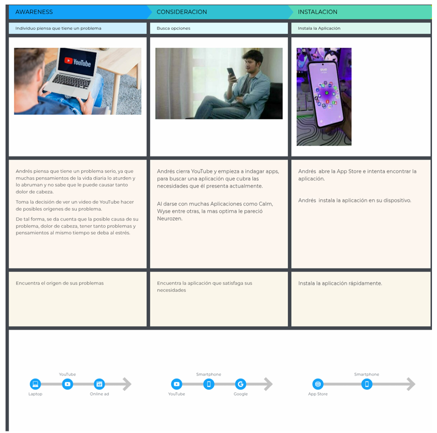</p>
</div>
<div>
  <p align="center">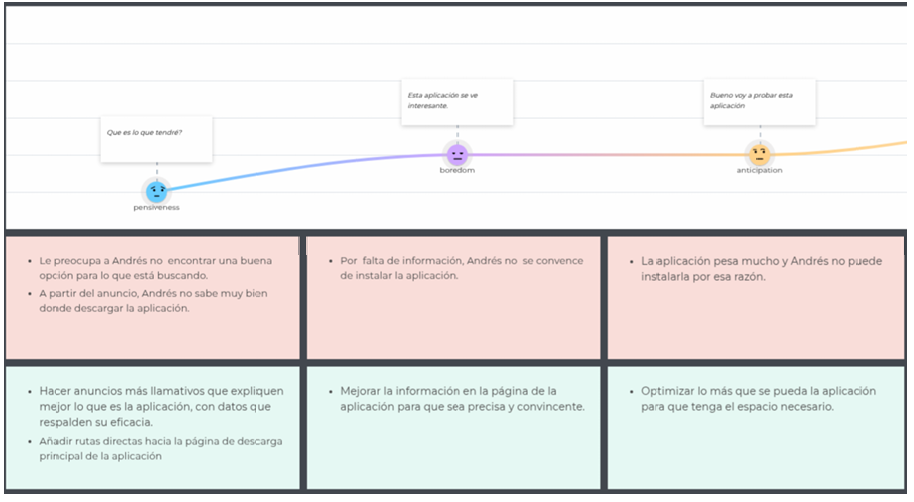</p>
</div>
<div>
  <p align="center">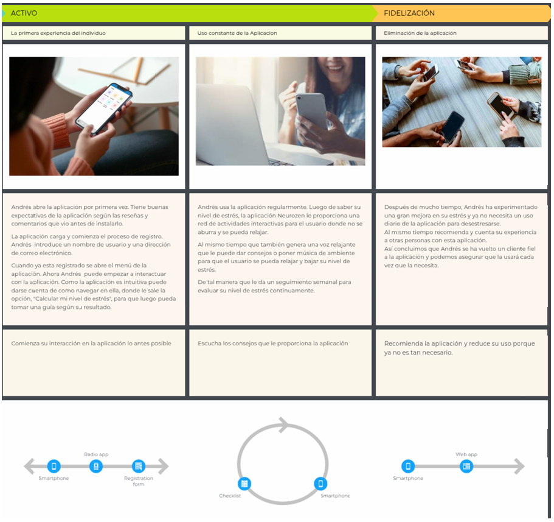</p>
</div>
<div>
  <p align="center">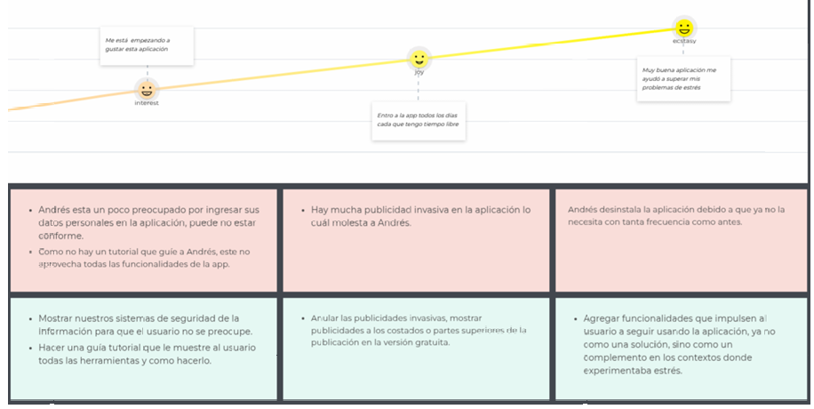</p>
</div>

### 2.3.4. Empathy Mapping

<div>
  <p align="center">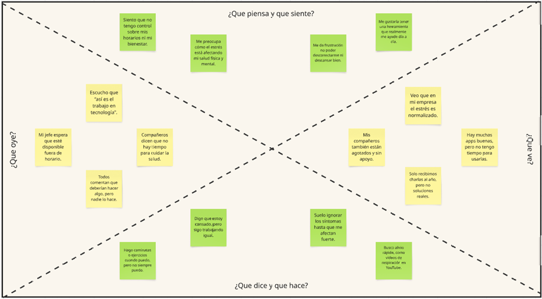</p>
</div>

<div>
  <p align="center">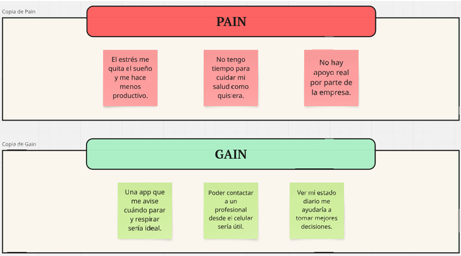</p>
</div>

<div>
  <p align="center">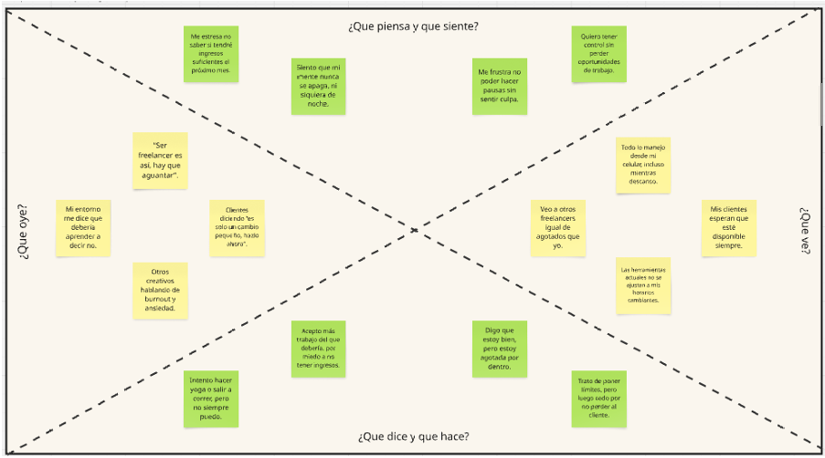</p>
</div>

<div>
  <p align="center">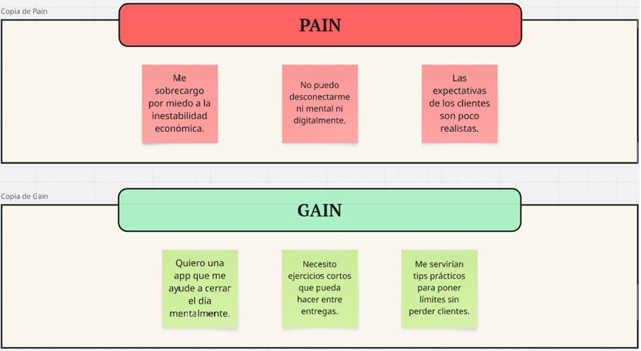</p>
</div>

### 2.3.5. Big Picture EventStorming

### 2.3.6. Ubiquitous Language

Este glosario define los términos clave que usamos en el proyecto para mantener un lenguaje común entre el equipo de desarrollo y los expertos en salud mental.

| Término                            | Definición                                                                                                                     |
| ---------------------------------- | ------------------------------------------------------------------------------------------------------------------------------ |
| **Usuario**                        | Persona adulta (20–50 años) que utiliza la app para evaluar, monitorear y gestionar su estrés laboral.                         |
| **Perfil biométrico**              | Conjunto de datos físicos iniciales del usuario (postura, rostro, respiración) que sirven como línea base.                     |
| **Test de autoevaluación**         | Cuestionario digital que mide síntomas y sensaciones de estrés percibidas por el usuario.                                      |
| **Análisis biométrico**            | Proceso de escaneo mediante la cámara/sensores para detectar señales físicas de estrés.                                        |
| **Síntomas físicos**               | Manifestaciones registradas por el usuario, como dolores de cabeza, insomnio, tensión muscular.                                |
| **Nivel de estrés**                | Clasificación automática (bajo, medio, alto) que combina datos de tests y biometría.                                           |
| **Recomendaciones personalizadas** | Consejos, ejercicios o pausas sugeridas por la app en base al estado actual del usuario.                                       |
| **Ejercicios de respiración**      | Actividad guiada por la app para reducir la tensión y ansiedad en pocos minutos.                                               |
| **Pausas activas**                 | Recordatorios programados que invitan al usuario a descansar o hacer micro ejercicios durante la jornada laboral.              |
| **Dashboard personal**             | Panel con estadísticas, tendencias y patrones de estrés en el tiempo.                                                          |
| **Desencadenante de estrés**       | Evento o situación registrada por el usuario que provoca incremento de su estrés (ej. exceso de trabajo, conflictos, tráfico). |
| **Informe de progreso**            | Documento generado con evolución de estrés y hábitos del usuario, que puede compartirse con un psicólogo.                      |
| **Especialista en salud mental**   | Psicólogo disponible en la plataforma para consultas y tratamiento profesional.                                                |
| **Cita**                           | Agendamiento de una sesión con un especialista, virtual o presencial.                                                          |
| **Grupo de apoyo**                 | Comunidad virtual de usuarios que comparten experiencias y consejos sobre el manejo del estrés.                                |
| **Biblioteca de recursos**         | Colección digital de artículos, videos o guías relacionadas al bienestar laboral y manejo del estrés.                          |

## 2.4. Requirements specification

### 2.4.1. User Stories

| **Epic ID** | **Nombre del Epic**                        | **Descripción**                                                                                                                                                                                                  |
| ----------- | ------------------------------------------ | ---------------------------------------------------------------------------------------------------------------------------------------------------------------------------------------------------------------- |
| EP01        | Registro y Configuración de Cuenta         | Como usuario nuevo, quiero registrarme, configurar mi perfil biométrico y completar un cuestionario inicial de salud, para acceder a la plataforma con un perfil personalizado y preciso.                        |
| EP02        | Detección y Evaluación del Estrés          | Como usuario, quiero evaluar mi nivel de estrés mediante autoevaluaciones, análisis biométricos y registro de síntomas, para obtener un diagnóstico completo de mi estado actual.                                |
| EP03        | Recomendaciones y Gestión del Estrés       | Como usuario diagnosticado con estrés, quiero recibir recomendaciones personalizadas, acceder a ejercicios de respiración y programar pausas activas, para reducir mis niveles de estrés y mejorar mi bienestar. |
| EP04        | Seguimiento y Análisis del Progreso        | Como usuario, quiero visualizar un dashboard personal, generar informes de progreso y registrar desencadenantes de estrés, para dar seguimiento a mi evolución y entender mis patrones de estrés.                |
| EP05        | Conexión con Especialistas en Salud Mental | Como usuario con necesidad de apoyo profesional, quiero buscar psicólogos, agendar citas y compartir informes, para recibir tratamiento especializado dentro de la plataforma.                                   |
| EP06        | Comunidad y Soporte Social                 | Como usuario, quiero participar en grupos de apoyo, acceder a una biblioteca de recursos y unirme a desafíos antiestrés, para sentir acompañamiento social y mantener la motivación en la gestión de mi estrés.  |
| EP07        | Integración con Entorno Laboral            | Como trabajador, quiero analizar mi carga laboral y recibir recordatorios de ergonomía, para prevenir sobrecarga y mejorar mi productividad sin comprometer mi bienestar.                                        |

| ID Épica | Épica                              | ID HU | Título HU                               | Descripción HU                                                                                                                     | Criterios de Aceptación                                                                                                                                                                                                                                                                                                                                                                            |
| -------- | ---------------------------------- | ----- | --------------------------------------- | ---------------------------------------------------------------------------------------------------------------------------------- | -------------------------------------------------------------------------------------------------------------------------------------------------------------------------------------------------------------------------------------------------------------------------------------------------------------------------------------------------------------------------------------------------- |
| EP01     | Registro y Configuración de Cuenta | US01  | Registrar cuenta de usuario             | Como nuevo usuario, quiero registrar una cuenta con mi correo o número de teléfono, para acceder a las funciones de la aplicación. | **Escenario 1: Registro exitoso**<br>Dado que el usuario no tiene cuenta,<br>Cuando ingresa sus datos obligatorios y acepta términos,<br>Entonces el sistema crea la cuenta y envía verificación.<br><br>**Escenario 2: Registro fallido**<br>Dado que el usuario ingresa datos inválidos,<br>Cuando intenta registrarse,<br>Entonces el sistema muestra mensaje de error y no crea cuenta.        |
| EP01     | Registro y Configuración de Cuenta | US02  | Configurar perfil biométrico            | Como usuario, quiero registrar mis datos biométricos para personalizar el análisis de estrés.                                      | **Escenario 1: Configuración inicial**<br>Dado que el usuario tiene cuenta activa,<br>Cuando registra o sincroniza datos biométricos,<br>Entonces el sistema los guarda y usa en futuros análisis.<br><br>**Escenario 2: Error de sincronización**<br>Dado que el usuario conecta un dispositivo,<br>Cuando ocurre un error,<br>Entonces el sistema muestra advertencia y permite reintentar.      |
| EP01     | Registro y Configuración de Cuenta | US03  | Completar cuestionario inicial de salud | Como usuario nuevo, quiero completar un cuestionario de salud para generar mi plan inicial.                                        | **Escenario 1: Cuestionario completado**<br>Dado que el usuario accede al cuestionario inicial,<br>Cuando responde todas las preguntas,<br>Entonces el sistema guarda respuestas y genera perfil.<br><br>**Escenario 2: Cuestionario incompleto**<br>Dado que el usuario abandona el cuestionario,<br>Cuando vuelve a ingresar,<br>Entonces el sistema permite retomar desde el progreso guardado. |

| ID Épica | Épica                             | ID HU | Título HU                                 | Descripción HU                                                                                      | Criterios de Aceptación                                                                                                                                                                                                                                                                                                             |
| -------- | --------------------------------- | ----- | ----------------------------------------- | --------------------------------------------------------------------------------------------------- | ----------------------------------------------------------------------------------------------------------------------------------------------------------------------------------------------------------------------------------------------------------------------------------------------------------------------------------- |
| EP02     | Detección y Evaluación del Estrés | US04  | Realizar test de autoevaluación de estrés | Como usuario, quiero realizar un test de estrés para conocer mi nivel actual.                       | **Escenario 1: Test completado**<br>Dado que el usuario accede al test,<br>Cuando responde todas las preguntas,<br>Entonces el sistema muestra resultado inmediato.<br><br>**Escenario 2: Test incompleto**<br>Dado que el usuario abandona el test,<br>Cuando regresa,<br>Entonces el sistema guarda progreso y permite retomarlo. |
| EP02     | Detección y Evaluación del Estrés | US05  | Análisis biométrico de señales de estrés  | Como usuario, quiero que la app analice mis datos biométricos para detectar estrés automáticamente. | **Escenario 1: Análisis exitoso**<br>Dado que el usuario sincronizó su dispositivo,<br>Cuando los datos se reciben,<br>Entonces el sistema calcula nivel de estrés.<br><br>**Escenario 2: Datos insuficientes**<br>Dado que faltan datos,<br>Cuando se intenta analizar,<br>Entonces el sistema notifica al usuario.                |
| EP02     | Detección y Evaluación del Estrés | US06  | Registro de síntomas físicos              | Como usuario, quiero registrar manualmente mis síntomas físicos para complementar el análisis.      | **Escenario 1: Registro exitoso**<br>Dado que el usuario accede a “Síntomas”,<br>Cuando ingresa información,<br>Entonces el sistema guarda los datos.<br><br>**Escenario 2: Validación**<br>Dado que el usuario omite un campo obligatorio,<br>Cuando intenta guardar,<br>Entonces el sistema solicita completar el campo.          |

| ID Épica | Épica                                | ID HU | Título HU                                  | Descripción HU                                                                | Criterios de Aceptación                                                                                                                                                                                                                                                                                                                                                                           |
| -------- | ------------------------------------ | ----- | ------------------------------------------ | ----------------------------------------------------------------------------- | ------------------------------------------------------------------------------------------------------------------------------------------------------------------------------------------------------------------------------------------------------------------------------------------------------------------------------------------------------------------------------------------------- |
| EP03     | Recomendaciones y Gestión del Estrés | US07  | Recibir recomendaciones personalizadas     | Como usuario, quiero recibir recomendaciones basadas en mi perfil de estrés.  | **Escenario 1: Recomendaciones generadas**<br>Dado que el usuario completó cuestionario y biometría,<br>Cuando accede a recomendaciones,<br>Entonces el sistema muestra sugerencias personalizadas.<br><br>**Escenario 2: Falta de datos**<br>Dado que el usuario no completó su perfil,<br>Cuando intenta ver recomendaciones,<br>Entonces el sistema muestra mensaje indicando datos faltantes. |
| EP03     | Recomendaciones y Gestión del Estrés | US08  | Realizar ejercicios de respiración guiados | Como usuario, quiero realizar ejercicios guiados para reducir el estrés.      | **Escenario 1: Ejercicio completado**<br>Dado que el usuario selecciona un ejercicio,<br>Cuando lo finaliza,<br>Entonces el sistema registra la actividad.<br><br>**Escenario 2: Interrupción**<br>Dado que el usuario abandona el ejercicio,<br>Cuando regresa,<br>Entonces el sistema permite reiniciar o continuar.                                                                            |
| EP03     | Recomendaciones y Gestión del Estrés | US09  | Programar pausas activas laborales         | Como usuario, quiero programar pausas para reducir mi carga laboral y estrés. | **Escenario 1: Pausa programada**<br>Dado que el usuario accede a la agenda,<br>Cuando programa una pausa,<br>Entonces el sistema guarda recordatorio.<br><br>**Escenario 2: Notificación**<br>Dado que se acerca la pausa,<br>Cuando llega la hora,<br>Entonces el sistema envía recordatorio.                                                                                                   |

| ID Épica | Épica                               | ID HU | Título HU                               | Descripción HU                                                                     | Criterios de Aceptación                                                                                                                                                                                                                                                                                                               |
| -------- | ----------------------------------- | ----- | --------------------------------------- | ---------------------------------------------------------------------------------- | ------------------------------------------------------------------------------------------------------------------------------------------------------------------------------------------------------------------------------------------------------------------------------------------------------------------------------------- |
| EP04     | Seguimiento y Análisis del Progreso | US10  | Visualizar dashboard personal de estrés | Como usuario, quiero ver mi estado actual de estrés en un dashboard.               | **Escenario 1: Dashboard con datos**<br>Dado que el usuario tiene registros,<br>Cuando ingresa al dashboard,<br>Entonces el sistema muestra sus métricas.<br><br>**Escenario 2: Sin datos**<br>Dado que no hay registros,<br>Cuando accede,<br>Entonces el sistema indica que aún no hay información.                                 |
| EP04     | Seguimiento y Análisis del Progreso | US11  | Generar informes de progreso            | Como usuario, quiero generar informes para evaluar mis avances.                    | **Escenario 1: Informe generado**<br>Dado que el usuario selecciona un periodo,<br>Cuando solicita un informe,<br>Entonces el sistema genera reporte descargable.<br><br>**Escenario 2: Falta de datos**<br>Dado que el usuario no tiene registros,<br>Cuando intenta generar,<br>Entonces el sistema muestra advertencia.            |
| EP04     | Seguimiento y Análisis del Progreso | US12  | Registrar desencadenantes de estrés     | Como usuario, quiero registrar situaciones que detonan mi estrés para analizarlas. | **Escenario 1: Registro exitoso**<br>Dado que el usuario accede a “Desencadenantes”,<br>Cuando ingresa información,<br>Entonces el sistema guarda el registro.<br><br>**Escenario 2: Registro incompleto**<br>Dado que el usuario no llena campos obligatorios,<br>Cuando intenta guardar,<br>Entonces el sistema solicita completar. |

| ID Épica | Épica                      | ID HU | Título HU                            | Descripción HU                                                                | Criterios de Aceptación                                                                                                                                                                                                                                                                                                                  |
| -------- | -------------------------- | ----- | ------------------------------------ | ----------------------------------------------------------------------------- | ---------------------------------------------------------------------------------------------------------------------------------------------------------------------------------------------------------------------------------------------------------------------------------------------------------------------------------------- |
| EP05     | Conexión con Especialistas | US13  | Buscar psicólogos especializados     | Como usuario, quiero buscar psicólogos según especialidad para recibir apoyo. | **Escenario 1: Búsqueda exitosa**<br>Dado que el usuario accede a la búsqueda,<br>Cuando ingresa criterios,<br>Entonces el sistema muestra psicólogos disponibles.<br><br>**Escenario 2: Sin resultados**<br>Dado que no hay coincidencias,<br>Cuando busca,<br>Entonces el sistema muestra mensaje indicando que no hay psicólogos.     |
| EP05     | Conexión con Especialistas | US14  | Agendar cita con psicólogo           | Como usuario, quiero agendar una cita en línea con un psicólogo.              | **Escenario 1: Cita agendada**<br>Dado que el usuario selecciona especialista y horario,<br>Cuando confirma,<br>Entonces el sistema guarda la cita.<br><br>**Escenario 2: Conflicto de horario**<br>Dado que ya existe una cita en ese horario,<br>Cuando intenta reservar,<br>Entonces el sistema muestra error y solicita otra opción. |
| EP05     | Conexión con Especialistas | US15  | Compartir informes con especialistas | Como usuario, quiero compartir mis informes de progreso con un psicólogo.     | **Escenario 1: Informe compartido**<br>Dado que el usuario selecciona un informe,<br>Cuando lo envía,<br>Entonces el especialista recibe acceso.<br><br>**Escenario 2: Error de envío**<br>Dado que ocurre una falla,<br>Cuando intenta compartir,<br>Entonces el sistema muestra mensaje de error.                                      |

| ID Épica | Épica                      | ID HU | Título HU                         | Descripción HU                                                               | Criterios de Aceptación                                                                                                                                                                                                                                                                                                   |
| -------- | -------------------------- | ----- | --------------------------------- | ---------------------------------------------------------------------------- | ------------------------------------------------------------------------------------------------------------------------------------------------------------------------------------------------------------------------------------------------------------------------------------------------------------------------- |
| EP06     | Comunidad y Soporte Social | US16  | Participar en grupos de apoyo     | Como usuario, quiero unirme a grupos de apoyo para compartir experiencias.   | **Escenario 1: Unión exitosa**<br>Dado que el usuario accede a grupos,<br>Cuando selecciona uno,<br>Entonces el sistema lo agrega.<br><br>**Escenario 2: Grupo cerrado**<br>Dado que el grupo requiere aprobación,<br>Cuando solicita unirse,<br>Entonces el sistema notifica que debe esperar confirmación.              |
| EP06     | Comunidad y Soporte Social | US17  | Acceder a biblioteca de recursos  | Como usuario, quiero acceder a artículos y videos sobre manejo del estrés.   | **Escenario 1: Acceso exitoso**<br>Dado que el usuario accede a la biblioteca,<br>Cuando selecciona un recurso,<br>Entonces el sistema lo abre.<br><br>**Escenario 2: Recurso no disponible**<br>Dado que un recurso fue eliminado,<br>Cuando el usuario lo selecciona,<br>Entonces el sistema notifica indisponibilidad. |
| EP06     | Comunidad y Soporte Social | US18  | Participar en desafíos antiestrés | Como usuario, quiero unirme a retos que me ayuden a mejorar mi salud mental. | **Escenario 1: Unión a desafío**<br>Dado que el usuario accede a desafíos,<br>Cuando selecciona uno,<br>Entonces el sistema lo registra.<br><br>**Escenario 2: Desafío finalizado**<br>Dado que el reto ya concluyó,<br>Cuando intenta unirse,<br>Entonces el sistema notifica que no está disponible.                    |

| ID Épica | Épica                           | ID HU | Título HU                          | Descripción HU                                                                                | Criterios de Aceptación                                                                                                                                                                                                                                                                                                                                |
| -------- | ------------------------------- | ----- | ---------------------------------- | --------------------------------------------------------------------------------------------- | ------------------------------------------------------------------------------------------------------------------------------------------------------------------------------------------------------------------------------------------------------------------------------------------------------------------------------------------------------ |
| EP07     | Integración con Entorno Laboral | US19  | Analizar carga laboral             | Como empleado, quiero registrar y analizar mi carga laboral para identificar estrés laboral.  | **Escenario 1: Registro exitoso**<br>Dado que el usuario ingresa horas trabajadas,<br>Cuando guarda la información,<br>Entonces el sistema calcula carga laboral.<br><br>**Escenario 2: Validación**<br>Dado que el usuario omite datos requeridos,<br>Cuando intenta guardar,<br>Entonces el sistema solicita completarlos.                           |
| EP07     | Integración con Entorno Laboral | US20  | Recibir recordatorios de ergonomía | Como usuario, quiero recibir recordatorios de ergonomía para cuidar mi postura en el trabajo. | **Escenario 1: Recordatorio enviado**<br>Dado que el usuario configuró notificaciones,<br>Cuando llega el horario programado,<br>Entonces el sistema envía recordatorio.<br><br>**Escenario 2: Notificaciones desactivadas**<br>Dado que el usuario desactiva recordatorios,<br>Cuando llega el horario,<br>Entonces el sistema no envía notificación. |

---

### 2.4.2. Impact Mapping

Impact Mapping - Segmento 1

<div>
  <p align="center">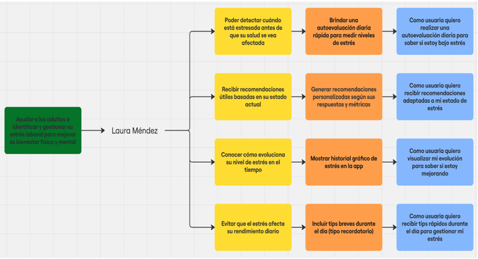</p>
</div>

Impact Mapping - Segmento 2

<div>
  <p align="center">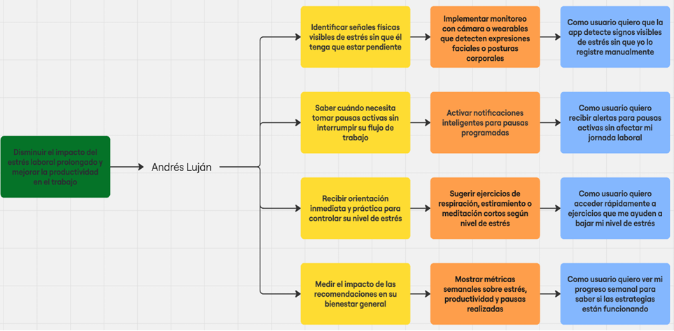</p>
</div>

---

### 2.4.3. Product Backlog

_Orden de User Stories y Technical Stories_

| Orden | ID   | User Story / Technical Story               | Story Points | Bounded Context |
| ----- | ---- | ------------------------------------------ | ------------ | --------------- |
| 01    | US01 | Registrar cuenta de usuario                | 3            | IAM             |
| 02    | US02 | Configurar perfil biométrico               | 5            | Biometrics      |
| 03    | US03 | Completar cuestionario inicial de salud    | 3            | Assessments     |
| 04    | US04 | Realizar test de autoevaluación de estrés  | 5            | Assessments     |
| 05    | US05 | Análisis biométrico de señales de estrés   | 5            | Biometrics      |
| 06    | US06 | Registrar síntomas físicos                 | 3            | Health Tracking |
| 07    | US07 | Recibir recomendaciones personalizadas     | 5            | Recommendations |
| 08    | US08 | Realizar ejercicios de respiración guiados | 3            | Activities      |
| 09    | US09 | Programar pausas activas laborales         | 3            | Activities      |
| 10    | US10 | Visualizar dashboard personal de estrés    | 5            | Dashboard       |
| 11    | US11 | Generar informes de progreso               | 5            | Reports         |
| 12    | US12 | Registrar desencadenantes de estrés        | 3            | Health Tracking |
| 13    | US13 | Buscar psicólogos especializados           | 3            | Professionals   |
| 14    | US14 | Agendar cita con psicólogo                 | 5            | Appointments    |
| 15    | US15 | Compartir informes con especialistas       | 3            | Reports         |
| 16    | US16 | Participar en grupos de apoyo              | 3            | Community       |
| 17    | US17 | Acceder a biblioteca de recursos           | 2            | Resources       |
| 18    | US18 | Participar en desafíos antiestrés          | 3            | Community       |
| 19    | US19 | Analizar carga laboral                     | 5            | Analytics       |
| 20    | US20 | Recibir recordatorios de ergonomía         | 2            | Notifications   |

## 2.5. Strategic-Level Domain-Driven Design

### 2.5.1. EventStorming

### Introducción

EventStorming es una técnica colaborativa de modelado del dominio que permite al equipo visualizar y comprender los procesos de negocio a través de eventos que ocurren en el sistema. Para el proyecto NeuroZen, se realizó una sesión de EventStorming con el objetivo de identificar los eventos clave, los actores principales y los _bounded contexts_ del dominio de detección y gestión del estrés laboral. Esta sesión facilitó la comunicación entre los miembros del equipo, permitiendo alinear una visión común del sistema y establecer una base sólida para el diseño de la arquitectura.

La sesión de EventStorming se llevó a cabo considerando los principales flujos de negocio: registro y configuración de perfiles biométricos, realización de autoevaluaciones, análisis de señales de estrés, programación de recomendaciones o pausas activas, y la conexión con especialistas en salud mental. El resultado fue un modelo visual que refleja las interacciones entre los actores principales (Usuarios trabajadores, Psicólogos o Especialistas, y el Sistema) en el contexto del bienestar y la salud mental en el entorno laboral.

#### 2.5.1.1. Candidate Context Discovery

**Objetivo:** Identificar y delimitar los contextos acotados (_bounded contexts_) que estructurarán el sistema NeuroZen, asegurando que cada contexto posea un propósito claro, un vocabulario ubicuo específico y reglas de negocio bien delimitadas.

**Proceso Realizado:**
La sesión de Candidate Context Discovery se llevó a cabo aplicando las técnicas recomendadas en Domain-Driven Design (DDD), que permitieron descomponer el dominio de detección y gestión del estrés laboral en áreas funcionales coherentes y manejables.

**Start-with-Value (Comenzar por el Valor):**
Se identificaron las áreas de mayor valor de negocio en NeuroZen:

- Detección temprana del estrés laboral mediante biometría y autoevaluaciones.
- Generación de recomendaciones personalizadas, ejercicios de respiración y pausas activas.
- Conexión directa entre usuarios y especialistas en salud mental (psicólogos).
- Monitoreo del progreso a través de un dashboard interactivo y análisis de carga laboral.

**Start-with-Simple (Comenzar con lo Simple):**
Se organizó el timeline del proceso en pasos secuenciales y lógicos:

- **Registro y Configuración:** Usuario se registra y configura su perfil de salud y datos biométricos base.
- **Evaluación:** Usuario realiza tests de autoevaluación o es escaneado para detectar señales físicas de estrés.
- **Intervención:** El sistema procesa los datos y entrega recomendaciones; el usuario ejecuta actividades para reducir la tensión.
- **Seguimiento:** El usuario revisa su historial, registra desencadenantes y visualiza su progreso.
- **Asistencia Profesional:** Si es necesario, el usuario busca un especialista, agenda una cita y comparte sus informes.

Este enfoque permitió agrupar eventos en bloques naturales de negocio.

**Look-for-Pivotal-Events (Buscar Eventos Clave):**
Se detectaron eventos pivotales que marcan cambios de estado críticos:

- "Perfil Biométrico Configurado" -> Habilita el análisis automatizado personalizado.
- "Evaluación de Estrés Completada" -> Genera el nivel de estrés actual del usuario.
- "Nivel de Estrés Calculado" -> Dispara la asignación de recomendaciones personalizadas.
- "Pausa Activa / Ejercicio Completado" -> Actualiza las estadísticas de progreso del usuario.
- "Cita con Especialista Confirmada" -> Establece el vínculo clínico y reserva el horario del profesional.

Estos eventos sirvieron como puntos de corte naturales para separar contextos.

**Bounded Contexts Identificados:**

**1. Identity & Access Management (IAM) Context**

- **Propósito:** Gestionar la seguridad, autenticación y perfiles base de los usuarios.
- **Responsabilidades:** Registro de usuarios, inicio de sesión, gestión de roles (Usuario trabajador, Especialista, Administrador).
- **Vocabulario:** Usuario, Credencial, Rol, Perfil, Autenticación.
- **Justificación:** Base fundamental del sistema que valida y controla el acceso seguro a la plataforma.

**2. Biometrics & Analysis Context**

- **Propósito:** Capturar y analizar señales físicas observables para la detección de estrés.
- **Responsabilidades:** Configuración del perfil biométrico, captura de datos por sensores/cámara (postura, tensión facial), cálculo de nivel de estrés físico.
- **Vocabulario:** Señal biométrica, Postura, Tensión, Respiración, Escaneo, Análisis.
- **Justificación:** Representa el núcleo tecnológico innovador de NeuroZen para la detección temprana.

**3. Assessments Context**

- **Propósito:** Gestionar las evaluaciones psicológicas y emocionales del usuario.
- **Responsabilidades:** Cuestionario inicial de salud, tests de autoevaluación recurrentes, cálculo de puntajes.
- **Vocabulario:** Test, Cuestionario, Pregunta, Respuesta, Autoevaluación, Resultado.
- **Justificación:** Permite cruzar la información subjetiva del usuario con los datos biométricos para un diagnóstico preciso.

**4. Recommendations & Activities Context**

- **Propósito:** Proveer herramientas prácticas para la mitigación inmediata del estrés.
- **Responsabilidades:** Sugerir intervenciones personalizadas, guiar ejercicios de respiración, gestionar la programación de pausas activas.
- **Vocabulario:** Recomendación, Ejercicio, Pausa Activa, Plan de Acción, Intervención.
- **Justificación:** Transforma el diagnóstico en soluciones accionables para mejorar el bienestar del usuario.

**5. Health Tracking & Dashboard Context**

- **Propósito:** Consolidar, analizar y presentar la evolución del estado de salud del usuario.
- **Responsabilidades:** Generación del dashboard, creación de reportes de progreso, registro de desencadenantes y síntomas, análisis de carga laboral.
- **Vocabulario:** Dashboard, Informe, Historial, Desencadenante, Síntoma, Carga Laboral, Progreso.
- **Justificación:** Mantiene al usuario comprometido y consciente de su evolución a largo plazo.

**6. Professionals & Appointments Context**

- **Propósito:** Facilitar la conexión con profesionales de la salud mental.
- **Responsabilidades:** Búsqueda de psicólogos por especialidad, agendamiento de citas, control de disponibilidad, compartición de reportes clínicos.
- **Vocabulario:** Especialista, Psicólogo, Cita, Horario, Especialidad, Paciente.
- **Justificación:** Brinda soporte humano avanzado cuando las herramientas de autogestión no son suficientes.

**7. Community & Resources Context**

- **Propósito:** Fomentar el apoyo social y la educación sobre salud mental.
- **Responsabilidades:** Gestión de grupos de apoyo, biblioteca de recursos (artículos, videos), administración de desafíos antiestrés.
- **Vocabulario:** Grupo de apoyo, Recurso, Artículo, Desafío, Comunidad.
- **Justificación:** Crea un ecosistema integral que acompaña al usuario más allá del entorno estrictamente clínico.

**8. Notification Context**

- **Propósito:** Gestionar la comunicación proactiva del sistema hacia el usuario.
- **Responsabilidades:** Envío de recordatorios de ergonomía, alertas de pausas activas, notificaciones de citas próximas.
- **Vocabulario:** Notificación, Recordatorio, Alerta, Ergonomía.
- **Justificación:** Asegura la adopción de micro-hábitos saludables durante la jornada laboral del usuario.

#### 2.5.1.2. Domain Message Flows Modeling

**Objetivo:** Visualizar cómo colaboran los bounded contexts para resolver los casos de negocio de NeuroZen, asegurando trazabilidad en el flujo de información y claridad en las responsabilidades.

**Técnica Aplicada:** Se utilizó Domain Storytelling para modelar las interacciones entre actores, contextos y eventos principales. Esta técnica permite describir narrativamente cómo fluye la información entre contextos y qué eventos desencadenan acciones en otros dominios.

**Flujos de Mensajes Modelados:**

```text
**1. Flujo: Usuario se Registra y Configura su Perfil Inicial**

Usuario Trabajador (Actor)
     ↓
[Identity & Access Management Context] - Recibe comando "RegistrarUsuario"
     ├─ Valida credenciales y crea cuenta
     └─ Genera evento "UsuarioRegistrado"
          ↓
[Assessments Context]
     ├─ Solicita completar cuestionario de salud
     ├─ Recibe respuestas base
     └─ Genera evento "CuestionarioInicialCompletado"
          ↓
[Biometrics & Analysis Context]
     ├─ Solicita configuración de datos biométricos
     ├─ Calibra señales físicas base (rostro, postura)
     └─ Genera evento "PerfilBiometricoConfigurado"
```

**Responsabilidades:**

- **Identity & Access Management Context:** Creación y seguridad de la cuenta.
- **Assessments Context:** Recopilación de información de salud inicial.
- **Biometrics & Analysis Context:** Establecimiento de la línea base física del usuario.

---

**2. Flujo: Detección de Estrés y Generación de Recomendaciones**

```text
Usuario Trabajador (Actor)
     ↓
[Biometrics & Analysis Context] / [Assessments Context]
     ├─ Recibe comando "AnalizarSeñales" o "RealizarTest"
     ├─ Procesa datos físicos y respuestas subjetivas
     ├─ Calcula el nivel de estrés actual
     └─ Genera evento "NivelEstresCalculado"
          ↓
[Recommendations & Activities Context]
     ├─ Recibe el nivel de estrés
     ├─ Selecciona ejercicios y pausas activas adecuadas
     └─ Genera evento "RecomendacionesGeneradas"
          ↓
[Notification Context] y [Health Tracking & Dashboard Context]
     ├─ [Notification] Envía alerta/sugerencia al usuario
     └─ [Health Tracking] Registra el evento de estrés en el historial
```

**Responsabilidades:**

- **Biometrics & Analysis / Assessments Context:** Diagnóstico preciso del estado del usuario.
- **Recommendations & Activities Context:** Selección de intervenciones personalizadas.
- **Notification Context:** Comunicación oportuna para la acción preventiva.
- **Health Tracking & Dashboard Context:** Almacenamiento de la métrica para el historial.

---

**3. Flujo: Ejecución de Pausa Activa y Actualización de Progreso**

```text
Usuario Trabajador (Actor)
     ↓
[Recommendations & Activities Context]
     ├─ Inicia ejercicio guiado o pausa activa
     ├─ Finaliza la actividad
     └─ Genera evento "ActividadCompletada"
          ↓
[Health Tracking & Dashboard Context]
     ├─ Recibe confirmación de actividad
     ├─ Actualiza métricas de adherencia y reducción de estrés
     ├─ Recalcula estadísticas del dashboard
     └─ Genera evento "DashboardActualizado"
          ↓
[Notification Context] (Opcional)
     └─ Envía refuerzo positivo o programa próximo recordatorio
```

**Responsabilidades:**

- **Recommendations & Activities Context:** Gestión y ejecución de la intervención.
- **Health Tracking & Dashboard Context:** Reflejo del esfuerzo en las métricas de progreso a largo plazo.
- **Notification Context:** Refuerzo de hábitos saludables.

---

**4. Flujo: Reserva de Cita y Compartición de Informes con Especialista**

```text
Usuario Trabajador (Actor)
     ↓
[Professionals & Appointments Context]
     ├─ Recibe comando "BuscarPsicologo" y "AgendarCita"
     ├─ Muestra disponibilidad y confirma reserva
     └─ Genera evento "CitaAgendada"
          ↓
[Health Tracking & Dashboard Context]
     ├─ Recibe autorización del usuario
     ├─ Empaqueta el reporte de progreso y métricas de estrés
     └─ Genera evento "InformeCompartido"
          ↓
[Notification Context]
     ├─ Notifica al Especialista (Psicólogo) sobre la nueva cita y el informe
     └─ Envía confirmación al Usuario Trabajador
```

**Responsabilidades:**

- **Professionals & Appointments Context:** Coordinación de agendas y enlace clínico.
- **Health Tracking & Dashboard Context:** Proveer contexto médico/emocional basado en datos al especialista.
- **Notification Context:** Confirmaciones y recordatorios a ambas partes.

#### 2.5.1.3. Bounded Context Canvases

**Objetivo:** Documentar de forma detallada cada bounded context mediante el Bounded Context Canvas, especificando el propósito, las capacidades, las reglas de negocio y las dependencias de cada dominio dentro de la plataforma NeuroZen.

**Proceso de Diseño:** Se siguió un proceso iterativo para cada canvas que incluyó:

- **Context Overview Definition:** Definición clara del nombre, propósito y alcance.
- **Business Rules Distillation & Ubiquitous Language Capture:** Extracción de reglas y vocabulario del dominio.
- **Capability Analysis:** Identificación de capacidades técnicas y de negocio.
- **Capability Layering:** Organización jerárquica de capacidades.
- **Dependencies Capture:** Mapeo de dependencias internas y externas.
- **Design Critique:** Validación con stakeholders.

---

**Canvas 1: Identity & Access Management (IAM) Context**

| Elemento                | Descripción                                                                                                                                                                                                                                                                                                      |
| :---------------------- | :--------------------------------------------------------------------------------------------------------------------------------------------------------------------------------------------------------------------------------------------------------------------------------------------------------------- |
| **Nombre**              | Identity & Access Management (IAM) Context                                                                                                                                                                                                                                                                       |
| **Propósito**           | Proveer autenticación, autorización y gestión de perfiles de usuario para la plataforma NeuroZen.                                                                                                                                                                                                                |
| **Descripción**         | Contexto encargado de validar credenciales, gestionar sesiones seguras y mantener perfiles de usuario con roles diferenciados (Usuario trabajador, Especialista, Administrador).                                                                                                                                 |
| **Actores Principales** | Usuario Trabajador, Especialista (Psicólogo), Administrador del Sistema.                                                                                                                                                                                                                                         |
| **Eventos Principales** | UsuarioRegistrado, SesionIniciada, SesionCerrada, PerfilActualizado, RolAsignado.                                                                                                                                                                                                                                |
| **Comandos**            | RegistrarUsuario, IniciarSesion, CerrarSesion, ActualizarPerfil, AsignarRol.                                                                                                                                                                                                                                     |
| **Reglas de Negocio**   | • Las contraseñas deben cumplir estándares de seguridad altos por tratar datos de salud.<br>• Las sesiones en dispositivos móviles se mantienen con tokens de expiración renovables.<br>• El correo electrónico (o teléfono) debe ser único.<br>• Verificación de identidad estricta para el rol "Especialista". |
| **Capacidades**         | • Registro con validación de datos biométricos/credenciales.<br>• Autenticación (Email/Password, OAuth).<br>• Gestión de JWT y sesiones seguras.<br>• Control de acceso basado en roles (RBAC).<br>• Recuperación de cuentas.                                                                                    |
| **Dependencias**        | → Notification Context (para enviar emails/SMS de verificación).                                                                                                                                                                                                                                                 |
| **Vocabulario Ubicuo**  | Usuario, Credencial, Rol, Perfil, Token, Sesión, Autenticación, Autorización.                                                                                                                                                                                                                                    |

---

**Canvas 2: Biometrics & Analysis Context**

| Elemento                | Descripción                                                                                                                                                                                                                                                      |
| :---------------------- | :--------------------------------------------------------------------------------------------------------------------------------------------------------------------------------------------------------------------------------------------------------------- |
| **Nombre**              | Biometrics & Analysis Context                                                                                                                                                                                                                                    |
| **Propósito**           | Capturar y analizar señales físicas observables para la detección de estrés.                                                                                                                                                                                     |
| **Descripción**         | Núcleo tecnológico que utiliza los sensores del dispositivo para captar postura, tensión facial y patrones físicos, calculando el nivel de estrés en tiempo real.                                                                                                |
| **Actores Principales** | Usuario Trabajador, Sistema de Análisis Biométrico.                                                                                                                                                                                                              |
| **Eventos Principales** | PerfilBiometricoConfigurado, EscaneoRealizado, NivelEstresFisicoCalculado, AnomaliaDetectada.                                                                                                                                                                    |
| **Comandos**            | ConfigurarPerfilBiometrico, IniciarEscaneo, ProcesarSeñales, CalcularNivelEstres.                                                                                                                                                                                |
| **Reglas de Negocio**   | • Requiere permiso explícito del usuario para usar cámara y sensores.<br>• Los datos biométricos crudos no se almacenan en la nube; se procesan localmente y se envía el resultado.<br>• La calibración inicial es obligatoria para establecer una "línea base". |
| **Capacidades**         | • Captura de señales mediante cámara/sensores.<br>• Análisis de tensión muscular facial y postura.<br>• Cálculo algorítmico de niveles de estrés físico.<br>• Calibración de línea base personal.                                                                |
| **Dependencias**        | ← IAM Context (para vincular análisis al usuario).<br>→ Recommendations & Activities Context (para disparar intervenciones).                                                                                                                                     |
| **Vocabulario Ubicuo**  | Perfil biométrico, Análisis biométrico, Señales físicas, Tensión, Postura, Nivel de Estrés Físico, Calibración.                                                                                                                                                  |

---

**Canvas 3: Assessments Context**

| Elemento                | Descripción                                                                                                                                                                                                                                                            |
| :---------------------- | :--------------------------------------------------------------------------------------------------------------------------------------------------------------------------------------------------------------------------------------------------------------------- |
| **Nombre**              | Assessments Context                                                                                                                                                                                                                                                    |
| **Propósito**           | Gestionar las evaluaciones psicológicas y emocionales del usuario mediante tests estandarizados.                                                                                                                                                                       |
| **Descripción**         | Contexto que administra los cuestionarios de salud mental, almacena las respuestas subjetivas y calcula el nivel de estrés percibido.                                                                                                                                  |
| **Actores Principales** | Usuario Trabajador.                                                                                                                                                                                                                                                    |
| **Eventos Principales** | CuestionarioInicialCompletado, TestIniciado, TestCompletado, NivelEstresPsicologicoCalculado.                                                                                                                                                                          |
| **Comandos**            | IniciarCuestionario, ResponderPregunta, FinalizarTest, CalcularPuntaje.                                                                                                                                                                                                |
| **Reglas de Negocio**   | • El cuestionario inicial de salud es obligatorio para completar el "onboarding".<br>• Los tests rápidos no deben tomar más de 3 minutos.<br>• Los puntajes se calculan en base a escalas psicológicas validadas.<br>• El test puede ser pausado y retomado más tarde. |
| **Capacidades**         | • Motor de renderizado de cuestionarios dinámicos.<br>• Almacenamiento seguro de respuestas sensibles.<br>• Cálculo de puntajes y niveles de riesgo.<br>• Gestión del estado del test (completado, en progreso).                                                       |
| **Dependencias**        | ← IAM Context.<br>→ Health Tracking & Dashboard Context (para historial).                                                                                                                                                                                              |
| **Vocabulario Ubicuo**  | Test de autoevaluación, Cuestionario, Pregunta, Escala, Puntaje, Estrés Percibido.                                                                                                                                                                                     |

---

**Canvas 4: Recommendations & Activities Context**

| Elemento                | Descripción                                                                                                                                                                                                                                                           |
| :---------------------- | :-------------------------------------------------------------------------------------------------------------------------------------------------------------------------------------------------------------------------------------------------------------------- |
| **Nombre**              | Recommendations & Activities Context                                                                                                                                                                                                                                  |
| **Propósito**           | Proveer herramientas prácticas y guiadas para la mitigación inmediata del estrés.                                                                                                                                                                                     |
| **Descripción**         | Recibe el nivel de estrés del usuario y genera sugerencias personalizadas, gestionando la ejecución de ejercicios de respiración y pausas activas.                                                                                                                    |
| **Actores Principales** | Usuario Trabajador, Motor de Recomendaciones.                                                                                                                                                                                                                         |
| **Eventos Principales** | RecomendacionesGeneradas, ActividadIniciada, EjercicioCompletado, PausaActivaProgramada.                                                                                                                                                                              |
| **Comandos**            | GenerarSugerencias, IniciarEjercicio, FinalizarActividad, ProgramarPausa.                                                                                                                                                                                             |
| **Reglas de Negocio**   | • Las recomendaciones de "alto riesgo" siempre incluyen la opción de contactar a un especialista.<br>• Los ejercicios de respiración deben tener control de reproducción (play/pause).<br>• Las pausas activas se adaptan a la disponibilidad horaria del trabajador. |
| **Capacidades**         | • Motor de reglas para seleccionar recomendaciones.<br>• Reproductor multimedia para ejercicios guiados (audio/video).<br>• Gestión y seguimiento de la ejecución de pausas activas.                                                                                  |
| **Dependencias**        | ← Biometrics / Assessments Context (recibe niveles de estrés).<br>→ Health Tracking & Dashboard Context (registra adherencia).<br>→ Notification Context (programa recordatorios).                                                                                    |
| **Vocabulario Ubicuo**  | Recomendaciones personalizadas, Ejercicios de respiración, Pausas activas, Intervención, Adherencia.                                                                                                                                                                  |

---

**Canvas 5: Health Tracking & Dashboard Context**

| Elemento                | Descripción                                                                                                                                                                                                                                   |
| :---------------------- | :-------------------------------------------------------------------------------------------------------------------------------------------------------------------------------------------------------------------------------------------- |
| **Nombre**              | Health Tracking & Dashboard Context                                                                                                                                                                                                           |
| **Propósito**           | Consolidar, analizar y presentar la evolución del estado de salud mental y carga laboral del usuario.                                                                                                                                         |
| **Descripción**         | El repositorio central de progreso. Genera gráficos, mantiene el historial de síntomas/desencadenantes y consolida reportes exportables.                                                                                                      |
| **Actores Principales** | Usuario Trabajador, Especialista (modo lectura compartida).                                                                                                                                                                                   |
| **Eventos Principales** | DashboardActualizado, InformeGenerado, SintomaRegistrado, DesencadenanteAgregado, CargaLaboralAnalizada.                                                                                                                                      |
| **Comandos**            | VisualizarEstadisticas, ExportarInforme, RegistrarSintoma, RegistrarDesencadenante.                                                                                                                                                           |
| **Reglas de Negocio**   | • La privacidad es "opt-in"; los informes solo se comparten si el usuario lo autoriza explícitamente.<br>• Los datos se agregan por día, semana y mes.<br>• Se requiere al menos 3 días de datos para mostrar tendencias de progreso válidas. |
| **Capacidades**         | • Agregación y procesamiento analítico de datos.<br>• Renderizado de gráficos de tendencias de estrés.<br>• Generador de reportes (PDF).<br>• CRUD de registro manual de síntomas físicos y detonantes.                                       |
| **Dependencias**        | ← Todos los contextos de captura (Biometrics, Assessments, Activities).<br>→ Professionals & Appointments Context (adjunta reportes a citas).                                                                                                 |
| **Vocabulario Ubicuo**  | Dashboard personal, Informe de progreso, Desencadenante de estrés, Síntoma físico, Tendencia, Carga laboral.                                                                                                                                  |

---

**Canvas 6: Professionals & Appointments Context**

| Elemento                | Descripción                                                                                                                                                                                                                                                                    |
| :---------------------- | :----------------------------------------------------------------------------------------------------------------------------------------------------------------------------------------------------------------------------------------------------------------------------- |
| **Nombre**              | Professionals & Appointments Context                                                                                                                                                                                                                                           |
| **Propósito**           | Facilitar la conexión segura y el agendamiento entre usuarios y especialistas en salud mental.                                                                                                                                                                                 |
| **Descripción**         | Directorio de psicólogos que permite búsquedas filtradas, gestión de calendarios, reserva de citas y enlace de historiales clínicos.                                                                                                                                           |
| **Actores Principales** | Usuario Trabajador, Especialista (Psicólogo).                                                                                                                                                                                                                                  |
| **Eventos Principales** | EspecialistaBuscado, CitaAgendada, CitaConfirmada, CitaCancelada, InformeClinicoVinculado.                                                                                                                                                                                     |
| **Comandos**            | BuscarEspecialistas, AgendarCita, ConfirmarDisponibilidad, CancelarCita, CompartirHistorial.                                                                                                                                                                                   |
| **Reglas de Negocio**   | • Las cancelaciones por parte del usuario deben realizarse con al menos 12 horas de anticipación.<br>• Las citas no pueden superponerse en el calendario del especialista.<br>• Los especialistas deben estar verificados por el administrador antes de aparecer en búsquedas. |
| **Capacidades**         | • Motor de búsqueda por especialidad y rating.<br>• Gestión de calendario y disponibilidad (slots de tiempo).<br>• Lógica de reservas y cancelaciones.<br>• Puente de acceso temporal a reportes de salud compartidos.                                                         |
| **Dependencias**        | ← IAM Context (perfiles de psicólogos).<br>← Health Tracking & Dashboard Context (obtener el PDF/Reporte).<br>→ Notification Context (confirmaciones).                                                                                                                         |
| **Vocabulario Ubicuo**  | Especialista en salud mental, Psicólogo, Cita, Disponibilidad, Reserva, Paciente.                                                                                                                                                                                              |

---

**Canvas 7: Community & Resources Context**

| Elemento                | Descripción                                                                                                                                                                                                                                       |
| :---------------------- | :------------------------------------------------------------------------------------------------------------------------------------------------------------------------------------------------------------------------------------------------ |
| **Nombre**              | Community & Resources Context                                                                                                                                                                                                                     |
| **Propósito**           | Fomentar el apoyo social, la educación continua sobre salud mental y la motivación.                                                                                                                                                               |
| **Descripción**         | Contexto que agrupa foros/grupos de apoyo moderados, desafíos de bienestar gamificados y una biblioteca de artículos/videos.                                                                                                                      |
| **Actores Principales** | Usuario Trabajador, Administrador/Moderador.                                                                                                                                                                                                      |
| **Eventos Principales** | GrupoUnido, MensajeComunidadPublicado, RecursoConsultado, DesafioIniciado.                                                                                                                                                                        |
| **Comandos**            | UnirseAGrupo, PublicarExperiencia, LeerArticulo, InscribirseDesafio.                                                                                                                                                                              |
| **Reglas de Negocio**   | • Los foros cuentan con filtros automáticos de palabras sensibles/ofensivas.<br>• Los usuarios pueden optar por participar de forma anónima en los grupos de apoyo.<br>• Todo el contenido de la biblioteca debe estar validado profesionalmente. |
| **Capacidades**         | • CMS (Content Management System) para recursos educativos.<br>• Sistema de foros y mensajería grupal moderada.<br>• Motor de gamificación y tracking de desafíos comunitarios.                                                                   |
| **Dependencias**        | ← IAM Context (identidad o pseudo-identidad).                                                                                                                                                                                                     |
| **Vocabulario Ubicuo**  | Grupo de apoyo, Biblioteca de recursos, Desafío antiestrés, Comunidad, Moderación.                                                                                                                                                                |

---

**Canvas 8: Notification Context**

| Elemento                | Descripción                                                                                                                                                                                                                                                                     |
| :---------------------- | :------------------------------------------------------------------------------------------------------------------------------------------------------------------------------------------------------------------------------------------------------------------------------ |
| **Nombre**              | Notification Context                                                                                                                                                                                                                                                            |
| **Propósito**           | Gestionar y orquestar toda la comunicación proactiva del sistema hacia los usuarios.                                                                                                                                                                                            |
| **Descripción**         | Contexto transversal responsable del envío de push notifications, correos electrónicos y recordatorios (ergonomía, pausas, citas).                                                                                                                                              |
| **Actores Principales** | Sistema NeuroZen, Usuario Trabajador, Especialista.                                                                                                                                                                                                                             |
| **Eventos Principales** | NotificacionPushEnviada, RecordatorioEntregado, EmailConfirmacionEnviado.                                                                                                                                                                                                       |
| **Comandos**            | EnviarNotificacion, ProgramarRecordatorio, ActualizarPreferenciasNotificacion.                                                                                                                                                                                                  |
| **Reglas de Negocio**   | • Se respeta el horario laboral y preferencias de silencio (No Molestar) del usuario.<br>• Los recordatorios de pausas activas tienen prioridad media; las confirmaciones de citas prioridad alta.<br>• El usuario puede personalizar qué tipo de notificaciones desea recibir. |
| **Capacidades**         | • Envío multicanal (Push, Email).<br>• Colas de tareas programadas (CRON) para recordatorios diferidos.<br>• Gestión de configuraciones de alerta por usuario.                                                                                                                  |
| **Dependencias**        | ↔ Escucha eventos de todos los demás contextos.<br>→ Integración con proveedores externos (FCM, SendGrid).                                                                                                                                                                      |
| **Vocabulario Ubicuo**  | Notificación, Recordatorio de ergonomía, Alerta, Horario laboral, Preferencias.                                                                                                                                                                                                 |

---

**Notas Sobre los Canvases:**

- Cada canvas ha sido diseñado iterativamente considerando las necesidades del usuario trabajador sometido a estrés laboral y los especialistas en salud mental.
- Las dependencias muestran explícitamente cómo los contextos colaboran para transformar datos crudos (Biometrics, Assessments) en acciones de bienestar y datos históricos valiosos.
- El vocabulario ubicuo mantiene estricta consistencia con el glosario previamente definido en el proyecto.
- Los canvases servirán de base técnica fundamental para el diseño arquitectónico de software a nivel de contenedores y componentes en las secciones posteriores.

### 2.5.2. Context Mapping

**Objetivo:** Establecer las relaciones de integración y el flujo de información entre los distintos Bounded Contexts de NeuroZen, definiendo los patrones de integración estratégicos para asegurar la coherencia del sistema.

<p align="center">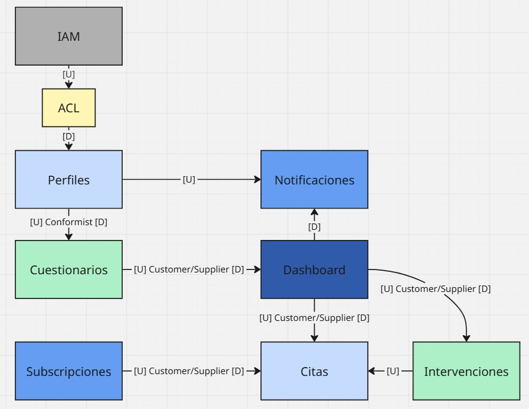</p>

#### IAM – Perfiles (ACL)

En esta relación, **IAM** actúa como Upstream, proveyendo la identidad base validada de los usuarios (trabajadores y psicólogos). El contexto de **Perfiles** es Downstream, consumiendo esta identidad para extenderla con datos personales, historial de salud y credenciales profesionales. Se implementa una **Anti-Corruption Layer (ACL)** en Perfiles para evitar que cambios en el sistema de autenticación base afecten el modelo de datos especializado de salud mental.

#### Perfiles – Cuestionarios y Tests (Conformist)

El contexto de **Cuestionarios y Tests** requiere la información de los usuarios para asociar los resultados de las evaluaciones de estrés a un empleado específico. En esta relación, **Perfiles** es Upstream y **Cuestionarios y Tests** es Downstream. La relación es de tipo **Conformist**, ya que el sistema de tests adopta directamente el modelo de identidad definido en Perfiles para mantener la integridad de los registros.

#### Cuestionarios y Tests – Seguimiento de Salud y Dashboard (Customer-Supplier)

Estos contextos colaboran estrechamente para procesar el bienestar del usuario. **Cuestionarios y Tests** actúa como Upstream (Supplier), suministrando los resultados brutos de las evaluaciones. **Seguimiento de Salud y Dashboard** es el Downstream (Customer), consumiendo estos datos para calcular métricas globales, generar tendencias de estrés y actualizar los indicadores visuales en tiempo real.

#### Seguimiento de Salud y Dashboard – Pausas Activas e Intervenciones (Customer-Supplier)

Para ofrecer recomendaciones efectivas, el contexto de **Pausas Activas e Intervenciones** debe conocer el estado actual del usuario. **Seguimiento de Salud y Dashboard** actúa como Upstream (Supplier) al proveer la tendencia de estrés procesada. **Pausas Activas e Intervenciones** es el Downstream (Customer), utilizando esta información para disparar planes de relajación y ejercicios personalizados.

#### Seguimiento de Salud y Dashboard – Directorio de Psicólogos y Citas (Customer-Supplier)

Cuando los niveles de estrés detectados requieren apoyo externo, se habilita la conexión profesional. **Seguimiento de Salud y Dashboard** es Upstream (Supplier) al proveer la alerta de necesidad de apoyo basada en datos. **Directorio de Psicólogos y Citas** es Downstream (Customer), consumiendo esta información para sugerir especialistas adecuados y facilitar el agendamiento.

#### Directorio de Psicólogos y Citas – Suscripciones (Customer-Supplier)

Para acceder a los servicios de agendamiento con especialistas, el sistema debe validar el estado de pago del usuario. El contexto de **Suscripciones** es Upstream (Supplier), validando la vigencia del plan. **Directorio de Psicólogos y Citas** es Downstream (Customer), pues consume esta validación para permitir o restringir el acceso a las funciones de consulta profesional.

#### Varios Contextos – Notificaciones y Comunicación (Conformist)

El contexto de **Notificaciones** depende de los eventos generados por múltiples contextos (confirmación de citas en _Citas_, recordatorios en _Intervenciones_ o nuevos reportes en _Dashboard_). Actúa como Downstream de dichos contextos bajo un modelo **Conformist**, adoptando directamente la estructura de los payloads de los eventos para distribuirlos por los canales correspondientes.

#### Directorio de Psicólogos y Citas – Perfiles (ACL)

En el flujo inverso, cuando se completa una consulta o se publica una reseña profesional, el contexto de **Directorio de Psicólogos y Citas** actúa como Upstream. El contexto de **Perfiles** es Downstream, utilizando una **ACL** para recibir y traducir las actualizaciones de reputación y feedback hacia el perfil del psicólogo sin comprometer la lógica de dominio interna del perfil.

### 2.5.3. Software Architecture

#### 2.5.3.1. Software Architecture Context Level Diagrams

En esta sección se presenta el diagrama de contexto del sistema NeuroZen, el cual permite visualizar de manera general la interacción entre la plataforma y los diferentes actores externos que participan en su funcionamiento. Este tipo de diagrama es fundamental dentro de la arquitectura de software, ya que delimita el alcance del sistema y muestra sus relaciones con usuarios y servicios externos, sin entrar en detalles internos de implementación.

El sistema NeuroZen se representa como un único bloque central, actuando como una plataforma digital enfocada en la detección temprana, monitoreo continuo y gestión del estrés laboral. A través de la integración de tecnologías de análisis biométrico, evaluaciones psicológicas y herramientas de bienestar, el sistema busca mejorar la calidad de vida de los usuarios en entornos laborales exigentes.
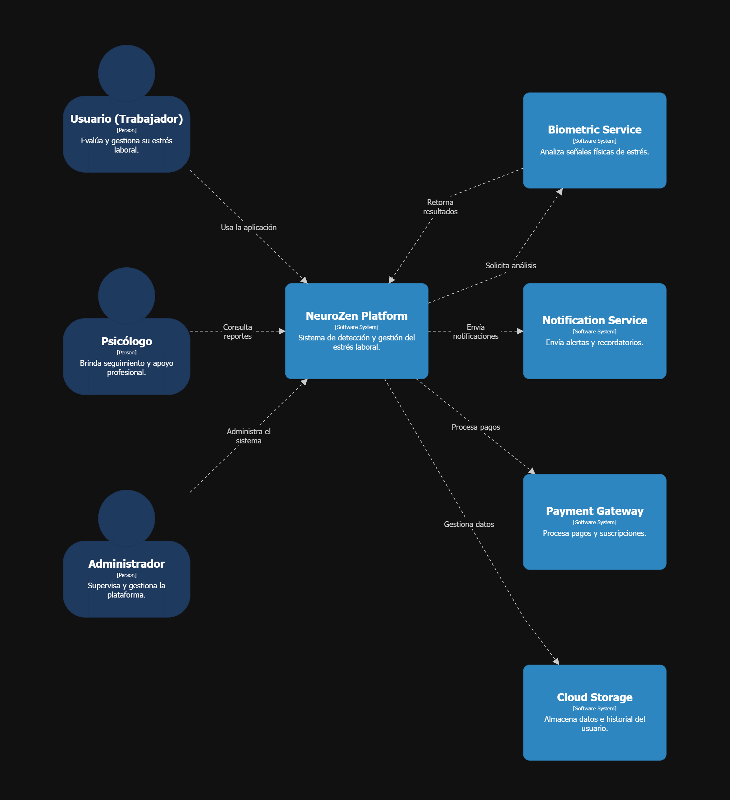

#### 2.5.3.2. Software Architecture Container Level Diagrams

En esta sección se presenta el diagrama de contenedores del sistema NeuroZen, el cual describe la estructura interna de la plataforma y la distribución de responsabilidades entre sus principales componentes.

A diferencia del diagrama de contexto, este nivel permite identificar los contenedores que conforman el sistema, así como las tecnologías utilizadas y la forma en que se comunican entre sí. En este caso, la arquitectura de NeuroZen está orientada principalmente a un entorno mobile-first, donde la interacción del usuario se realiza a través de una aplicación móvil.

El sistema se compone de una aplicación móvil como cliente principal, un backend que centraliza la lógica de negocio, y servicios externos encargados del análisis biométrico, notificaciones, pagos y almacenamiento de datos.

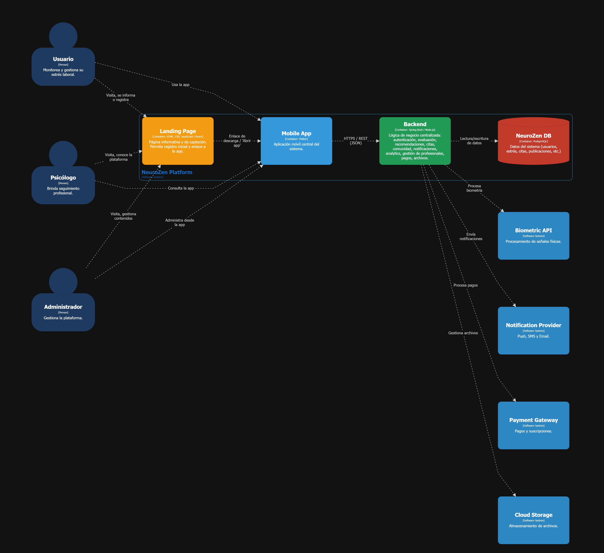

#### 2.5.3.3. Software Architecture Deployment Diagrams

#### 2.5.3.3. Software Architecture Deployment Diagrams

En esta sección se detallan los diagramas de despliegue y componentes que especifican la distribución física y lógica de los servicios que componen el ecosistema de NeuroZen.

##### Identity & Access Management (IAM) Context

Para la seguridad, roles y cuentas de usuario.
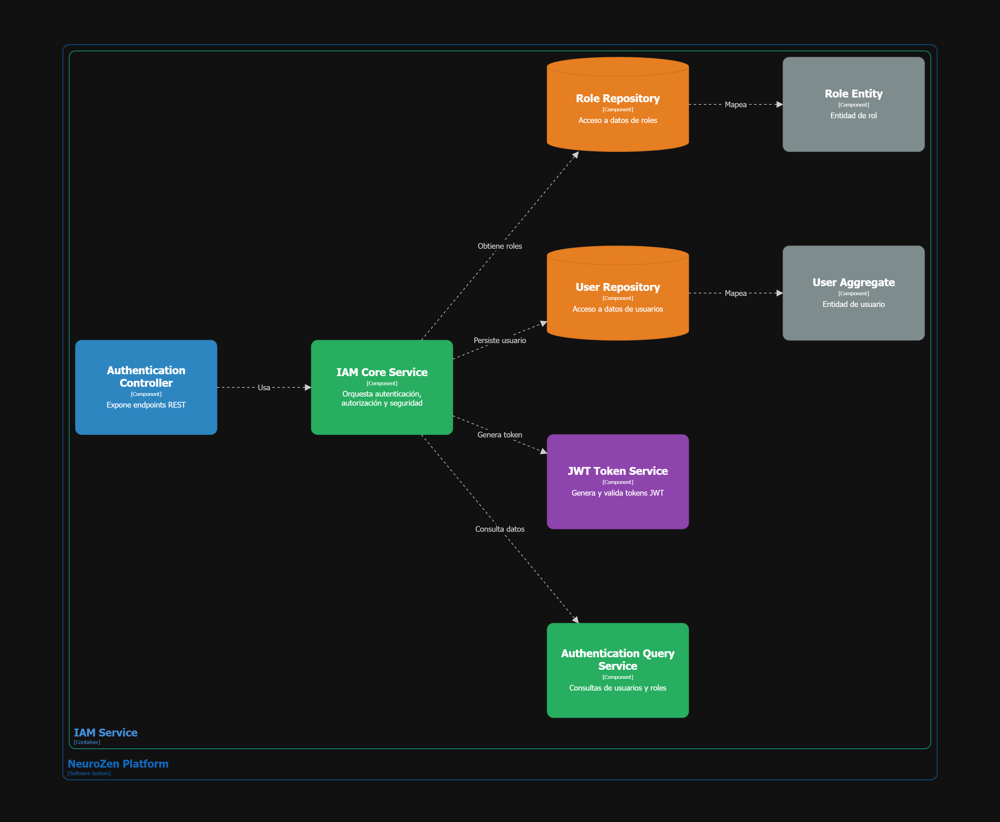

##### Assessments Context

Para los tests psicológicos y cuestionarios.
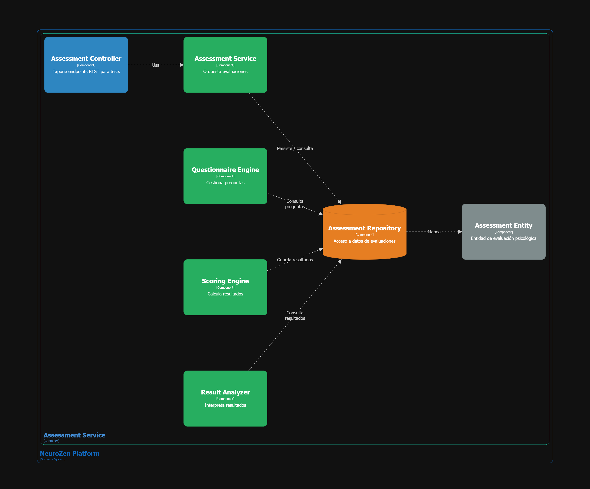

##### Recommendations & Activities Context

Para las pausas activas y ejercicios de respiración.
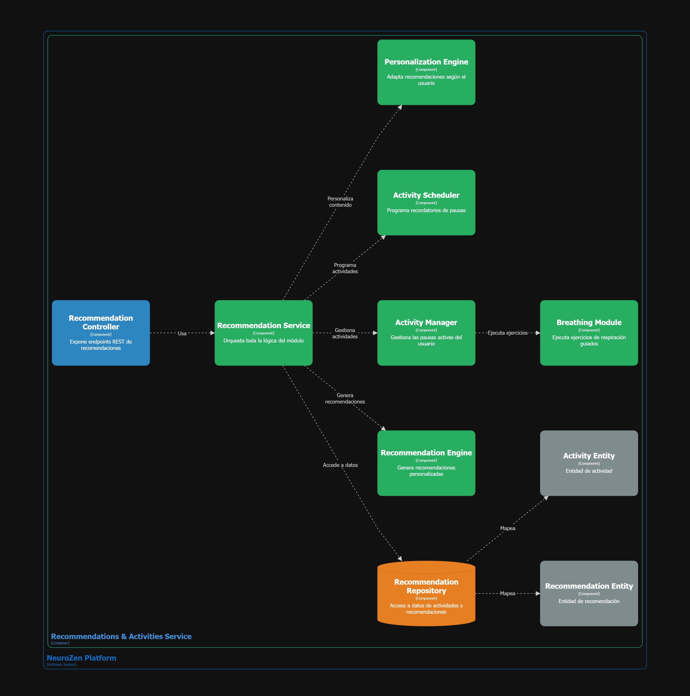

##### Health Tracking & Dashboard Context

Para el historial, estadísticas y reportes.


##### Professionals & Appointments Context

Para el directorio de psicólogos y gestión de citas.
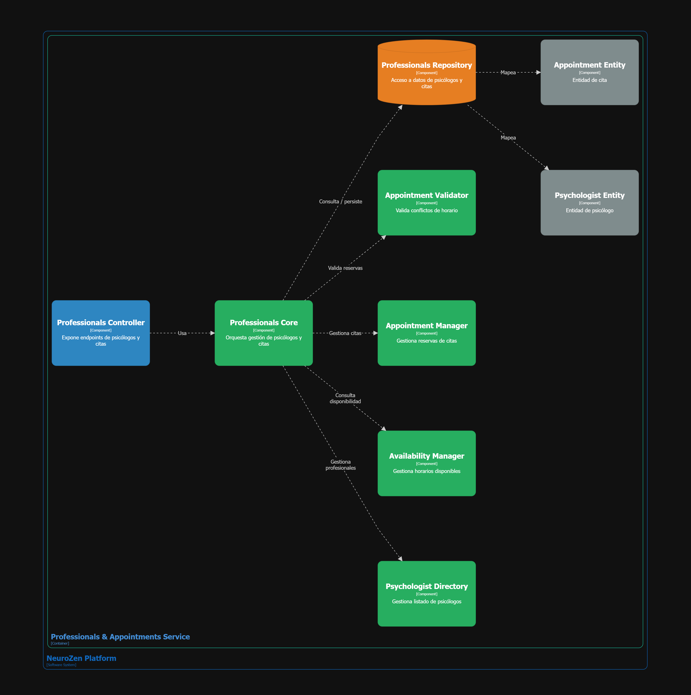

##### Community & Resources Context

Para los foros de apoyo y artículos de bienestar.
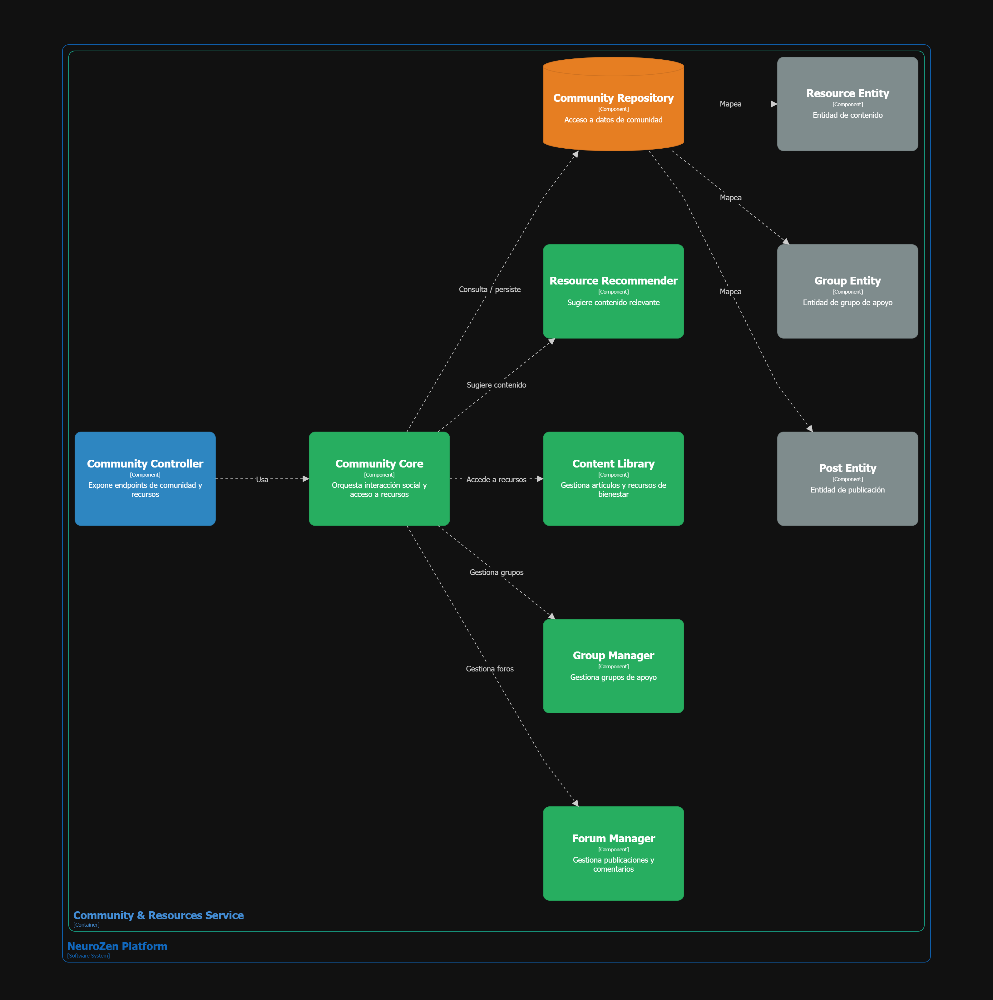

##### Notification Context

Para las alertas, recordatorios y correos.
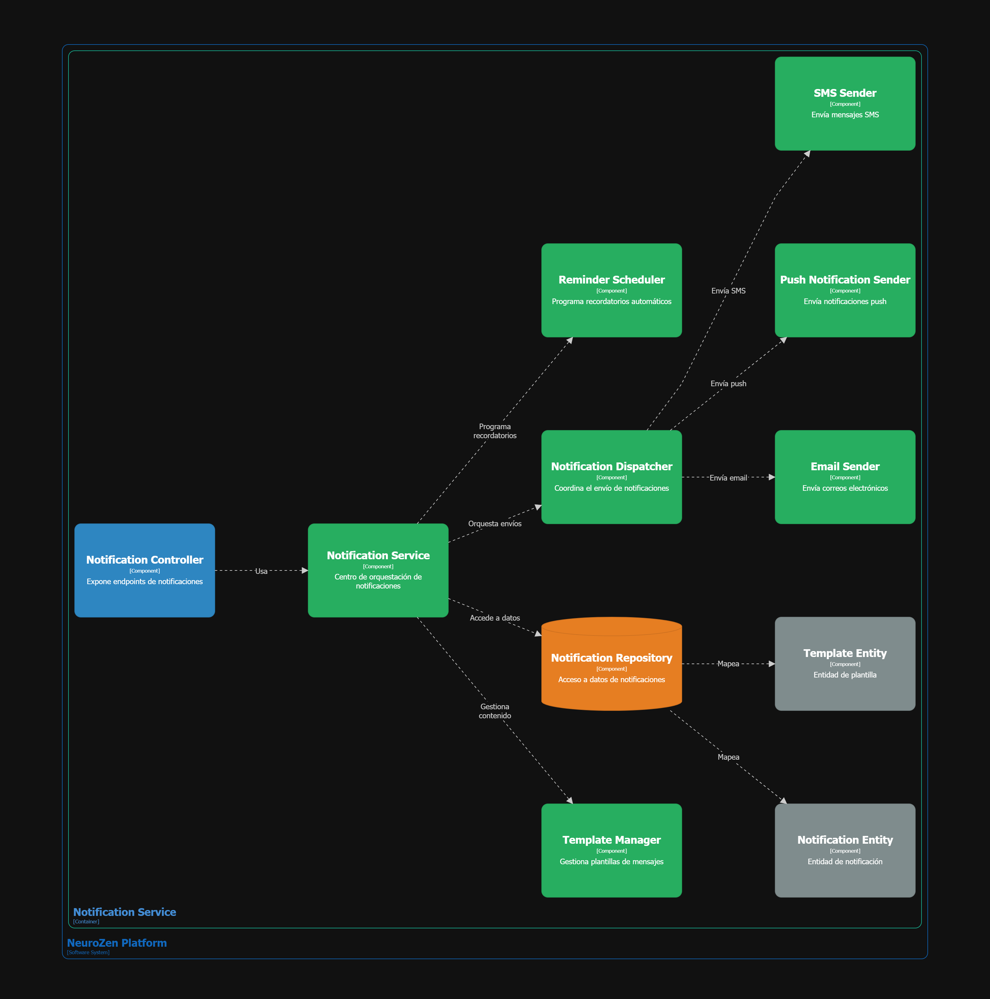

## 2.6. Tactical-Level Domain-Driven Design

### 2.6.1. Bounded Context: IAM

El bounded context IAM representa la capacidad del sistema encargada de gestionar la seguridad, la autenticación y la identidad de los usuarios (Trabajadores, Especialistas y Administradores). Su propósito es validar credenciales, emitir tokens de sesión y mantener los datos básicos de la cuenta. La entidad principal es `UserAccount`, la cual concentra las credenciales y roles.
Este contexto se relaciona como proveedor (Upstream) para todos los demás bounded contexts del sistema, ya que los demás dominios consumen el identificador del usuario autenticado para asociar historiales, tests y citas.

#### 2.6.1.1. Domain Layer

La capa de dominio contiene el núcleo de la seguridad.

- **Aggregate Root:** `UserAccount` (Atributos: id, email, passwordHash, role, isActive).
- **Value Objects:** `EmailAddress`, `Password`, `Role` (Enum: WORKER, SPECIALIST, ADMIN).
- **Commands:** `RegisterUserCommand`, `AuthenticateUserCommand`, `ChangePasswordCommand`.
- **Queries:** `GetUserByIdQuery`, `GetUserByEmailQuery`.
- **Domain Events:** `UserRegisteredEvent`, `UserAuthenticatedEvent`.
- **Reglas de negocio:** El email debe ser único; la contraseña debe estar encriptada; un usuario inactivo no puede autenticarse.

#### 2.6.1.2. Interface Layer

Contiene los controladores que exponen los servicios de autenticación al frontend.

- **REST Controllers:** `AuthController`, `UsersController`.
- **Endpoints:** `POST /api/v1/auth/register`, `POST /api/v1/auth/login`.
- **DTOs:** `RegisterUserResource`, `LoginResource`, `AuthTokenResource`.
- **Assemblers:** Transforman los recursos HTTP en comandos del dominio (ej. `RegisterUserCommandFromResourceAssembler`).

#### 2.6.1.3. Application Layer

Coordina los flujos de registro y login.

- **Command Services:** `UserAccountCommandServiceImpl` (Valida unicidad de email, hashea la contraseña, guarda la entidad y emite el token).
- **Query Services:** `UserAccountQueryServiceImpl`.
- **Flujo principal:** El usuario envía credenciales, el Command Service las verifica contra la base de datos, y si son correctas, delega la generación del JWT a la infraestructura.

#### 2.6.1.4. Infrastructure Layer

Gestiona la persistencia y la criptografía.

- **Repositories:** `UserAccountRepository` (extiende JpaRepository).
- **Adapters:** `JwtTokenProvider` (genera y valida tokens), `PasswordEncoderAdapter` (BCrypt).
- **Persistencia:** Tabla `user_accounts` con restricciones `UNIQUE` para el campo email.

#### 2.6.1.5. Bounded Context Software Architecture Component Level Diagrams

_Descripción:_
El diagrama de componentes de IAM ilustrará la interacción entre el `Auth REST API Component`, el `IAM Command Processing Component` y el `Security & Persistence Component`. Mostrará cómo las peticiones de login ingresan, se validan, acceden a la base de datos y retornan un JWT.

<div>
  <p align="center"></p>
</div>

#### 2.6.1.6. Bounded Context Software Architecture Code Level Diagrams

##### 2.6.1.6.1. Bounded Context Domain Layer Class Diagrams

_Descripción:_
Presentará la clase `UserAccount`, su relación estricta con el Enum `Role`, y las interfaces `UserAccountCommandService` y `UserAccountRepository`.

<div>
  <p align="center">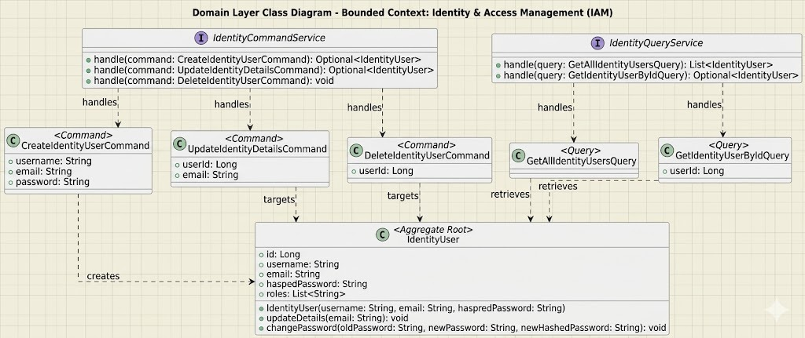</p>
</div>

##### 2.6.1.6.2. Bounded Context Database Design Diagram

_Descripción:_
Mostrará la tabla `user_accounts` con sus campos `id`, `email`, `password_hash`, `role` y `created_at`, destacando el `id` como Primary Key.

<div>
  <p align="center">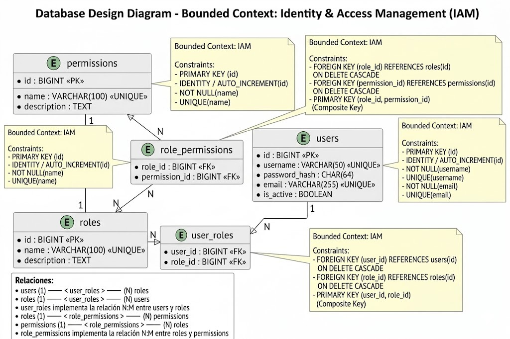</p>
</div>

---

### 2.6.2. Bounded Context: Assessments

El bounded context Assessments gestiona las evaluaciones psicológicas y cuestionarios de salud. Su propósito es capturar las respuestas subjetivas del usuario para diagnosticar su estrés percibido. La entidad principal es `Assessment` o `TestResult`.

#### 2.6.2.1. Domain Layer

- **Aggregate Root:** `Assessment` (Atributos: id, userId, score, stressLevel, takenAt).
- **Entities:** `Question`, `Answer`.
- **Value Objects:** `StressLevel` (Enum: LOW, MEDIUM, HIGH).
- **Commands:** `SubmitAssessmentCommand`, `CreateQuestionCommand`.
- **Queries:** `GetAssessmentsByUserIdQuery`.
- **Domain Events:** `TestCompletedEvent`.

#### 2.6.2.2. Interface Layer

- **REST Controllers:** `AssessmentsController`.
- **Endpoints:** `POST /api/v1/assessments`, `GET /api/v1/assessments/user/{userId}`.
- **DTOs:** `SubmitAssessmentResource`, `AssessmentResultResource`.

#### 2.6.2.3. Application Layer

- **Command Services:** `AssessmentCommandServiceImpl` (Recibe las respuestas, calcula el puntaje total, determina el `StressLevel`, persiste el resultado y dispara el `TestCompletedEvent`).
- **Query Services:** `AssessmentQueryServiceImpl` (Recupera el historial de tests).

#### 2.6.2.4. Infrastructure Layer

- **Repositories:** `AssessmentRepository`, `QuestionRepository`.
- **Persistencia:** Tablas `assessments`, `questions`, y `answers`. Llaves foráneas apuntando hacia `user_accounts` (conceptualmente, a través del userId).

#### 2.6.2.5. Bounded Context Software Architecture Component Level Diagrams

_Descripción:_
Este diagrama mostrará cómo el `Assessments API` recibe las respuestas, las pasa al `Scoring Component` (Application Layer) para calcular el nivel de estrés, lo persiste, y se comunica mediante eventos hacia el contexto de Health Tracking.

<div>
  <p align="center">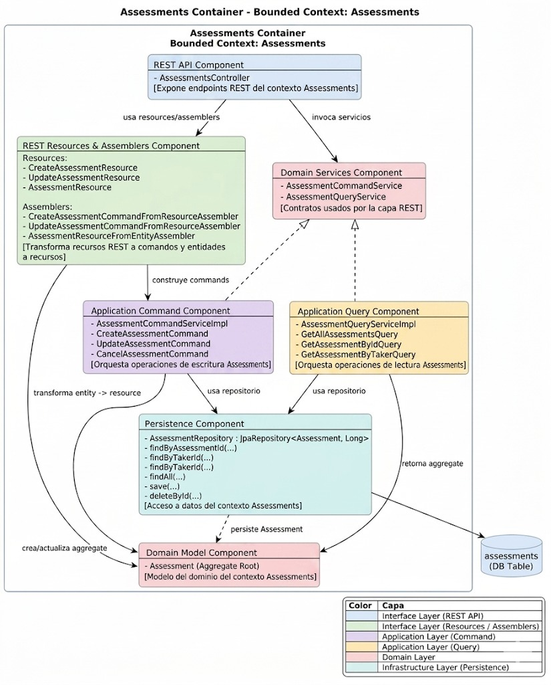</p>
</div>

#### 2.6.2.6. Bounded Context Software Architecture Code Level Diagrams

##### 2.6.2.6.1. Bounded Context Domain Layer Class Diagrams

_Descripción:_
Mostrará la relación One-to-Many entre `Assessment` y `Answer`, y las dependencias de los servicios de dominio encargados del cálculo de puntajes.

<div>
  <p align="center">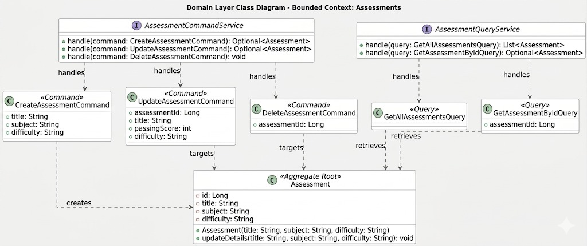</p>
</div>

##### 2.6.2.6.2. Bounded Context Database Design Diagram

_Descripción:_
Diagrama relacional conectando `assessments` con `answers`, donde cada respuesta está vinculada al test correspondiente y al usuario.

<div>
  <p align="center">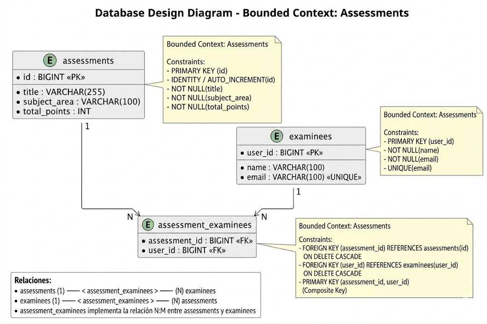</p>
</div>

---

### 2.6.3. Bounded Context: Recommendations & Activities

Este contexto se encarga de proveer pausas activas, ejercicios de respiración e intervenciones personalizadas basadas en el nivel de estrés del usuario. Su agregado principal es `ActivityPlan` o `Intervention`.

#### 2.6.3.1. Domain Layer

- **Aggregate Root:** `ActivityPlan` (Atributos: id, userId, recommendedActivities, status).
- **Entities:** `Activity` (ej. Ejercicio de respiración, estiramiento).
- **Commands:** `GenerateActivityPlanCommand`, `MarkActivityAsCompletedCommand`.
- **Domain Events:** `ActivityCompletedEvent`, `PlanGeneratedEvent`.
- **Reglas de negocio:** Los planes se generan dinámicamente basados en el `StressLevel`. Una actividad completada no puede volverse a marcar.

#### 2.6.3.2. Interface Layer

- **REST Controllers:** `ActivitiesController`, `PlansController`.
- **Endpoints:** `GET /api/v1/plans/current`, `POST /api/v1/activities/{id}/complete`.
- **DTOs:** `ActivityPlanResource`, `CompleteActivityResource`.

#### 2.6.3.3. Application Layer

- **Command Services:** `ActivityCommandServiceImpl` (Genera el plan evaluando el estrés, marca ejercicios como hechos y notifica al sistema).
- **Event Handlers:** Escucha el `TestCompletedEvent` (desde Assessments) para auto-generar un nuevo plan de actividades.

#### 2.6.3.4. Infrastructure Layer

- **Repositories:** `ActivityPlanRepository`, `ActivityCatalogueRepository`.
- **Persistencia:** Tablas para el catálogo de actividades (`activities_catalogue`) y el seguimiento de los planes asignados a los usuarios (`user_activity_plans`).

#### 2.6.3.5. Bounded Context Software Architecture Component Level Diagrams

_Descripción:_
Representará el flujo donde el motor de recomendaciones recibe el perfil del usuario, consulta el catálogo de actividades en la base de datos y genera un plan estructurado, exponiéndolo mediante el API REST.

<div>
  <p align="center">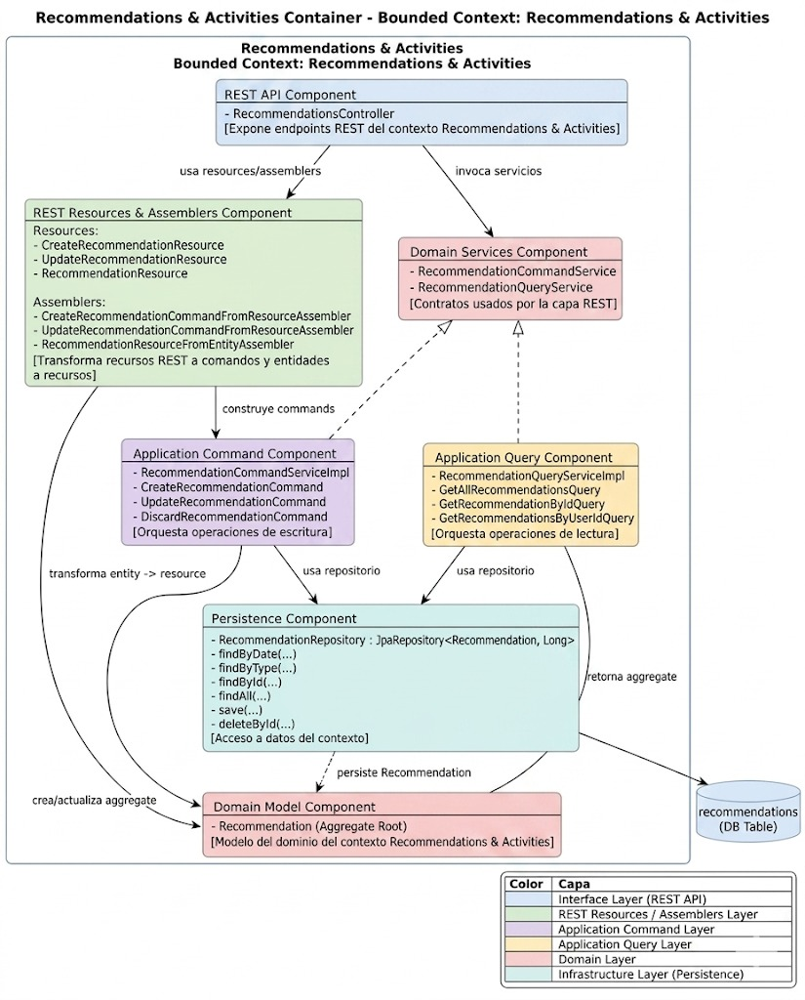</p>
</div>

#### 2.6.3.6. Bounded Context Software Architecture Code Level Diagrams

##### 2.6.3.6.1. Bounded Context Domain Layer Class Diagrams

_Descripción:_
Diagrama UML destacando `ActivityPlan`, la lista asociada de `Activity`, y el servicio de dominio generador de planes.

<div>
  <p align="center">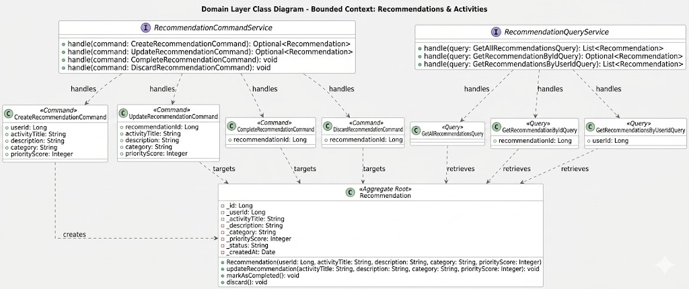</p>
</div>

##### 2.6.3.6.2. Bounded Context Database Design Diagram

_Descripción:_
Modelado de las tablas catálogo contra las tablas transaccionales de planes de usuario.

<div>
  <p align="center">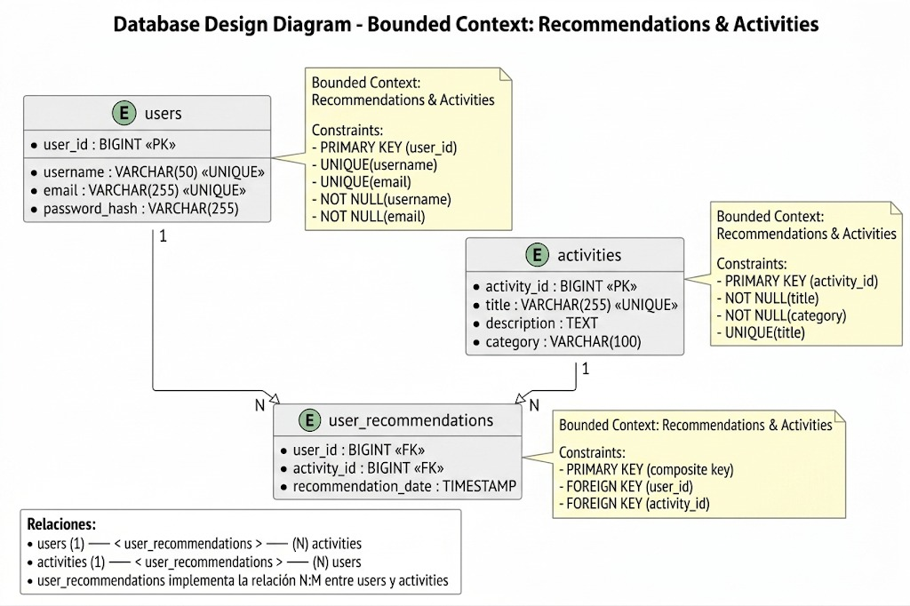</p>
</div>

---

### 2.6.4. Bounded Context: Health Tracking & Dashboard

El contexto encargado de consolidar todo el progreso del usuario. Consume eventos de evaluaciones y actividades para construir un historial clínico/estadístico. Su agregado raíz es `HealthRecord`.

#### 2.6.4.1. Domain Layer

- **Aggregate Root:** `HealthRecord` (Atributos: id, userId, globalStressScore, date).
- **Entities:** `Symptom`, `Trigger` (Desencadenante).
- **Commands:** `UpdateHealthRecordCommand`, `LogSymptomCommand`.
- **Queries:** `GetDashboardMetricsQuery`, `GenerateProgressReportQuery`.
- **Domain Events:** `HealthTrendUpdatedEvent`.

#### 2.6.4.2. Interface Layer

- **REST Controllers:** `DashboardController`, `HealthRecordsController`.
- **Endpoints:** `GET /api/v1/dashboard/{userId}`, `POST /api/v1/health-records/symptoms`.
- **DTOs:** `DashboardMetricsResource`, `SymptomResource`.

#### 2.6.4.3. Application Layer

- **Event Handlers:** `OnTestCompletedEventHandler`, `OnActivityCompletedEventHandler` (Actualizan el historial en background).
- **Query Services:** Agrupa métricas de los últimos 7, 15 o 30 días para enviar información procesada al frontend.

#### 2.6.4.4. Infrastructure Layer

- **Repositories:** `HealthRecordRepository`, `SymptomRepository`.
- **Adapters:** Generador de reportes PDF para exportar la historia clínica del usuario.
- **Persistencia:** Tablas diseñadas para lectura rápida (Read-Model) y agregación de métricas.

#### 2.6.4.5. Bounded Context Software Architecture Component Level Diagrams

_Descripción:_
Mostrará la arquitectura orientada a eventos de este contexto: cómo sus `Event Listeners` reaccionan a los mensajes de la plataforma, actualizan la base de datos de métricas y cómo el `Dashboard Query Component` sirve los datos al móvil.

<div>
  <p align="center">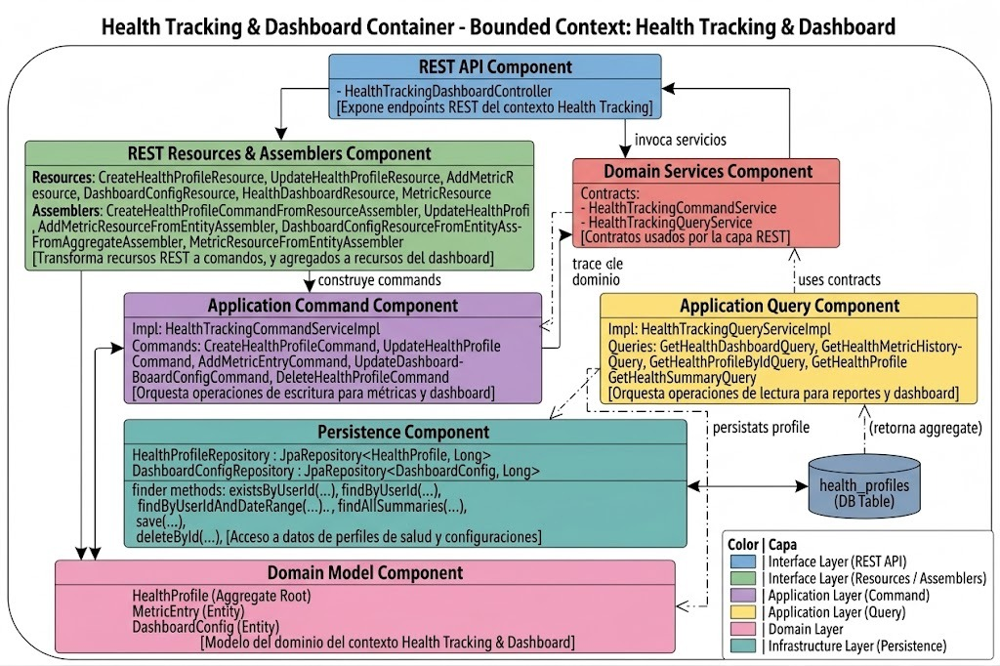</p>
</div>

#### 2.6.4.6. Bounded Context Software Architecture Code Level Diagrams

##### 2.6.4.6.1. Bounded Context Domain Layer Class Diagrams

_Descripción:_
Estructura de `HealthRecord` agrupando métricas de estrés, síntomas reportados manualmente y tendencias.

<div>
  <p align="center">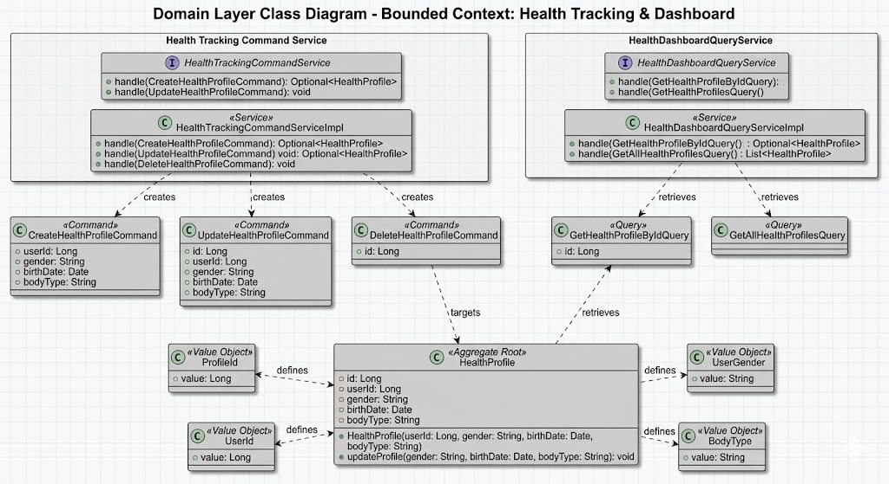</p>
</div>

##### 2.6.4.6.2. Bounded Context Database Design Diagram

_Descripción:_
Esquema de base de datos optimizado para consultas de series de tiempo (Time-Series) del estrés diario del usuario.

<div>
  <p align="center">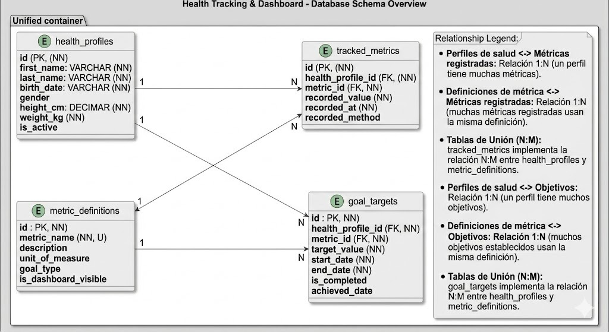</p>
</div>

---

### 2.6.5. Bounded Context: Professionals & Appointments

Gestiona el directorio de especialistas en salud mental y el ciclo de vida de las reservas de citas. El agregado raíz es `Appointment`.

#### 2.6.5.1. Domain Layer

- **Aggregate Root:** `Appointment` (Atributos: id, patientId, specialistId, scheduledAt, status).
- **Value Objects:** `AppointmentStatus` (SCHEDULED, CANCELLED, COMPLETED).
- **Commands:** `BookAppointmentCommand`, `CancelAppointmentCommand`.
- **Domain Events:** `AppointmentBookedEvent`, `AppointmentCancelledEvent`.
- **Reglas de negocio:** Validar que el especialista tenga disponibilidad en el horario; un paciente no puede reservar dos citas a la misma hora.

#### 2.6.5.2. Interface Layer

- **REST Controllers:** `AppointmentsController`, `SpecialistsController`.
- **Endpoints:** `POST /api/v1/appointments`, `GET /api/v1/specialists`.
- **DTOs:** `CreateAppointmentResource`, `SpecialistProfileResource`.

#### 2.6.5.3. Application Layer

- **Command Services:** `AppointmentCommandServiceImpl` (Valida horarios, cruza la disponibilidad, crea la reserva).
- **Query Services:** Búsqueda y filtrado de psicólogos por especialidad o rating.

#### 2.6.5.4. Infrastructure Layer

- **Repositories:** `AppointmentRepository`, `SpecialistProfileRepository`.
- **Adapters:** Posible integración con una pasarela de pago externa en caso de citas de pago.
- **Persistencia:** Tablas `appointments` y `specialist_profiles`.

#### 2.6.5.5. Bounded Context Software Architecture Component Level Diagrams

_Descripción:_
Ilustrará cómo interactúan el componente de reservas con el catálogo de especialistas, validando disponibilidades antes de persistir la cita y emitiendo el evento hacia el Notification Context.

<div>
  <p align="center"></p>
</div>

#### 2.6.5.6. Bounded Context Software Architecture Code Level Diagrams

##### 2.6.5.6.1. Bounded Context Domain Layer Class Diagrams

_Descripción:_
Mostrará la relación entre `Appointment`, `SpecialistProfile` y el paciente (identificado por su ID de IAM).

<div>
  <p align="center">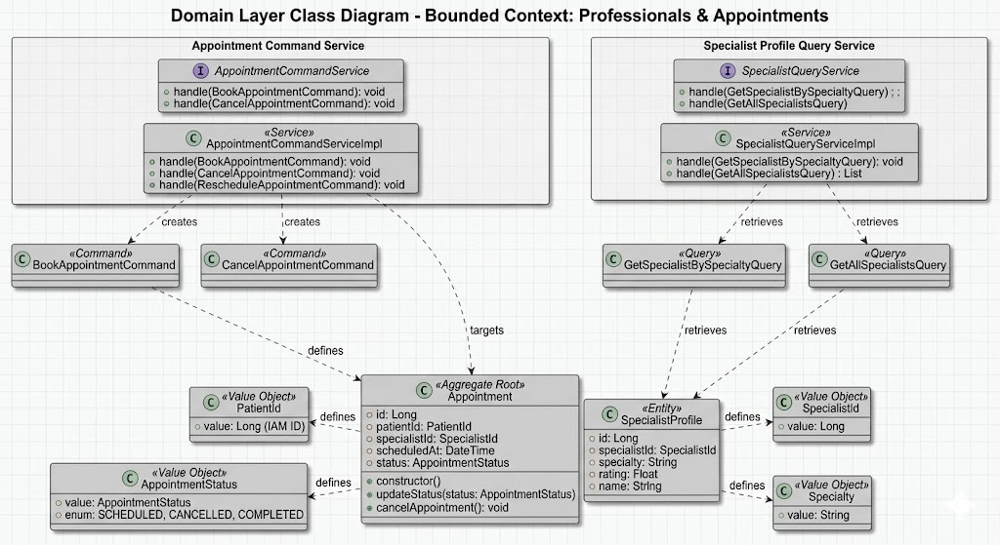</p>
</div>

##### 2.6.5.6.2. Bounded Context Database Design Diagram

_Descripción:_
Esquema de reservas con sus respectivas llaves foráneas apuntando a la tabla de perfiles de especialistas y estado de la cita.

<div>
  <p align="center">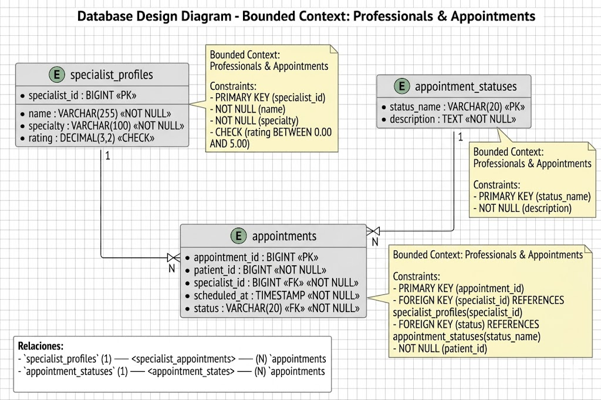</p>
</div>

---

### 2.6.6. Bounded Context: Community & Resources

Este contexto abarca el contenido educativo y el soporte social. Su enfoque es más de gestión de contenido (CMS) e interacción social. Agregados principales: `Resource` (Artículos/Videos) y `ForumGroup`.

#### 2.6.6.1. Domain Layer

- **Aggregate Roots:** `EducationalResource`, `SupportGroup`.
- **Entities:** `GroupMessage`.
- **Commands:** `PublishMessageCommand`, `JoinGroupCommand`.
- **Queries:** `GetAllResourcesQuery`, `GetGroupMessagesQuery`.

#### 2.6.6.2. Interface Layer

- **REST Controllers:** `ResourcesController`, `GroupsController`.
- **Endpoints:** `GET /api/v1/resources`, `POST /api/v1/groups/{id}/messages`.
- **DTOs:** `ResourceDTO`, `GroupMessageDTO`.

#### 2.6.6.3. Application Layer

- **Command/Query Services:** Sirve el contenido multimedia y gestiona la lógica de participación en los foros de apoyo, aplicando filtros básicos de contenido.

#### 2.6.6.4. Infrastructure Layer

- **Repositories:** `ResourceRepository`, `SupportGroupRepository`.
- **Persistencia:** Almacenamiento de URLs multimedia y metadatos de los artículos, junto con el registro de mensajes de chat grupales.

#### 2.6.6.5. Bounded Context Software Architecture Component Level Diagrams

_Descripción:_
Representará el subsistema de entrega de contenido (Content Delivery Component) y el motor de foros, mostrando cómo se sirve información estática e interactiva al usuario.

<div>
  <p align="center">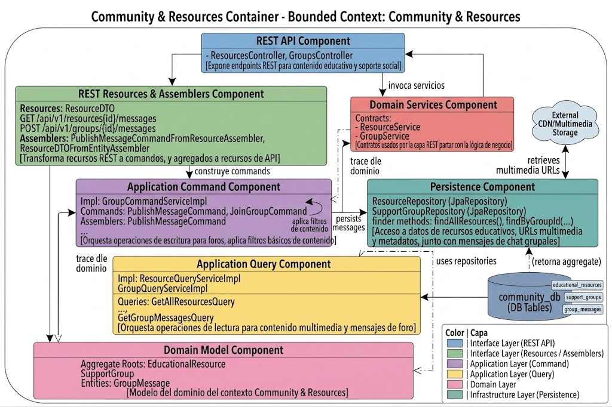</p>
</div>

#### 2.6.6.6. Bounded Context Software Architecture Code Level Diagrams

##### 2.6.6.6.1. Bounded Context Domain Layer Class Diagrams

_Descripción:_
UML simple de las clases de recursos educativos y foros comunitarios.

<div>
  <p align="center">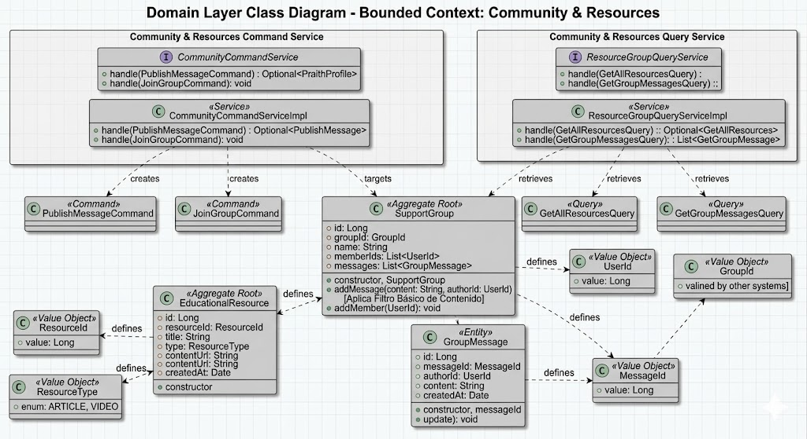</p>
</div>

##### 2.6.6.6.2. Bounded Context Database Design Diagram

_Descripción:_
Tablas relacionales de grupos, mensajes y catálogo de recursos de bienestar.

<div>
  <p align="center">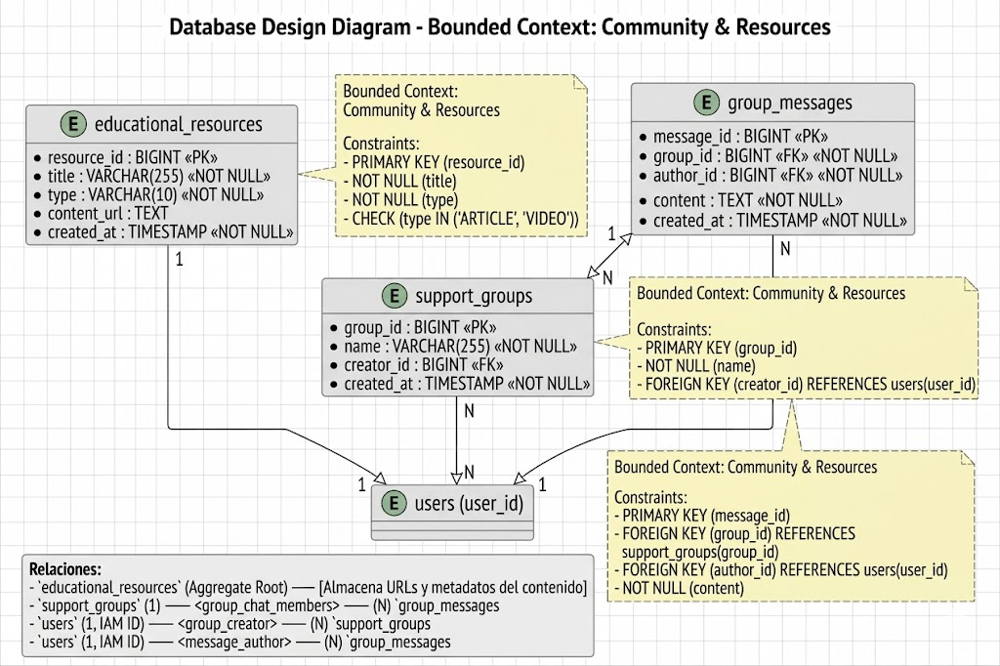</p>
</div>

---

### 2.6.7. Bounded Context: Notification

Es un contexto técnico transversal. No interactúa directamente a través de un CRUD tradicional, sino que reacciona a los Domain Events del sistema para notificar a los usuarios. Su agregado raíz es `Notification`.

#### 2.6.7.1. Domain Layer

- **Aggregate Root:** `Notification` (Atributos: id, recipientId, message, type, sentAt, isRead).
- **Value Objects:** `NotificationType` (EMAIL, PUSH, IN_APP).
- **Commands:** `SendNotificationCommand`, `MarkAsReadCommand`.
- **Reglas de negocio:** Registrar todo envío en un log de notificaciones; no enviar mensajes push si el usuario configuró el modo "No Molestar".

#### 2.6.7.2. Interface Layer

- **REST Controllers:** `NotificationsController` (Para que el usuario vea sus alertas in-app o las marque como leídas).
- **Endpoints:** `GET /api/v1/notifications`, `PUT /api/v1/notifications/{id}/read`.

#### 2.6.7.3. Application Layer

- **Event Handlers:** La capa más crítica. Escucha eventos como `AppointmentBookedEvent`, `TestCompletedEvent`, o `PlanGeneratedEvent` para orquestar la creación de comandos de notificación.
- **Command Services:** `NotificationCommandServiceImpl`.

#### 2.6.7.4. Infrastructure Layer

- **Adapters:** `SendGridEmailAdapter` (envío de correos), `FirebasePushNotificationAdapter` (envío a móviles).
- **Repositories:** `NotificationRepository`.
- **Persistencia:** Tabla de log de notificaciones para histórico y estado de lectura.

#### 2.6.7.5. Bounded Context Software Architecture Component Level Diagrams

_Descripción:_
Mostrará un Event Bus conectando el Notification Context con los demás contextos. Ilustrará cómo los adaptadores externos (FCM, SMTP) envían los mensajes físicos al dispositivo del usuario.

<div>
  <p align="center">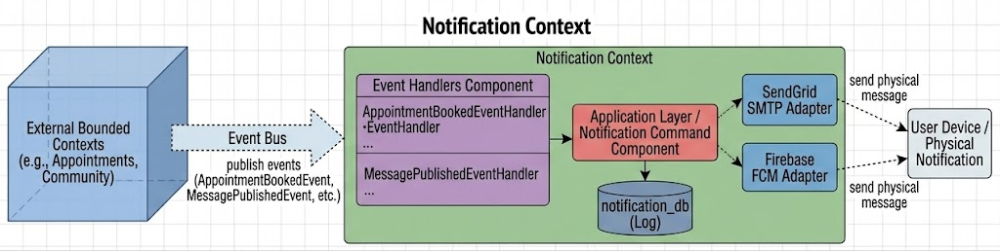</p>
</div>

#### 2.6.7.6. Bounded Context Software Architecture Code Level Diagrams

##### 2.6.7.6.1. Bounded Context Domain Layer Class Diagrams

_Descripción:_
Modelará la clase `Notification` y las interfaces de los adaptadores de mensajería (Ports).

<div>
  <p align="center">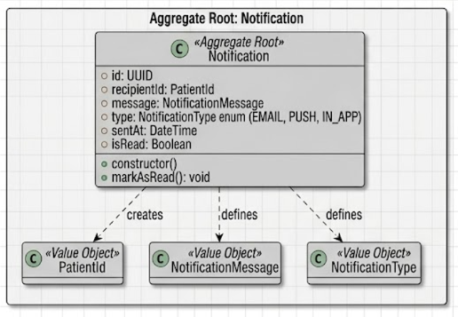</p>
</div>

##### 2.6.7.6.2. Bounded Context Database Design Diagram

_Descripción:_
Tabla simple para almacenar el histórico de notificaciones (`id`, `recipient_id`, `message`, `is_read`, `created_at`).

<div>
  <p align="center">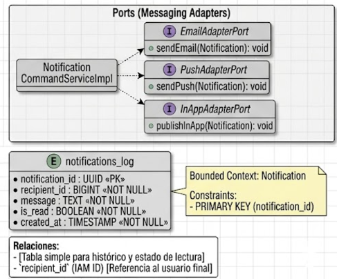</p>
</div>

---

# Capítulo III: Solution UI/UX Design

## 3.1. Product design

### 3.1.1. Style Guidelines

NeuroDraw, dedicado a la detección rápida y manejo del estrés laboral, transmite calma, confianza y profesionalismo. Nuestra identidad visual combina tonos azules y verdes para evocar tranquilidad, con tipografía clara y espacios limpios. Comunicamos con un lenguaje accesible pero riguroso, transformando conceptos complejos de neurociencia en soluciones prácticas para el bienestar laboral.

#### 3.1.1.1. General Style Guidelines

Logo: El logo de NeuroZen fusiona elementos neurológicos y serenidad en un diseño significativo. La silueta de perfil humano en Verde Bosque muestra circuitos cerebrales que simbolizan cómo nuestra plataforma conecta ciencia y bienestar mental.

<div>
  <p align="center"></p>
</div>

Tipografía:

La tipografía de la página debe ser fácil de leer, adaptándose al dispositivo en el que se encuentre. Para ello, se emplearán dos fuentes sans-serif (sin remates decorativos) porque son más legibles y claras. Además, el contenido mostrado debe de resaltar.

Color Guide:

1. Verde Bosque (#2D5A4A)
Representación: El verde bosque simboliza estabilidad, crecimiento y conexión con la naturaleza. En el contexto de NeuroZen, este color representa la base sólida que ofrece la plataforma para ayudar a los usuarios a manejar su estrés. Se utiliza en elementos principales como el logotipo y encabezados, transmitiendo confianza y un ambiente relajante que invita a la calma mental.
<div>
  <p align="center">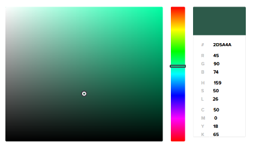</p>
</div>

2. Verde Menta (#A2C4B5)
Representación: El verde menta evoca frescura, renovación y claridad mental. Este color más suave complementa al verde bosque y se utiliza en áreas secundarias de la plataforma. Representa la sensación refrescante que experimentan los usuarios al reducir su estrés mediante las técnicas proporcionadas por NeuroZen, creando un ambiente digital que respira tranquilidad.
<div>
  <p align="center">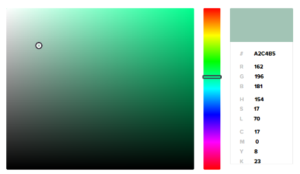</p>
</div>

3. Beige Cálido (#F1E9D4)
Representación: El beige cálido transmite neutralidad, confort y serenidad. En NeuroZen, este color se utiliza para fondos y espacios de descanso visual, proporcionando un ambiente acogedor que reduce la fatiga visual durante las sesiones de meditación o ejercicios anti-estrés. El beige crea un entorno digital que se siente como un refugio seguro.
<div>
  <p align="center">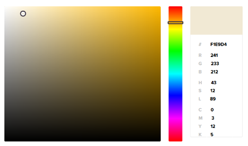</p>
</div>

4. Turquesa Profundo (#1A6F78)
Representación: El turquesa profundo simboliza la profundidad emocional, la comunicación y la sabiduría. Este color representa el componente científico y psicológico de NeuroZen, destacando las herramientas basadas en evidencia para el manejo del estrés. Se utiliza en elementos interactivos y botones de acción, invitando a los usuarios a explorar soluciones más profundas.
<div>
  <p align="center">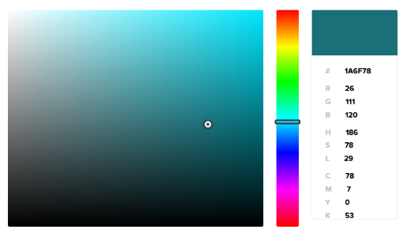</p>
</div>

5. Gris Piedra (#8C9893)
Representación: El gris piedra evoca neutralidad, equilibrio y estabilidad. En NeuroZen, este color funciona como un ancla visual que equilibra los verdes y turquesas más expresivos. Se utiliza para texto secundario y elementos de interfaz sutiles, aportando sofisticación sin competir con los colores principales que transmiten calma y bienestar.
<div>
  <p align="center">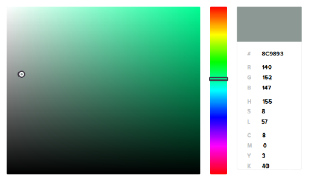</p>
</div>

La paleta de colores de NeuroZen combina verdes y turquesas para transmitir naturaleza y tecnología, beige para crear un entorno acogedor y gris piedra para aportar profesionalismo. En conjunto, el diseño busca generar una experiencia visual relajante y coherente con la misión de reducir el estrés del usuario.

Buttons:

La plataforma NeuroZen para control del estrés presenta una interfaz intuitiva con botones fácilmente identificables en toda la experiencia. Los botones principales utilizan Verde Bosque (#2D5A4A) para acciones importantes como iniciar meditaciones, mientras que los secundarios aparecen en Verde Menta (#A2C4B5), creando jerarquía visual. El fondo en Beige Cálido (#F1E9D4) proporciona un ambiente relajante, complementado por elementos interactivos en Turquesa Profundo (#1A6F78) para funciones especiales y Gris Piedra (#8C9893) para textos y detalles sutiles. Todos los botones tienen formas redondeadas y tamaños generosos, facilitando su uso incluso en momentos de estrés, mientras que los estados de hover y feedback ofrecen respuestas visuales claras que refuerzan la sensación de calma y control que define la experiencia de NeuroZen.

Variaciones del logo en diferentes representaciones:

<div>
  <p align="center">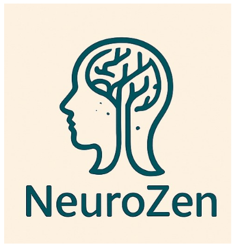</p>
</div>
-Una opción minimalista, sin muchos detalles y relajante a la vista.
<div>
  <p align="center">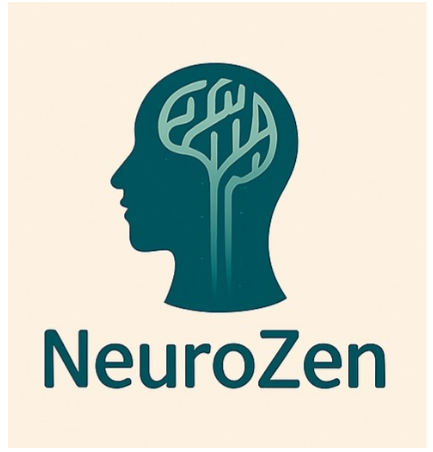</p>
</div>
-Una opción con mejor detalle y uso de colores.
<div>
  <p align="center">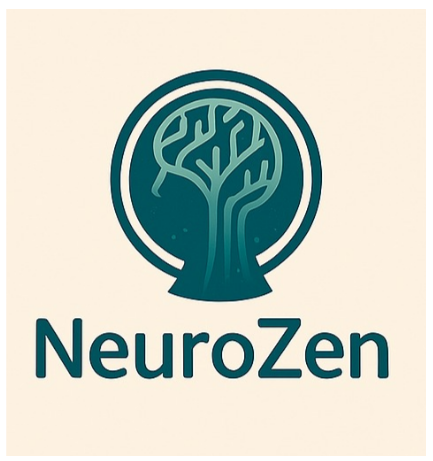</p>
</div>
-Una representación más abstracta que inspira relajación.
<div>
  <p align="center">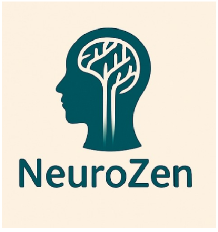</p>
</div>
-Una opción que combina las dos primeras ideas.

---

### 3.1.2. Information Architecture

NeuroZen detecta el estrés laboral combinando datos biométricos (postura, tensión facial, respiración) con autoevaluaciones emocionales para generar un perfil de estrés personalizado. La app ofrece recomendaciones y ejercicios para reducir los síntomas, envía notificaciones en tiempo real ante aumentos de estrés y permite revisar un historial de tendencias para identificar patrones.

A futuro, se integrará con psicólogos y programas de bienestar laboral para empresas, convirtiéndose en una herramienta completa de prevención y gestión del estrés.

---

#### 3.1.2.1. Organization Systems

La información se organiza de forma lógica para que el usuario encuentre rápido lo que necesita:

Estructura basada en módulos claros: inicio, autoevaluación, recomendaciones, profesionales, comunidad y recursos.

Jerarquización de contenidos: lo más usado (tests y recomendaciones) aparece en posiciones destacadas.

---

#### 3.1.2.2. Labelling Systems

El etiquetado debe ser claro, breve y familiar para los usuarios:

Uso de términos simples como: Inicio, Test de Estrés, Recomendaciones, Comunidad, Psicólogos, Recursos.

Evitar tecnicismos clínicos, priorizando un lenguaje cotidiano.

Consistencia en los nombres en toda la app y web.

---

#### 3.1.2.3. SEO Tags and Meta Tags

Meta títulos: deben incluir palabras clave relacionadas con salud mental, estrés laboral y bienestar.

Meta descripciones: claras, con llamado a la acción (ejemplo: “Evalúa tu nivel de estrés y recibe recomendaciones personalizadas”).

Etiquetas alt en imágenes con descripciones concisas.

Uso de headings (H1, H2, H3) para mejorar la indexación en buscadores.

---

#### 3.1.2.4. Searching Systems

Búsqueda interna intuitiva, con autocompletado y sugerencias rápidas.

Posibilidad de filtrar resultados (ejemplo: artículos, psicólogos, recursos, ejercicios).

Optimización para resultados relevantes según la necesidad del usuario.

---

#### 3.1.2.5. Navigation Systems

Menú principal: siempre visible, con las secciones clave (Inicio, Autoevaluación, Recomendaciones, Comunidad, Contacto).

Breadcrumbs para indicar dónde se encuentra el usuario.

CTA (Call To Action) claros y visibles, guiando al usuario hacia las acciones más importantes (hacer test, contactar especialista, unirse a un grupo).

Compatibilidad responsive, manteniendo la navegación fluida en móviles y escritorio.

---

### 3.1.3. Landing Page UI Design

El diseño de la interfaz de usuario para la landing page de NeuroZen será un elemento clave, ya que representará la primera impresión que recibirán los usuarios sobre la aplicación. Su objetivo es ofrecer una experiencia visual atractiva y fácil de usar que despierte el interés de los visitantes y los motive a conocer más sobre las funciones de la plataforma.

---

#### 3.1.3.1. Landing Page Wireframe

Los Wireframes de la página son una versión simplificada de la manera en la que se organizará la información. Se hace una organización de la estructura visual de todos los componentes previo a centrarse en la parte visual de la página. Gracias a esto, podemos observar que cosas se necesitan cambiar si fuera necesario, agilizando el tiempo de organizar los datos.

<div>
  <p align="center">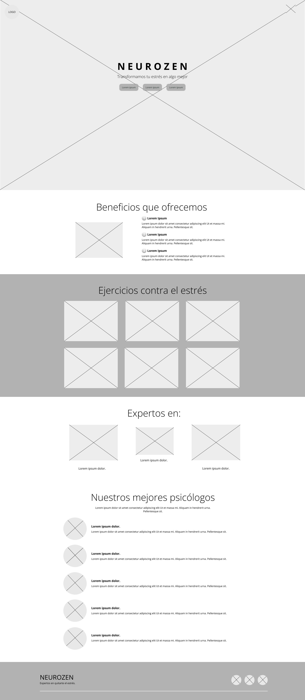</p>
</div>

<div>
  <p align="center">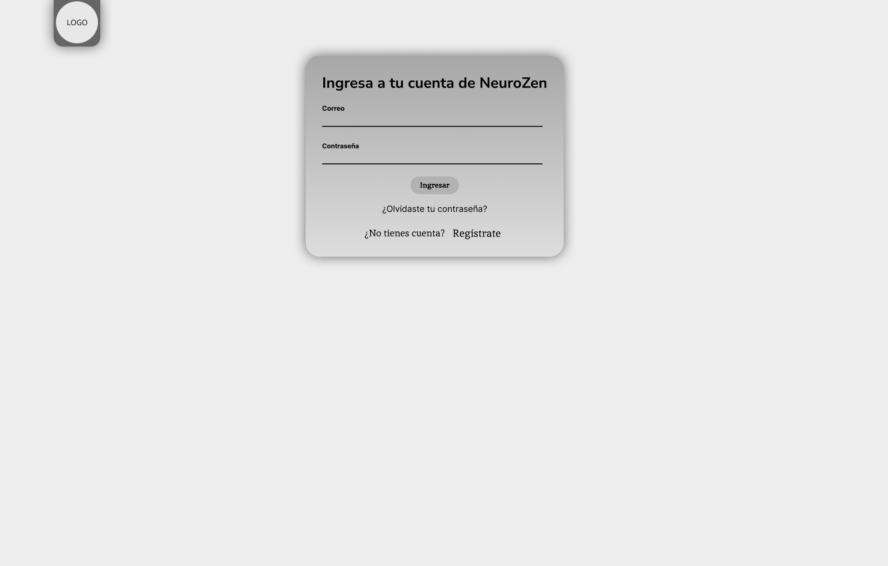</p>
</div>

<div>
  <p align="center">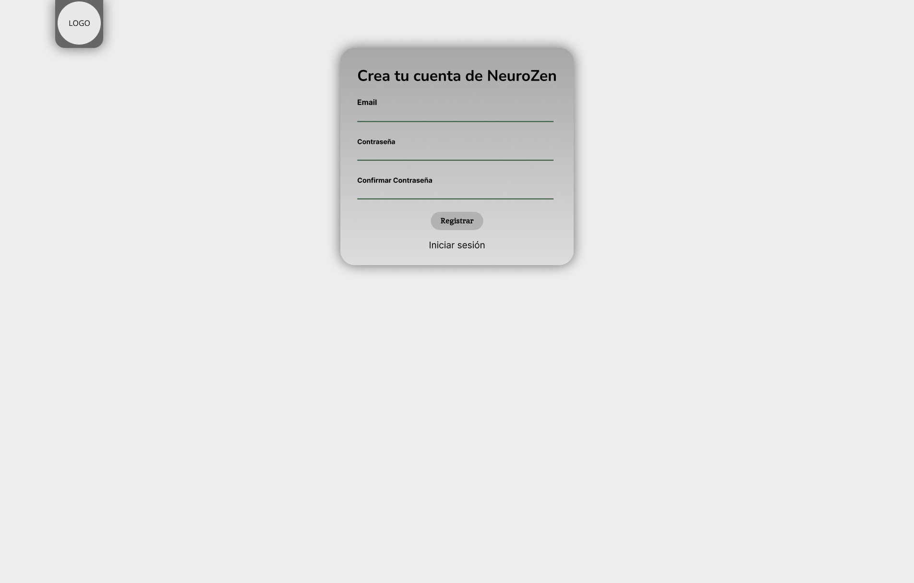</p>
</div>

<div>
  <p align="center">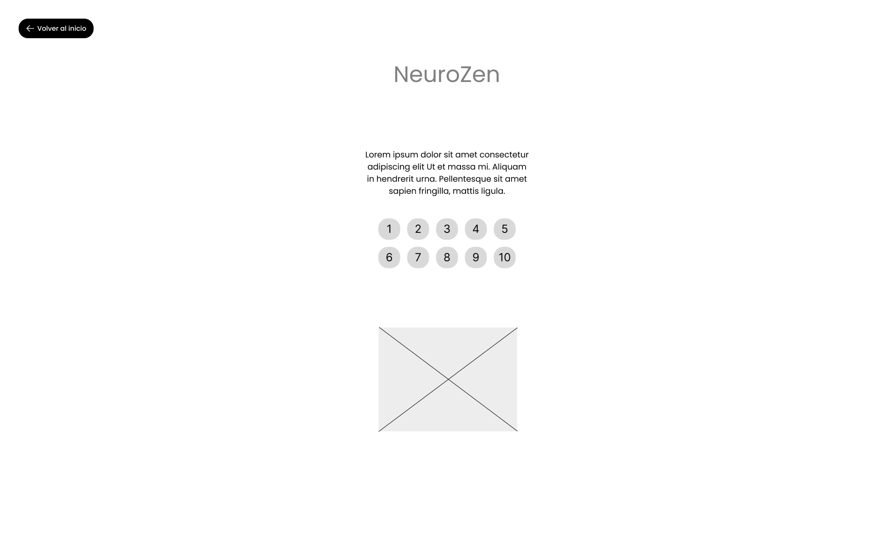</p>
</div>

---

#### 3.1.3.2. Landing Page Mock-up

Un mockup es una representación visual de un producto que muestra cómo lucirá, a diferencia de un wireframe, que se enfoca en la estructura. Aunque no es interactivo, puede ser de media o alta fidelidad y ayuda a tomar decisiones finales sobre aspectos como esquemas de colores, estilo visual y tipografía. Es una herramienta valiosa en el proceso de diseño para alinear expectativas y obtener retroalimentación antes de la implementación.

<div>
  <p align="center">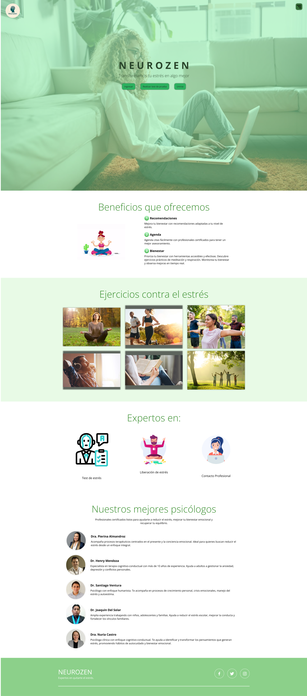</p>
</div>

<div>
  <p align="center"></p>
</div>

<div>
  <p align="center">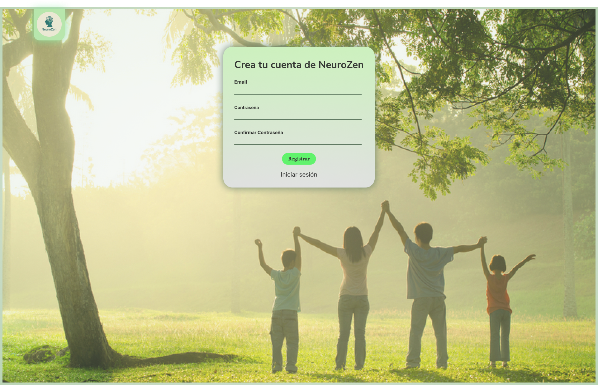</p>
</div>

<div>
  <p align="center">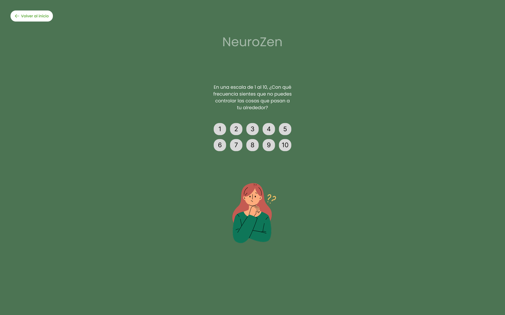</p>
</div>

Nuestro Landing Page:

## [● Link: [https://neurozen-home.netlify.app](https://neurozen-home.netlify.app)]

### 3.1.4. Mobile Applications UX/UI Design

El diseño de experiencia de usuario (UX) y de interfaz de usuario (UI) busca ofrecer una interacción digital clara, sencilla y motivadora. La UX se enfoca en entender las necesidades de las personas que buscan manejar su estrés y en crear flujos que les permitan registrar sus datos, evaluar su estado y recibir recomendaciones de forma rápida. La UI complementa esta experiencia con un diseño visual relajante y ordenado, usando colores, íconos y botones que transmiten calma y profesionalismo. Al combinar funcionalidad intuitiva con una estética agradable, se logra que el usuario se sienta acompañado y en control de su bienestar.

[Inserte cosas]

#### 3.1.4.1. Mobile Applications Wireframes

Los wireframes representan la estructura básica de las pantallas clave de la aplicación web, evidenciando la aplicación de principios de simplicidad, consistencia visual y accesibilidad.

[Inserte cosas]

#### 3.1.4.2. Mobile Applications Wireflow Diagrams

Los wireflows ilustran cómo se enlazan los wireframes a través de interacciones típicas de los usuarios (User Goals).

[Inserte cosas]

#### 3.1.4.3. Mobile Applications Mock-ups

Los mock-ups muestran la versión visual detallada de las pantallas, aplicando la identidad visual de NeuroZen (colores, tipografías y estilos inclusivos). Aquí se evidencian las decisiones finales de diseño.

[Inserte cosas]

#### 3.1.4.4. Mobile Applications User Flow Diagrams

Los **User Flow Diagrams** representan los caminos que siguen los usuarios dentro de la aplicación para cumplir sus objetivos.  
Estos flujos integran los **mock-ups** y los **wireflows**, mostrando tanto la ruta esperada (**happy path**) como las rutas alternativas en caso de error (**unhappy path**).

A continuación, presentamos los principales **User Goals** identificados y sus respectivos flujos:

[Inserte cosas]

---

#### 3.1.4.5. Mobile Applications Prototyping

##### Introducción

En esta sección se presentan los prototipos interactivos de la aplicación **NeuroZen**.  
Estos prototipos simulan la navegación y los principales flujos de interacción, basados en los **User Flow Diagrams** previamente definidos.

[Inserte cosas]

---

# Capítulo IV: Product Implementation & Validation

En esta sección se mencionan las decisiones y convenciones las cuales permitirán mantener una consistencia durante el desarrollo del proyecto.

## 4.1. Software Configuration Management

### 4.1.1. Software Development Environment Configuration

**Project Management:**

La gestión de los proyectos tiene como objetivo mejorar los procesos y su entorno para alcanzar los resultados esperados.

- **Trello:** Es una herramienta visual que permite gestionar cualquier tipo de proyecto y el flujo de trabajo que el equipo desarrollador seguirá para implementar correctamente las tareas de código para el Landing Page y el web Application.

<table>
    <tbody>
        <tr>
            <td>Link de referencia: </td>
            <td>https://trello.com/es </td>
        </tr>
    </tbody>
</table>

**Requirements Management:**

Es el proceso de garantizar que una organización documente verifique y satisfaga las necesidades, expectativas de sus clientes con las partes interesadas internas o externas.

- **Pivotal Tracker:** Esta herramienta se define como una plataforma en la que se realiza la gestión de user stories, agrupándolos en epics y clasificando su presencia en el programa, por puntaje. Se usó porque permite que cada miembro del equipo comparta la misma vista en tiempo real de lo que está sucediendo con cada proyecto, ya sea aportando con diferentes secciones o corrigiendo el flujo del proyecto.

<table>
    <tbody>
        <tr>
            <td>Link de referencia: </td>
            <td>https://www.pivotaltracker.com/  </td>
        </tr>
    </tbody>
</table>

**Product UX/UI Design:**

Nos permite desarrollar el modelo en nuestro producto de manera digital y forme parte de la vida del consumidor. En este caso realizar un modelo de sitio web para computadoras y celulares.

- **Uxpressia:** es una herramienta en línea para el mapeo de la trayectoria del cliente que crea mapas de impacto y personas. Sus herramientas nos permitieron establecer las bases del modelado de User Persona, Empathy Map y Journey Map

<table>
    <tbody>
        <tr>
            <td>Link de referencia: </td>
            <td>https://uxpressia.com/ </td>
        </tr>
    </tbody>
</table>

- **MIRO:** es una pizarra digital colaborativa en línea, que puede ser usada para la investigación, la ideación, la creación de lluvias de ideas, mapas mentales y una variedad de otras actividades colaborativas.

<table>
    <tbody>
        <tr>
            <td>Link de referencia: </td>
            <td>https://www.miro.com/</td>
        </tr>
    </tbody>
</table>

- **Figma:** es una herramienta de prototipo web y editor de gráficos vectorial, que, a diferencia de las otras herramientas, se aloja en la web, permitiendo establecer los modelos para versión en Web Browser y Landing Page.

<table>
    <tbody>
        <tr>
            <td>Link de referencia: </td>
            <td>https://www.figma.com/ </td>
        </tr>
    </tbody>
</table>

- **LucidChart:** es una herramienta de diagramación basada en la web, que permite a los usuarios colaborar y trabajar juntos en tiempo real, creando diseños UML, mapas mentales, prototipos de software y muchos otros tipos de diagrama.

<table>
    <tbody>
        <tr>
            <td>Link de referencia: </td>
            <td>https://www.lucidchart.com </td>
        </tr>
    </tbody>
</table>

- **Structurizr:** es una herramienta de diseño que soporta el modelo C4, para visualizar la arquitectura de software de nuestra solución.

<table>
    <tbody>
        <tr>
            <td>Link de referencia: </td>
            <td>https://structurizr.com/ </td>
        </tr>
    </tbody>
</table>

**Software Development:**

Es una estructura aplicada al desarrollo de un producto de software. Se utiliza para el establecimiento de un proceso para el desarrollo de software, cada uno de los cuales describe un enfoque diferente para diferentes actividades que tienen lugar durante el proceso.

- **Github:** Es un repositorio comunitario cuya función es almacenar los avances de un proyecto elaborado por un grupo de personas.

<table>
    <tbody>
        <tr>
            <td>Link de referencia: </td>
            <td> https://github.com/  </td>
        </tr>
    </tbody>
</table>

- **WebStorm:** Es un entorno de JetBrains, empresa desarrolladora de Software. Este nos ofrece facilidad en probar nuestro entorno web en navegadores web. Para el proyecto se implementará la ayuda de los lenguajes HTML, CSS y TypeScript.

<table>
    <tbody>
        <tr>
            <td>Link de referencia: </td>
            <td> https://www.jetbrains.com/webstorm/ 
            </td>
        </tr>
    </tbody>
</table>

- **HTML:** Es un lenguaje que sirve como desarrollador de plataformas web que trabaja con hipertextos, que enlace a otros documentos. Este lenguaje ofrece herramientas para el diseño del sitio web.

<table>
    <tbody>
        <tr>
            <td>Link de referencia: </td>
            <td> https://www.jetbrains.com/help/webstorm/editing-html-files.html 
             </td>
        </tr>
    </tbody>
</table>

- **CSS:** Es un lenguaje de diseño para el entorno web. Permite elaborar el interfaz de usuario diseñada anteriormente, agregando colores, tamaños entre otros elementos.

<table>
    <tbody>
        <tr>
            <td>Link de referencia: </td>
            <td> https://www.jetbrains.com/help/webstorm/style-sheets.html#ws_css_completion 
             </td>
        </tr>
    </tbody>
</table>

- **TypeScript:** Es un superconjunto de JavaScript, que esencialmente añade tipos estáticos y objetos basados en clases

<table>
    <tbody>
        <tr>
            <td>Link de referencia: </td>
            <td> https://www.typescriptlang.org/ 
             </td>
        </tr>
    </tbody>
</table>

- **Astro:** Es un marco web de JavaScript optimizado para crear sitios web rápidos y centrados en el contenido.

<table>
    <tbody>
        <tr>
            <td>Link de referencia: </td>
            <td> https://astro.build  </td>
        </tr>
    </tbody>
</table>

**Software Testing:**

Es el acto de examinar los artefactos y el comportamiento del software bajo prueba mediante validación y verificación.

- **Lenguaje Gherkins:** Es un DSL o Lenguaje Específico de Dominio (Domain-Specific Language), es decir, un lenguaje que está creado para resolver un problema. Además de ser interpretado en código, se puede agregar los users stories del programa con sus respectivas partes: Feature, Scenario, Example, Scenario Outline, Given, When, Then y And.

**Software Development:**

- **Github pages:** Servicio de Github que nos permitió alojar nuestra landing page y nos permitirá alojar nuestro web applications.

<table>
    <tbody>
        <tr>
            <td>Link de referencia: </td>
            <td> https://pages.github.com/ </td>
        </tr>
    </tbody>
</table>

### 4.1.2. Source Code Management

En esta sección se presenta la gestión de código fuente o como es conocido por sus siglas en inglés SCM (Source Code Management). Su función principal es realizar un seguimiento de las modificaciones que el equipo realizará a lo largo del desarrollo de sus proyectos en los repositorios de código fuente. Se emplea como un sistema de control de versiones que permite dar seguimiento a los cambios que cada integrante o desarrollador realice en el proyecto. Asimismo, cabe resaltar que para el sistema de control de versiones emplearemos GitHub.

**GitFlow**

Es el modelo alternativo de creación de ramas en Git que en los últimos años se ha vuelto una herramienta indispensable para muchos desarrolladores. Este flujo de trabajo de control de versiones utiliza ramas y fue publicado y popularizado por Vincent Driessen. Su principal función es ayudar en la organización de la versión de un código, permitiendo la creación de nuevos Features y Hotfixes de manera organizada.

**Main Branches:**

- **main:** es la rama principal, a partir de ella se recorrerán todas las ramas y contendrá la última versión y las anteriores creadas por los desarrolladores.

- **Develop:** Esta rama puede ser creada a partir de la rama main(master) y contará con todos los Features estables. Esto significa que a través de esta rama el equipo podrá integrar las funciones.

**Support Branches:**

- **Feature:** se ramifica de developer y al finalizar debe fusionarse de nuevo en develop. Se emplea para desarrollar nuevas funciones que se integrarán en versiones posteriores.

- **Release:** también se ramifica de develop, es la rama que admite la preparación de una nueva versión de producción.

- **Hotfix:** también está destinado a una nueva versión de producción, pero esta se ramifica de main. Su función es reparar rápidamente las publicaciones de producción.

**Conventional Commits:**

Son una convención para nombrar mensajes de commit en Git de forma estructurada, clara y semántica.

- feat: Se añade una nueva funcionalidad.
- fix: Se corrige un error.
- docs: Cambios en la documentación.
- style: Cambios de formato o estilo de código (sin impacto en la lógica).
- refactor: Mejoras en el código que no añaden nuevas funcionalidades ni corrigen errores.
- test: Añadir o modificar tests.
- chore: Cambios menores sin impacto en el código de producción (actualización de dependencias, configuración, etc.).

### 4.1.3. Software Deployment Configuration

Como se mencionó previamente, la gestión de nuestro código fuente se realizará a través de GitHub. Asimismo, se utilizará GitHub Pages para la publicación y despliegue de la página.

Para el desarrollo del Landing Page de NeuroZen se han usado las siguientes herramientas:

- HTML: lenguaje con el cual está estructurado nuestro landing page.

- CSS: diseño y formato para el html desarrollado.

El despliegue de nuestro landing page es posible gracias a la herramienta de Github Pages. El cual es un servicio que nos permite alojar nuestro landing directamente desde el
repositorio de GitHub.

Para lograr el despliegue seguimos lo siguientes pasos:

1. Dirigirnos al repositorio de la página y entrar en la sección de configuración.

2. Ir a la opción de “Pages”, donde se encontrarán todas las opciones de publicación de página.

3. Se debe seleccionar la rama la cual se va a publicar en el vínculo. También se debe seleccionar la carpeta donde se localizara la publicación.

4. Finalmente, el link vínculo de nuestra página aparecerá en la parte superior.

---

## 4.2. Landing Page & Mobile Application Implementation

### 4.2.1. Sprint 1

El primer sprint es un hito importante en nuestro proceso de desarrollo ágil. Durante este período, nos enfocamos en la implementación de las características y funcionalidades prioritarias identificadas en la planificación inicial. Esto implica traducir los requisitos y especificaciones en código funcional, desarrollando las bases de nuestro producto de manera iterativa.

#### 4.2.1.1. Sprint Planning 1

El sprint planning es una reunión en la metodología ágil donde el equipo planifica las actividades del próximo sprint. Define qué trabajo se hará, cuánto tiempo tomará y quién será responsable. El objetivo es establecer un plan claro y alcanzable para el equipo, fomentando la colaboración y asegurando que todos estén alineados en cuanto a objetivos y prioridades.

<table  style="text-align: center;">
    <tbody>
        <tr>
			<td colspan="1">Sprint #</td>
            <td colspan="1"> Sprint 1  </td>
		</tr>
        <tr>
			<td colspan="2">Sprint Planning Background </td>
		</tr>
        <tr>
			<td colspan="1">Date</td>
            <td colspan="1"> 2026-05-10 </td>
		</tr>
        <tr>
			<td colspan="1">Time</td>
            <td colspan="1"> 11:00 PM </td>
		</tr>
        <tr>
			<td colspan="1">Location</td>
            <td colspan="1">Microsoft Teams (Reunion virtual)</td>
		</tr>
        <tr>
			<td colspan="1">Prepared By</td>
            <td colspan="1"> Joao Castro </td>
		</tr>
        <tr>
			<td colspan="1"> Attendees (to planning meeting)</td>
            <td colspan="1"> Miguel Vila / Diego Requena / Joao Castro / Valentino Solis / Jean Pool  </td>
		</tr>
         <tr>
			<td colspan="1">Sprint 1 – 1 Review Summary </td>
            <td colspan="1">Se alcanzaron los objetivos del producto como la realización de todos los capítulos, el despliegue completo de la Landing Page, nuestro backend y app móvil, así como la mayoría de información necesaria dentro del reporte, sin embargo, una de las tareas/objetivos más importantes que se debía alcanzar fue la presentación de un informa en formato pdf y word.</td>
		</tr>
         <tr>
			<td colspan="1">Sprint 1 – 1 Retrospective Summary </td>
            <td colspan="1">El sprint 1 fue un poco menos productivo de lo esperado. El producto resultante no es perfecto, pero sí es funcional. Debemos realizar una mejor coordinación para los futuros trabajos.</td>
		</tr>
         <tr>
			<td colspan="2">Sprint Goal & User Stories </td>
		</tr>
         <tr>
			<td colspan="1">Sprint 1 Goal</td>
            <td colspan="1">Para este sprint se requiere el cumplimiento de los siguientes objetivos: Finalización de reporte y despliegue sin problemas de la Landing Page, backend y app móvil que se encuentran en nuestro repositorio. La métrica de cumplimiento se basará en el proceso de cómo nuestro "Board de Trello" luzca con el paso del tiempo, nuestro resultado final debe de mostrar todas las tareas en el lado derecho de la herramienta, ubicándolos en la columna "Terminado"</td>
		</tr>
        <tr>
			<td colspan="1">Sprint 1 Velocity </td>
            <td colspan="1">Para este sprint se han elegido 5 User Stories que tienen 5 Story points cada uno.</td>
		</tr>
        <tr>
			<td colspan="1">Sum of Story Points </td>
            <td colspan="1">25</td>
		</tr>
</tbody>
</table>

#### 4.2.1.2. Sprint Backlog 1

En este primer sprint, nos enfocamos en la implementación de las funcionalidades básicas de la Landing Page, incluyendo la estructura general, el diseño visual y la navegación básica, también se ha creado un reporte que muestra el ciclo de vida de todo nuestro proyecto de software. Estas características son fundamentales para establecer las bases de nuestro producto y proporcionar una experiencia de usuario sólida y coherente.
A continuación el sprint backlog 1:

#### 4.2.1.3. Development Evidence for Sprint Review

#### 4.2.1.4. Testing Suite Evidence for Sprint Review

#### 4.2.1.5. Execution Evidence for Sprint Review

#### 4.2.1.6. Services Documentation Evidence for Sprint Review

#### 4.2.1.7. Software Deployment Evidence for Sprint Review

#### 4.2.1.8. Team Collaboration Insights during Sprint

### 4.2.2. Sprint 2

#### 4.2.2.1. Sprint Planning 2

#### 4.2.2.2. Sprint Backlog 2

#### 4.2.2.3. Development Evidence for Sprint Review

#### 4.2.2.4. Testing Suite Evidence for Sprint Review

#### 4.2.2.5. Execution Evidence for Sprint Review

#### 4.2.2.6. Services Documentation Evidence for Sprint Review

#### 4.2.2.7. Software Deployment Evidence for Sprint Review

#### 4.2.2.8. Team Collaboration Insights during Sprint

### 4.2.3. Sprint 3

#### 4.2.3.1. Sprint Planning 3

#### 4.2.3.2. Sprint Backlog 3

#### 4.2.3.3. Development Evidence for Sprint Review

#### 4.2.3.4. Testing Suite Evidence for Sprint Review

#### 4.2.3.5. Execution Evidence for Sprint Review

#### 4.2.3.6. Services Documentation Evidence for Sprint Review

#### 4.2.3.7. Software Deployment Evidence for Sprint Review

#### 4.2.3.8. Team Collaboration Insights during Sprint

### 4.2.4. Sprint 4

#### 4.2.4.1. Sprint Planning 4

#### 4.2.4.2. Sprint Backlog 4

#### 4.2.4.3. Development Evidence for Sprint Review

#### 4.2.4.4. Testing Suite Evidence for Sprint Review

#### 4.2.4.5. Execution Evidence for Sprint Review

#### 4.2.4.6. Services Documentation Evidence for Sprint Review

#### 4.2.4.7. Software Deployment Evidence for Sprint Review

#### 4.2.4.8. Team Collaboration Insights during Sprint

## 4.3. Validation Interviews

### 4.3.1. Diseño de Entrevistas

**Segmento 1: Personas activas en el ámbito laboral con jornadas extendidas**

Para evaluar la efectividad del landing page de NeuroZen, hemos formulado preguntas para
comprender cómo los residentes perciben la aplicación y si sienten que el diseño y contenido
de la página reflejan adecuadamente su objetivo que es apaciguar el estrés de las personas.
Además queremos saber si la página motiva a los usuarios a registrarse y a confiar en
Neurozen como una ayuda a su estrés.

Introducción:  
Buenos días soy [Tu Nombre], estudiante de la UPC, y junto a mi equipo estamos
desarrollando Neurozen, una aplicación para ayudar a las personas a reducir el estrés.
Nos gustaría hacerle algunas preguntas sobre la página web y aplicación móvil del proyecto,
y le agradecemos su tiempo para ayudarnos con esta entrevista.

Preguntas:

- ¿Qué te hizo sentir o pensar la página cuando la viste por primera vez?
- ¿Entendiste fácilmente para qué sirve la aplicación? ¿Qué crees que hace?
- ¿Qué te parece la parte donde puedes registrarte o iniciar sesión? ¿Te queda claro cómo hacerlo?
- ¿La página te da confianza sobre la seguridad de tus datos o privacidad? ¿Por qué?
- ¿Te parece que el diseño (colores, botones, distribución) es fácil de usar y moverse?
- ¿Qué cambiarías o mejorarías en esta página?
- ¿Qué opinas de las nuevas funciones de la aplicación como ver perfil, herramientas contra el estrés y suscripciones?

---

**Segmento 2: Adultos entre 20 y 50 años con trabajo informal o sin horarios definidos**

Para evaluar la efectividad del landing page de NeuroZen, hemos formulado preguntas
dirigidas a usuarios pertenecientes al segmento objetivo: adultos entre 20 y 50 años con
trabajo informal o sin horarios definidos. A continuación, presentamos una entrevista
realizada a Cristofer, uno de nuestros usuarios de prueba.

Introducción:  
Buenos días soy [Tu Nombre], estudiante de la UPC, y junto a mi equipo estamos
desarrollando Neurozen, una aplicación para ayudar a las personas a reducir el estrés.
Nos gustaría hacerle algunas preguntas sobre la página web y aplicación móvil del proyecto,
y le agradecemos su tiempo para ayudarnos con esta entrevista.

Preguntas:

- ¿La estética de la página (colores, imágenes, diseño) te resulta atractiva o te causa alguna impresión en particular?
- ¿Te resultó fácil navegar por el menú y encontrar las secciones como “Beneficios” o “Ejercicios”?
- ¿Sentiste que el contenido se adapta a alguien como tú, con horarios poco estructurados o sin un trabajo fijo?
- ¿Qué opinas de la sección de “Ejercicios contra el estrés”? ¿Te llama la atención probarlos?
- ¿Te quedó claro que la plataforma también ofrece contacto con profesionales? ¿Te parecería útil esa opción?
- ¿Cambiarías algo del diseño o contenido para que sea más útil o claro para ti?
- ¿Qué opinas de las nuevas funciones de login, ver perfil y suscripciones dentro de la aplicación?

---

### 4.3.2. Registro de Entrevistas

**Segmento 1: Personas activas en el ámbito laboral con jornadas extendidas**

**Entrevista 1 – Segmento 1**

- Nombre: Milenio Bonifacio Vila Lujan.

- Sexo: Masculino.

- Edad: 27 años.

- Estado Civil: Viudo.

- Labor: Vendedor de helados.

Detalles de la entrevista:

- Duración: 5:41 minutos.

Link : [https://drive.google.com/file/d/18UtH0VYeeHezwYrqdNocy89Uj14yxmNK/view?usp=sharing](https://drive.google.com/file/d/18UtH0VYeeHezwYrqdNocy89Uj14yxmNK/view?usp=sharing)

Resumen de los puntos clave en la entrevista:

Milenio Bonifacio, un vendedor de helados de 27 años, comentó durante la entrevista que la landing page de NeuroZen le generó una impresión tranquila y clara, entendiendo rápidamente que la aplicación está orientada a reducir el estrés. Consideró intuitiva la sección de registro y percibió confianza en el diseño, aunque sugirió incluir más información sobre privacidad. Señaló que la distribución y los colores facilitan la navegación, y recomendó añadir ejemplos visuales del funcionamiento. Sobre las nuevas funciones, opinó que son útiles y coherentes con el propósito de la app.

**Entrevista 2 – Segmento 1**

- Nombre: Alejandro Cárdenas López

- Sexo: Masculino.

- Edad: 24 años.

- Estado Civil: Soltero.

- Labor: Operador de almacén con turnos extendidos

Detalles de la entrevista:

- Duración: Mas o menos 10 minutos aproximadamente.

Link : [https://drive.google.com/drive/folders/1TXbnV7_IFn77mdGEWyPfuNRUqZb9FTb0?usp=sharing](https://drive.google.com/drive/folders/1TXbnV7_IFn77mdGEWyPfuNRUqZb9FTb0?usp=sharing)

Resumen de los puntos clave en la entrevista:

Alejandro comentó que la landing page de NeuroZen le transmitió una sensación profesional y tranquila gracias a los colores y la distribución equilibrada. Entendió inmediatamente que la app se enfocaba en la reducción del estrés.
Dijo que la sección de registro le pareció clara, aunque sugirió incluir un pequeño texto explicando qué beneficios gana el usuario al registrarse.
Notó que el diseño era moderno y sencillo de navegar, aunque para personas con poco tiempo sería útil incluir botones más visibles.
Sugirió agregar una sección con testimonios o casos reales para aumentar la confianza.
En cuanto a las nuevas funciones, opinó que las herramientas contra el estrés serían ideales para personas con jornadas extendidas y que la opción de perfil y suscripciones podría ser útil si ofrece recomendaciones personalizadas.

**Entrevista 3 – Segmento 1**

- Nombre: Cristian Rivera Mendoza

- Sexo: Masculino.

- Edad: 26 años.

- Estado Civil: Soltero.

- Labor: Técnico de mantenimiento con jornadas largas

Detalles de la entrevista:

- Duración: Mas o menos 10 minutos aproximadamente.

Link : [https://drive.google.com/drive/folders/1cDqIQDhljWPuGd-m5QhuJUAyu_L4FfaG?usp=sharing](https://drive.google.com/drive/folders/1cDqIQDhljWPuGd-m5QhuJUAyu_L4FfaG?usp=sharing)

Resumen de los puntos clave en la entrevista:

Cristian dijo que al ingresar a la landing page sintió que la aplicación era seria y confiable. La información le pareció clara y entendió desde el inicio el propósito de combatir el estrés.
Consideró muy intuitiva la sección de registro, aunque recomendó añadir una breve guía visual para usuarios nuevos.
El diseño le pareció limpio y fácil de navegar. Sin embargo, sugirió hacer que los títulos sean un poco más grandes para facilitar la lectura.
Respecto a privacidad, le transmitió confianza, aunque le gustaría ver un apartado que explique qué datos se almacenan.
Comentó que las nuevas funciones como herramientas de estrés, perfil y suscripciones le parecen coherentes con el propósito de la aplicación y que serían útiles en momentos de mucha carga laboral.

---

**Segmento 2: Adultos entre 20 y 50 años con trabajo informal o sin horarios definidos**

**Entrevista 4 – Segmento 2**

- Nombre: Valeria

- Sexo: Femenino

- Edad: 21años

- Estado Civil: Soltera

- Labor: Trabaja como diseñadora freelance, con horarios flexibles y proyectos por encargo

Detalles de la entrevista:

- Duración: 11:25

- Link: [https://drive.google.com/file/d/1-Puz7VD-DfS2ttLd_Ns95JO7wk_mcqA8/view?usp=sharing](https://drive.google.com/file/d/1-Puz7VD-DfS2ttLd_Ns95JO7wk_mcqA8/view?usp=sharing)

Resumen de los puntos clave en la entrevista:

- Valeria considera que el diseño es visualmente atractivo y transmite calma, lo cual está alineado con el propósito de la app.
- Navegar por el menú fue sencillo, aunque sugiere que los íconos podrían tener etiquetas más claras.
- El contenido le pareció adecuado para personas con rutinas variables como ella.
- La sección de ejercicios le pareció interesante y estaría dispuesta a probarlos.
- Le gustó que se ofrezca contacto con profesionales, aunque recomienda que se explique mejor cómo funciona esa opción.
- Sugiere incluir una guía rápida para nuevos usuarios en la landing page.
- Las funciones de login, perfil y suscripciones le parecieron útiles, especialmente si se integran con recordatorios personalizados.

**Entrevista 5 – Segmento 2**

- Nombre: Joaquín Herrera Tamayo

- Sexo: Masculino

- Edad: 23 años

- Estado Civil: Soltero

- Labor: Repartidor independiente con horarios variables

Detalles de la entrevista:

- Duración: Mas o menos 10 minutos aproximadamente.

- Link: [https://drive.google.com/drive/folders/1cw2cbsHjGYblujk0frozfOtwaCB3JUPY?usp=sharing](https://drive.google.com/drive/folders/1cw2cbsHjGYblujk0frozfOtwaCB3JUPY?usp=sharing)

Resumen de los puntos clave en la entrevista:

Joaquín mencionó que la estética de la página le pareció relajante y adecuada para alguien que trabaja en la calle y necesita momentos de descanso.
Comentó que navegar por el menú fue sencillo, pero sugirió que algunos íconos incluyan texto porque no todos son intuitivos.
Sintió que el contenido se adapta bien a personas con horarios irregulares.
Sobre la sección de ejercicios contra el estrés, dijo que le llamó bastante la atención porque suele tener días muy cargados.
La idea de contactar profesionales le pareció útil, pero recomendó que se explique mejor si es por chat, videollamada o mensajes.
Sugirió añadir un pequeño tutorial para nuevos usuarios.
Sobre las funciones de login, perfil y suscripciones, opinó que serían útiles si incluyen beneficios como recordatorios o rutinas rápidas.

**Entrevista 6 – Segmento 2**

- Nombre: Mateo Alarcón Palacios

- Sexo: Masculino

- Edad: 25 años

- Estado Civil: Soltero

- Labor: Freelancer de edición de video con horarios flexibles

Detalles de la entrevista:

- Duración: Mas o menos 10 minutos aproximadamente.

- Link: [https://drive.google.com/drive/folders/1Agr3NAavTSWaCIPs1MlKkhshXdCUGAB7?usp=drive_link](https://drive.google.com/drive/folders/1Agr3NAavTSWaCIPs1MlKkhshXdCUGAB7?usp=drive_link)

Resumen de los puntos clave en la entrevista:

Mateo comentó que el diseño de la landing page le pareció atractivo, especialmente por los colores suaves que transmiten serenidad.
Navegar por la página le fue fácil, aunque sugirió añadir una vista previa de los ejercicios para que los usuarios sepan qué esperar.
Indicó que el contenido se adapta bien a personas que no siguen un horario fijo.
La sección de ejercicios contra el estrés le pareció muy interesante y dijo que sí los probaría.
Sobre el contacto con profesionales, le gustó la idea, pero sugirió aclarar si se trata de psicólogos, coaches o especialistas en bienestar.
Propuso incluir una sección de “primeros pasos” al ingresar.
Vio útiles las funciones de login, perfil y suscripciones, sobre todo si pueden personalizarse según la rutina del usuario.

---

### 4.3.3. Evaluaciones según heurísticas

**Evaluación heurística de la aplicación NeuroZen**

Este análisis se basa en principios de usabilidad para evaluar la experiencia del usuario en la aplicación NeuroZen. Se identifican fortalezas, debilidades y recomendaciones de mejora.

| **Heurística**                      | **Severidad** | **Descripción**                                                                                                                                      | **Recomendación**                                                                                                        |
| ----------------------------------- | ------------- | ---------------------------------------------------------------------------------------------------------------------------------------------------- | ------------------------------------------------------------------------------------------------------------------------ |
| Visibilidad del estado del sistema  | 2             | La aplicación cuenta con una sección de “Tests” donde el usuario puede realizar un test dentro de la misma página web para ver su nivel de estrés.   | La sección de test debe mejorar un poco el diseño en mostrar las preguntas más interactivas para el usuario.             |
| Control y libertad del usuario      | 1             | El usuario puede eliminar, cancelar o rehacer cualquier actividad que esté haciendo en la aplicación, porque siempre tiene una opción para cancelar. | En esta sección no hay mejoras, ya que siempre se encuentra esta heurística.                                             |
| Diseño estético y minimalista       | 1             | El diseño es limpio y tranquilo, lo cual va en línea con el objetivo del proyecto. No hay sobrecarga de información.                                 | Mantener el estilo actual. Podría beneficiarse de sutiles animaciones o íconos explicativos para aumentar el atractivo.  |
| Reconocimiento en lugar de recuerdo | 3             | La aplicación aún presenta algunos fallos en cuanto a guardar información cotidiana de la actividad del usuario.                                     | Se debe mejorar el análisis de la información que el usuario mantiene cotidianamente para disminuir la carga de memoria. |

---

---

# Conclusiones

## Conclusiones

1. **Relevancia social**  
   NeuroZen responde a una necesidad real: el cuidado de la salud mental en entornos digitales, cada vez más demandado en la sociedad actual.

2. **Enfoque integral**  
   Combina autoevaluación (tests) con acceso a especialistas, siendo más completo que soluciones que solo abordan una de estas partes.

3. **Seguridad y confianza**  
   La inclusión de autenticación en dos pasos transmite seriedad y compromiso con la protección de los datos personales.

4. **Escalabilidad**  
   El proyecto tiene el potencial de evolucionar hacia un ecosistema más robusto con nuevas funcionalidades, manteniendo su base sencilla en HTML y CSS.

5. **Potencial de impacto**  
   NeuroZen puede crecer como una plataforma de apoyo integral, integrando tecnologías emergentes como inteligencia artificial, chatbots y seguimiento personalizado.

---

## Recomendaciones

1. **Mejora de la experiencia de usuario (UX/UI)**
   - Implementar un diseño minimalista y calmante (paleta de colores suaves, tipografía clara).
   - Incluir dashboards visuales para mostrar la evolución del usuario en sus niveles de estrés.

2. **Nuevas funcionalidades sugeridas**
   - Chatbot de acompañamiento con ejercicios de relajación y consejos inmediatos.
   - Gamificación: logros y recompensas por completar actividades de autocuidado.
   - Agenda virtual para agendar citas con psicólogos desde la plataforma.

3. **Escalabilidad técnica**
   - Evolucionar a frameworks como React, Vue o Angular para mayor dinamismo.
   - Incorporar bases de datos seguras (ej. MongoDB, PostgreSQL) para gestión de perfiles, tests y citas.

4. **Alianzas estratégicas**
   - Colaborar con psicólogos colegiados para dar mayor respaldo profesional.
   - Establecer convenios con universidades o centros de bienestar para ganar credibilidad.

5. **Sostenibilidad y monetización**
   - Ofrecer una versión gratuita con funciones básicas y una premium con servicios avanzados (consultas online, planes personalizados).
   - Incluir publicidad ética y no invasiva relacionada con bienestar.

---

## Video App Validation

## Video About the product

## Video About the team

---

# Bibliografía

## Referencias

Brown, T. (2009). _Change by design: How design thinking creates new alternatives for business and society_. Harper Business. https://www.harpercollins.com/products/change-by-design-tim-brown

Cockburn, A. (2001). _Writing effective use cases_. Addison-Wesley. https://www.informit.com/store/writing-effective-use-cases-9780201702255

Creswell, J. W., & Poth, C. N. (2018). _Qualitative inquiry and research design: Choosing among five approaches_ (4th ed.). SAGE Publications. https://us.sagepub.com/en-us/nam/qualitative-inquiry-and-research-design/book246896

Evans, E. (2003). _Domain-driven design: Tackling complexity in the heart of software_. Addison-Wesley. https://www.informit.com/store/domain-driven-design-tackling-complexity-in-the-heart-9780321125217

Gamma, E., Helm, R., Johnson, R., & Vlissides, J. (1994). _Design patterns: Elements of reusable object-oriented software_. Addison-Wesley. https://www.informit.com/store/design-patterns-elements-of-reusable-object-oriented-9780201633610

Goodman, E., Kuniavsky, M., & Moed, A. (2012). _Observing the user experience: A practitioner’s guide to user research_ (2nd ed.). Morgan Kaufmann. https://www.elsevier.com/books/observing-the-user-experience/goodman/978-0-12-384869-7

Krug, S. (2014). _Don’t make me think, revisited: A common sense approach to web usability_ (3rd ed.). New Riders. https://www.peachpit.com/store/dont-make-me-think-revisited-a-common-sense-approach-9780321965516

Larman, C. (2004). _Applying UML and patterns: An introduction to object-oriented analysis and design and iterative development_ (3rd ed.). Prentice Hall. https://www.informit.com/store/applying-uml-and-patterns-an-introduction-to-object-9780131489066

Newman, S. (2015). _Building microservices: Designing fine-grained systems_. O’Reilly Media. https://www.oreilly.com/library/view/building-microservices/9781491950340/

Patton, M. Q. (2015). _Qualitative research & evaluation methods: Integrating theory and practice_ (4th ed.). SAGE Publications. https://us.sagepub.com/en-us/nam/qualitative-research-evaluation-methods/book232962

Preece, J., Rogers, Y., & Sharp, H. (2019). _Interaction design: Beyond human-computer interaction_ (5th ed.). Wiley. https://www.wiley.com/en-us/Interaction+Design%3A+Beyond+Human+Computer+Interaction%2C+5th+Edition-p-9781119547259

Richardson, C. (2018). _Microservices patterns: With examples in Java_. Manning. https://www.manning.com/books/microservices-patterns

Stickdorn, M., Hormess, M. E., Lawrence, A., & Schneider, J. (2018). _This is service design doing: Applying service design thinking in the real world_. O’Reilly Media. https://www.thisisservicedesigndoing.com/

Yin, R. K. (2018). _Case study research and applications: Design and methods_ (6th ed.). SAGE Publications. https://us.sagepub.com/en-us/nam/case-study-research-and-applications/book250150

# Anexos

## Anexo A. Formato para Evaluación de User Experience según Heurísticas

Durante la validación del prototipo se aplicaron heurísticas de usabilidad, arquitectura de información y diseño inclusivo.

**Tareas evaluadas:**

1. Registro de un usuario nuevo.
2. Inicio de sesión y recuperación de contraseña.
3. Realización de test de estrés.
4. Visualización de psicólogos disponibles.
5. Acceso a recomendaciones y actividades de relajación.
6. Uso de agenda para contacto con psicólogos.
7. Realización de pagos de suscripción.

## Anexo B. Integrantes del Equipo

| Foto                                                    | Nombres y Apellidos               | Carrera                | Descripción                                                                                                                                                                                                                                                 |
| ------------------------------------------------------- | --------------------------------- | ---------------------- | ----------------------------------------------------------------------------------------------------------------------------------------------------------------------------------------------------------------------------------------------------------- |
|     | Manuel Fernando Joao Castro Picón | Ingeniería de Software | Tengo 19 años y curso el 5to ciclo en la Universidad Peruana de Ciencias Aplicadas. Me gusta entrenar calistenia, escuchar música y jugar fútbol. Me considero responsable, adaptable al trabajo en equipo y con metas claras para ser un gran profesional. |
|     | Santiago Valentino Solis Chang    | Ingeniería de Software | Tengo 20 años y curso el 5to ciclo en la Universidad Peruana de Ciencias Aplicadas. En mi tiempo libre disfruto jugar videojuegos, practicar tenis y aprender sobre programación web. Soy responsable, comprometido y capaz de trabajar en equipo.          |
|   | Miguel Angel Vila Guillen         | Ingeniería de Software | Tengo 21 años y estudio el 6to ciclo en la Universidad Peruana de Ciencias Aplicadas. Me gusta jugar videojuegos, tocar la guitarra y el fútbol. Me considero capaz de trabajar en equipo y aspiro a ser un profesional competente.                         |
|  | Diego Gabriel Requena Gutiérrez   | Ingeniería de Software | Tengo 19 años y curso el 5to ciclo en la Universidad Peruana de Ciencias Aplicadas. Soy una persona comprometida con mis objetivos, busco optimizar mi rendimiento y mantener un equilibrio entre la excelencia y una vida saludable.                       |
|     | Huaman De La Cruz Jean Pool       | Ingeniería de Software | Tengo 23 años; Estoy cursando la carrera de ingeniería de software en quinto ciclo. Soy una persona orientada a objetivos y con una meta clara, quiero poder crear soluciones disruptivas que revolucionen el mercado.                                      |
